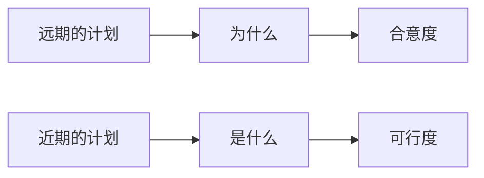

## 引言

为什么大家设定的目标最后无法实现,大多数人找错根本原因,人人都能更加成功达成目标

### 成功者和自制力的悖论

每个人都有自制力,区别就是高低水平

最令自己感到自豪的成就,都不是轻松完成的,必须付出艰苦卓绝的能力,这就需要自制力

### 自制力到底是怎样的

自制力类似肌肉需要锻炼得到增强,过度压榨自制力,肯定会疲惫无法控制自己

### 你能做什么

刚开始控制抵抗点心,一根烟,烦人的任务,感觉煎熬,过了一会,自制力恢复,变得没那么难熬

以奖励的方法增强动机，可以弥补短时间内消耗的自制力。把目标以外的奖励方式作为实现目标的重要部分

### 本书的主题

在于描述如何实现目标,自制力是其中重要一环

## 第一部分 准备就绪
## 第1章 你明白自己去往哪里吗

首先,要确定目标,其次,清楚如何实现目标

### 别说“做到最好 ”

"做到最好"这个目标一般

#### 用什么目标替代"做到最好"?
明确而艰巨的目标

#### 为什么明确而艰难的目标比“做到最好”更能激发人们的动力呢？
"明确":明确期望值,免得告诉自己,已经做的足够好了,可以歇一歇,达成和未达成之前不存在中间地带

"艰巨":会使自己付出更大的努力,更加聚精会神,坚持的更久

### 大局与细节
每次行动或目标,有不同的方式进行理解

注重"为什么"要做,习惯用抽象的方式理解行为

> 掌握代数

注重"是什么"要做,习惯看重实际

> 题目做对

#### 什么时候要用"为什么",什么时候要用"是什么"?

"为什么":更加抽象,让人充满激情,一件事与更大的意义联系在一起

"是什么":更加具体,在解决一件困难,生疏,复杂的事情更有帮助

#### 怎样从"为什么"的角度思考

1. **写下一件你最近由于缺乏动力或者诱惑太多而无法完成的事。**
2. **现在，写下你“为什么”想做这件事。** 你个人的目的是什么？这样做能帮助你实现什么？你怎样从中受益？

>等你下次再试着做这件事时，停下来想一想你刚刚总结的“为什么”。反反复复地这样做，直到它成为习惯为止。（它会成为习惯的。只要反复去做，任何简单的行为，都能变成习惯，做起来易如反掌，只要你肯坚持。）
{: .prompt-info }

#### 怎样从“是什么”的角度思考?

1. **写出一件你想做却特别复杂、困难或者陌生的事。**
2. **现在，写下你第一步应当做什么。** 为了开始追求那个目标，你需要采取的具体行动是什么？

>等你下次再尝试做这件事时，停下来想一想你刚刚总结的需要采取的下一个具体行动，并且聚精会神地做。这很快也会成为一个习惯。
{: .prompt-info }

### 现在与将来

一方面，我们偏向于用大而抽象的概念（强调“为什么”）来考虑较长时间以后才会执行的计划；另一方面，在考虑近期的计划时，我们往往更加具体，也就是更加专注于做好这件事需要做的“是什么”

合意度:关注这些事情有多有趣,多愉悦,多有益

可行度:是不是真的能做好,有多大把握取得成功,有什么会阻碍你完成

合意度和可行度在远期和近期计划上的错位,是一些人痛苦的根源

关注合意度,不考虑可行度,就会安排些看起来不错,实际没有可能执行的计划

关注可行度,不考录合意度,就会安排些较为简单的任务,忽视一些对提升自己更有价值的任务

### 积极思考的利与弊

积极思考有两种
1. 相信自己能成功
2. 想象自己能轻而易举地成功，并且抗拒诱惑和克服障碍

有害的积极思考使得人们对完成计划盲目乐观,认为轻轻松松实现

#### 为什么相信成功道路艰险对实现目标那么重要?
焦虑和担心,这种负面情绪能给人带来很强的动力

#### 树立并实现目标，而非陷入白日梦中，最好的方法是什么呢？
设定目标时积极地思考你已经实现目标时的情景，同时切合实际地思考在实现目标的过程中需要做些什么,又称"心理对照"

#### "心理对照"什么时候有用?
当全心全意相信你确实能够完成的目标时有用

成功率高时,增强实现目标的决心,成功率不高时,认清形势,放下包袱继续前行

#### 运用"心理对照"确定目标

1.**拿起笔记本或者一张纸，写下你最近产生的愿望或想法。** 这可以是一件你想要做或是已经开始做的事情（例如去加勒比海度假、搬到洛杉矶去当一名编剧，或者减掉四五千克体重）。

2.**现在，想象一下愿望实现时的美好结局。** 写下这个美好结局一个方面的好处（比如你可以不去查收电子邮件，惬意地躺在沙滩上放松身心，该是多么的美好）。

3.**接下来，想一想你现在的状况与这个美好结局之间还存在些什么障碍**（比如，我现在有些胖，而我的美好结局是减掉四五千克体重，这两者之间的障碍是我格外喜欢吃奶酪）。

4.**现在再列出另一个方面的好处。**

5.**接着列出另一个障碍。**

6.**然后再列出一个方面的好处。**

7.**再列举一个障碍。**

你觉得你取得成功的概率有多大？你应该追求这个目标吗？通过将你一定会获得的好处与妨碍你实现目标的障碍进行一番对比，你就能更清楚地知道自己成功的把握有多大，也知道自己有多大的决心去实现这个目标。

## 第2章 你知道目标来自哪里吗

搞清目标有什么不同,哪种目标适合自己,如何帮助自己改变目标

首先要先理解,已经确定的目标来自于哪里,诚实而客观的评估他们,自由地做出不同的选择

### 信念如何塑造成功

对自己能力的信念影响着对可能发生事情的认知,还影响我们能创造的成就

看待智力能否提高,把人分成实体论者和渐变论者

实体论者:智力是或多或少与生俱来的、很大程度上是遗传的，或者是在儿童时期培育起来，但成年以后基本保持固定不变的

渐变论者:相信智力是一种能够借助经验和学习来提升的品质，通过努力，你能够获得更多的智力

导致后果

实体论者:过于担心自己能不能获得别人的认可。只要有可能，他们希望别人确信他们聪明（或者，最起码不愚蠢）2他们想让自己给人感觉很聪明。他们想让自己看上去充满智慧。会避开那些过于艰难的目标，喜欢在更安全的赌局上下注。

渐变论者:不会太过执拗地证明你很聪明，而是努力培育自己的智慧。挑战对你来说不是威胁，而是学习新技能的机会。犯错并不代表你很愚蠢，相反，你会觉得错误本身充满了有助于你学习和成长的东西。

### 确实是江山易改、本性难移吗
### 我们如何摆脱困境

回想自己有没有逃避困难,谨小慎微,固守容易达到的目标,有没有一件事你很久以前就认定自己永远也不擅长的?有没有一些技能是你认定自己永远也掌握不了的,类似的事越多越说明自己是个实体论者

实体理论并不正确,而且彻底错误,务必挣脱这套理论对自己成长的束缚,

### 你，处在自动导航模式

有意识思考的事情都是少数,越熟练的事会交给潜意识,大多数思考都是潜意识完成,潜意识根据周围的环境信息暗示,做出反应,甚至没有意识到自己在追求这个目标

### 触发因素的神奇之处

### 让潜意识思维为你所用
## 第二部分 预备开始
## 第3章 使人们不断前进的目标
### 当你以展示才华为目标时
### 当你以谋求进步为目标时
### 哪种目标对我最有益
### 解决困难
### 大学医学预科班学生与毅力
### 享受过程
### 寻求帮助
### 情绪低落也能催人奋起
## 第4章 乐观者和悲观者的目标
### 被爱与保持安全
### 积极思考（或者，也许不必）
### 保持动力
### 乐观主义者与悲观主义者是如何形成的
### 进取、防御与优先性
### 你的焦点和你的感觉
### 适合你目标焦点的策略
### 运用合适的策略
### 一个目标的优势是另一个目标的劣势
## 第5章 让你幸福的目标
### 我们真的需要什么
### 我们真的不需要的目标
### 这到底是谁的目标
### 如何营造自主选择的感觉
### 如何把别人规定的目标转化为自己的目标
## 第6章 选择适合自己的目标
### 当你觉得不费吹灰之力时
### 当你需要鞭策时
### 当前路十分坎坷时
### 当你无法抗拒诱惑时
### 当你本该昨天做完时
### 当你需要完美地完成任务时
### 当你需要创意像流水般动起来时
### 当你想欣赏沿路景色时
### 当你想要真正的快乐时
## 第7章 帮助他人设立最佳目标
### 直接方法
### 运用提示信号
### 图画在这里，请选框架
### 目标感染
## 第三部分 行动起来
## 第8章 扫除障碍
### 把握当前时机
### 保护目标
### 我做得怎么样
### 你需要的太少了，不需要的太多了
## 第9章 制订计划
### 圣诞节的文章
### “如果……那就…… ”计划的力量
### 这还不是全部……
### 为什么简单的计划却能奏效
## 第10章 增强自制力
### 启动自制力
### 恢复自制力
### 面对消耗一空的自制力
### 最后的警告：别去挑战命运
## 第11章 切合实际的乐观
### 总看到生活的光明一面
### 但要警惕黑暗的一面……
### 增强乐观精神
## 第12章 懂得坚持
### 怎样才能坚持不懈
### 亚洲人不同的地方
### 懂得何时放手
## 第13章 给予反馈
### 当表现不尽如人意时
### 当表现令人满意时
## 结语
## 额外收获
## 成功人士与众不同的9种做法
## 目标故障诊断与解决