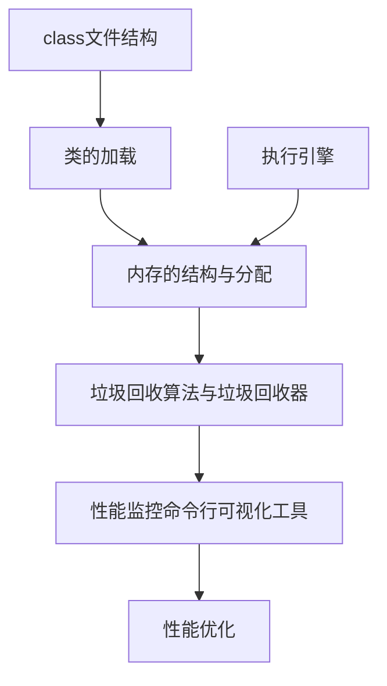

## 第1篇-字节码篇

### 1.01-课程内容介绍
### 1.02-JVM的概述内容

#### 如何理解JVM跨平台语言

#### Java发展的几个重大事件

现在的JMC就是之前JRockit提供的监控工具

dk1.7 默认垃圾收集器Parallel Scavenge（新生代）+Parallel Old（老年代）

jdk1.8 默认垃圾收集器Parallel Scavenge（新生代）+Parallel Old（老年代）

jdk1.9 默认垃圾收集器G1

CMS在14中被彻底干掉

ZGC是未来,目前还不是默认的垃圾回收器

#### 说说你认识的JVM

Graal VM是虚拟机未来

安卓使用的事Dalvik VM

#### JVM的生命周期
Java虚拟机的启动是通过引导类加载器(bootstrap class loader)创建一个初始类(initialclass)来完成的，这个类是由虚拟机的具体实现指定的。

#### 重点说下HotSpot
SUN的]DK版本从1.3.1开始运用HotSpot虚拟机，2006年底开源，主要使用C++实现，JNI接口部
分用C实现。

HotSpot,是较新的]ava虚拟机，使用JIT(Just in Time)编译器，可以大大提高Java运行的性能。

]ava原先是把源代码编译为字节码在虚拟机执行，这样执行速度较慢。而HotSpot将常用的部分代码编译为本地(原生，native)代码，这样显着提高了性能。

HotSpot JVM参数可以分为规则参数(standard options)和非规则参数(non-standard options).规则参数相对稳定，在]DK未来的版本里不会有太天的改动。非规则参数则有因升级]DK而改动的可能。

#### 画出JVM架构图

务必画出来

程序计数器,本地方法栈,虚拟机栈 线程私有

方法区,堆 多个线程共享

注意这是HotSpot JVM

JRockit,J9 没有涉及方法区概念

执行引擎就是一方面解释运行,另一方面就是JIT编译器对热点代码进行编译缓存

上图还有更详细版本

这个架构可以分成三层看：
- 最上层：javac编译器将编译好的字节码class文件，通过java类装载器执行机制，把对象或class文件存放在jvm划分内存区域。
- 中间层：称为Runtime Data Area,主要是在Java代码运行时用于存放数据的，从左至右为方法区（永久代、元数据区）、堆(共享，GC回收对象区域)、栈、程序计数器、寄存器、本地方法栈（私有）。
- 最下层：解释器、JIT(just in time)编译器和GC(Garbage Collection,垃圾回收器)

#### JVM有哪几块知识脉络

### 1.03-字节码文件的概述

#### 资金码文件是跨平台的吗?
Java虚拟机主要识别的字节码文件,已经不和编程语言耦合

#### 字节码文件里面是什么?
字节码是一种二进制的类文件,内容是JVM指令

#### 前端编译器种类
Java源代码的编译结果是字节码， 那么肯定需要有 一种编译器能够将]ava源码编译为字节码， 承担这个重要责任的就是配置在path环境变量中的javac编译器。 javac是一种能够将]ava源码编译为字节码的前端编译器

在Java的前端编译器领域，除了javac之外，还有一种被大家经常用到的前端编译器，那就是内置在
Eclipse中的ECJ(Eclipse Compiler for Java)编译器。和]avac的全量式编译不同，ECJ是一种增量式编译器。

默认情况下，Intel1i)IDEA使用javac编译置(还可以自己设置为Aspect]编译器ajc)

#### 前端编译器的任务
前端编译器的主要任务就是负责将符合]ava语法规范的]ava代码转换为符合JVM规范的字节码文件

### 1.04-跟字节码使用相关的几个面试代码题
### 1.05-class文件结构的分析
### 1.06-相关的字节码指令

## 第2篇-类的加载篇

### 1.07-类的加载概述_loading的阶段
### 2.01-链接环节的执行
### 2.02-类的初始化_主动使用与被动使用
### 2.03-类的使用与类的卸载
### 2.04-类的加载器的分类
### 2.05-ClassLoader的源码分析
### 2.06-自定义类的加载器
### 2.07-双亲委派机制
### 2.08-Tomcat的类加载机制

## 第3篇-运行时内存篇

### 2.09-程序计数器的理解
### 2.10-栈的理解
### 3.01-局部变量表的说明
### 3.02-操作数栈
### 3.03-动态链接(指向运行时常量池中该方法的引用）
### 3.04-方法返回地址
### 3.05-栈总结的5个面试问题
### 3.06-本地方法栈的说明
### 3.07-堆空间大小的设置
### 3.08-新生代与老年代的参数设置
### 3.09-对象分配过程
### 3.10-MinorGC、MajorGC、FullGC
### 3.11-方法区的设置_演进
### 4.01-小结

## 第4篇-对象内存布局

### 4.02-对象的创建方式
### 4.03-创建的对象的内存分配过程
### 4.04-对象的内存布局
### 4.05-对象的访问定位

## 第5篇：执行引擎篇

### 4.06-解释器与JIT编译器
### 4.07-JIT针对何种代码进行提前编译
### 4.08-两种不同的编译器C1和C2

## 第6篇-垃圾回收篇

### 4.09-GC的基本概念
### 4.10-引用技术算法的理解
### 4.11-可达性分析算法
### 4.12-垃圾标记和清除环节的算法
### 4.13-System.gc()与finalize()的说明
### 4.14-内存溢出和内存泄漏问题
### 4.15-安全点与安全区域_并行与并发
### 5.01-5种引用的说明
### 5.02-GC评价指标
### 5.03-GC的组合关系
### 5.04-SerialGC
### 5.05-ParNewGC
### 5.06-ParallelGC
### 5.07-CMSGC
### 5.08-G1GC
### 5.09-GC日志分析
### 5.10-案例一：堆溢出
### 5.11-案例二：元空间溢出
### 5.12-案例三：GC overhead limit exceeded
### 5.13-案例四：创建线程1
### 5.14-案例四：创建线程2

## 第7篇-VM性能监控篇
## 第8篇-VM性能调优案例篇

### 6.01-调优的基本问题
### 6.02-调优的步骤
### 6.03-Jmeter的配置
### 6.04-优化案例1：调整堆大小提升服务的吞吐量
### 6.05-优化案例2：逃逸分析之栈上分配
### 6.06-优化案例2：逃逸分析之标量替换、锁消除
### 6.07-优化案例3：合理配置堆内存
### 6.08-如何计算YGC发生频率
### 6.09-UseAdaptiveSizePolicy的使用
### 6.10-优化案例4：CPU占用很高的排查方案
### 6.11-优化案例5：G1并发GC线程数对性能的影响
### 6.12-优化案例6：调整垃圾回收器对吞吐量的影响
### 6.13-优化案例7：日均百万订单如何设置JVM参数
### 6.14-多种命令行工具的使用
### 6.15-Arthas的基本使用
### 6.16-课程结束