## 01 -导论

### 什么是 GOF?
在 1994 年，由 Erich Gamma、Richard Helm、Ralph Johnson 和 John Vlissides 四人合著出版了一本名为 Design Patterns - Elements of Reusable Object-Oriented Software（中文译名：设计模式 - 可复用的面向对象软件元素） 的书，该书首次提到了软件开发中设计模式的概念。

**对接口编程**而不是对实现编程。
**优先使用对象组合**而不是继承。

### 什么是对实现编程?
B在使用A的方法,经常使用的是其实现类,而不是接口定义的抽象方法

### 设计模式的基石是什么?

- 面向对象的三大特性
  - 封装, 零散的内容封装在一起
  - 继承, 通过类的继承关系不断进行功能扩展
  - 多态, 传入A1调A1,传入A2调A2


### 设计模式总览

- 创建型模式（Creational Patterns）
  - 单例（Singleton）模式
  - 原型（Prototype）模式
  - 工厂方法（FactoryMethod）模式
  - 抽象工厂（AbstractFactory）模式
  - 建造者（Builder）模式

- 结构型模式（Structural Patterns）
  - 代理（Proxy）模式
  - 适配器（Adapter）模式
  - 桥接（Bridge）模式
  - 装饰（Decorator）模式
  - 外观（Facade）模式
  - 享元（Flyweight）模式
  - 组合（Composite）模式
  - 过滤器模式（Filter Pattern）

- 行为型模式（Behavioral Patterns）
  - 模板方法（Template Method）模式
  - 策略（Strategy）模式
  - 命令（Command）模式
  - 职责链（Chain of Responsibility）模式
  - 状态（State）模式
  - 观察者（Observer）模式
  - 中介者（Mediator）模式
  - 迭代器（Iterator）模式
  - 访问者（Visitor）模式
  - 备忘录（Memento）模式
  - 解释器（Interpreter）模式

### 为什么要分为这三种类型?


要完成一个功能,第一步要定义一个类,要有什么属性和方法

第二步,我们要创建类的对象,才能干活

第三步,最后调用类对象的相关方法,让类完成相应的功能2

实际上设计模式是混用的

设计模式复杂的联动也是框架的核心,当你扒清他的内结构发现清楚他的方法调用以后所有的框架对你来说都是非常easy的

### 设计的七大原则

这是我们做设计时需要考虑的原则,但不是必须的原则,如果采用后导致系统复杂度上升一个数量级,就没必要使用这个

- 开闭原则（Open Closed Principle，OCP）

    软件实体应当对扩展开放，对修改关闭（Software entities should be open for extension，but closed for modification）

    合成复用原则、里氏替换原则相辅相成，都是开闭原则的具体实现规范

    **扩展新类而不是修改旧类**

    一个功能的新增,修改最好通过增加类的方式解决

- 里氏替换原则（Liskov Substitution Principle，LSP）

    继承必须确保超类所拥有的性质在子类中仍然成立（Inheritance should ensure that any property proved about supertype objects also holds for subtype objects）

    **继承父类而不去改变父类**

    子类不去重写父类已经定义好的方法,而是重写父类留给拓展的方法,那么在定义父类的时候就要注意,如果方法是会变动的,就留下扩展的方法定义


- 依赖倒置原则（Dependence Inversion Principle，DIP）

    高层模块不应该依赖低层模块，两者都应该依赖其抽象；抽象不应该依赖细节，细节应该依赖抽象（High level modules shouldnot depend upon low level modules.Both should depend upon abstractions.Abstractions should not depend upon details. Details should depend upon abstractions）

    **面向接口编程，而不是面向实现类**

    A,B是抽象类

    a1,b1分别是其实现类,是细节

    A里面不应该出现b1的引用,a1依赖b1,不能引用b1,而应该是B

- 单一职责原则（Single Responsibility Principle，SRP）

    一个类应该有且仅有一个引起它变化的原因，否则类应该被拆分（There should never be more than one reason for a class to change）

    **每个类只负责自己的事情，而不是变成万能**
    
    

- 接口隔离原则（Interface Segregation Principle，ISP）

    一个类对另一个类的依赖应该建立在最小的接口上（The dependency of one class to another one should depend on the smallest possible interface）。

    **各个类建立自己的专用接口，而不是建立万能接口**


- 迪米特法则（Law of Demeter，LoD）

    最少知识原则（Least Knowledge Principle，LKP)

    只与你的直接朋友交谈，不跟“陌生人”说话（Talk only to your immediate friends and not to strangers）

    **无需直接交互的两个类，如果需要交互，使用中间者**

    **过度使用迪米特法则会使系统产生大量的中介类，从而增加系统的复杂性，使模块之间的通信效率降低**


- 合成复用原则（Composite Reuse Principle，CRP）

    又叫组合/聚合复用原则（Composition/Aggregate Reuse Principle，CARP）

    软件复用时，要尽量先使用组合或者聚合等关联关系来实现，其次才考虑使用继承关系来实现

    **优先组合，其次继承**

    组合指的是作为一个对象放到属性中,继承指的是继承所有属性

## 02 -创建型模式-为什么使用创建型模式

单例(Singleton)模式

原型(Prototype)模式

工厂方法(FactoryMethod)模式

抽象工厂(AbstractFactory)模式

>工厂方法和抽象工厂可以统一叫工厂模式

建造者(Builder)模式

- 创建型设计模式关注点"怎样创建出对象"

- "对象的创建和使用分离"

- 降低系统的耦合度

- 使用者无需关注对象的创建细节
  - 对象的创建由相关的工厂来完成:(各种工厂模式)
    - 使用者不关注细节
  - 对象的创建由一个建造者来完成(建造者模式)
    - 使用者关注创建过程中的一些细节
  - 对象的创建由原来对象克隆完成 (原型模式)
  - 对象再系统中只有一个实例 (单例模式)

## 03 -创建型模式-单例的演示

- 一个单一的类,负责创建自己的对象,同时确保系统中只有单个对象被创建

单例特点
- 某个类只能有一个实例；（构造器私有）
- 它必须自行创建这个实例；（自己编写实例化逻辑）
- 它必须自行向整个系统提供这个实例；（对外提供实例化方法）


## 04 -创建型模式-单例的应用场景

- 什么场景用到？
  - 多线程中的线程池
  - 数据库的连接池
  - 系统环境信息
  - 上下文(ServletContext)
  
- 面试问题
  - 系统环境信息(System.getProperties（）)?
  - Spring中怎么保持组件单例的？
  - ServletContext是什么？是单例吗？怎么保证？
    - ApplicationContext:tomcat:一个应用会有一个应用上下文
    - ApplicationContext:Spring:：表示整个I0C容器(怎么保证单例)。ioc容器中有很多组件(怎么保证单例)
  - ApplicationContext是什么？是单例吗？怎么保证？
  - 数据库连接池一般怎么创建出来的，怎么保证单实例？

## 05 -创建型模式-原型模式
创建重复对象,同时能保证性能

1、GuiguMyBatis:操作数据库，从数据库里面查出很多记录(70%改变很少)

2、每次查数据库，查到以后把所有数据都封装一个对象，返回。

  10000 thread:查一个记录：new User("zhangsan",18);每次创建一个对象封装并返回

  系统里面就会有10000个User:浪费内存

3、解决：缓存；查过的保存。如果再查就返回


从缓存中直接拿容易读到别的进程修改后的内容,因此不能直接给

希望能快速得到克隆体就需要原型模式

实现Cloneable接口,重写克隆方法

- 什么场景用到？
  - 资源优化
  - 性能和安全要求
  - 一个对象多个修改者的场景。
  - 一个对象需要提供给其他对象访问，而且各个调用者可能都需要修改其值时可以考虑使用原型模式拷贝多个对象供调用者使用。

## 06 -创建型模式-工厂-简单工厂模式

工厂模式(Factory Pattern)提供了一种创建对象的最佳方式。我们不必关心对象的创建细节，只需要根据不同情况获取不同产品即可

从易到难

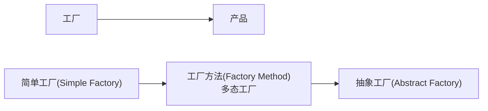

简单工厂呢产品数量有限,只需要if 判断就能解决

更多的产品就违反开闭原则

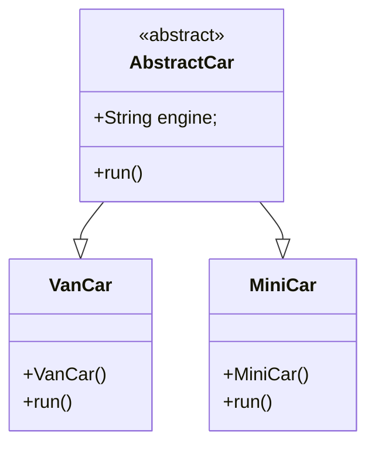

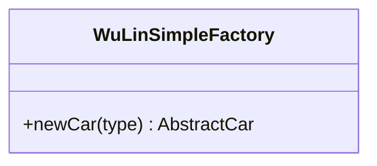

## 07 -创建型模式-工厂-工厂方法模式


怎么把一个功能提升一个层次：定义抽象(抽象类，接口)
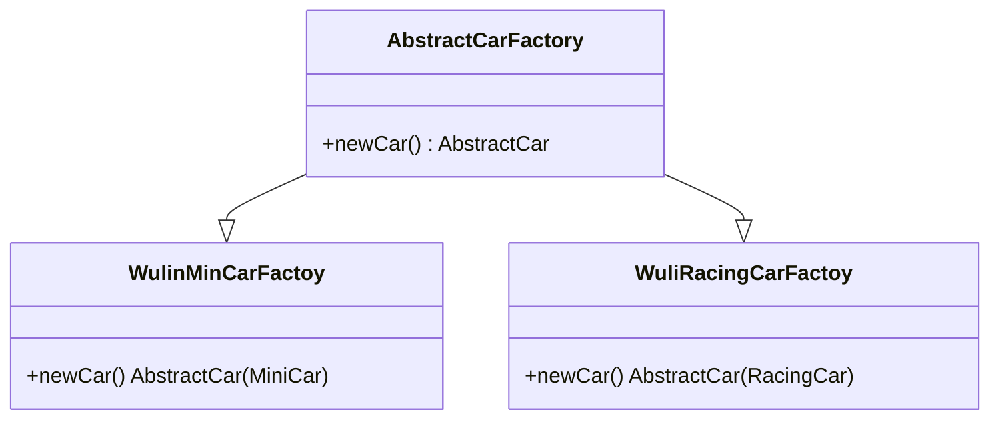
之前是一个工厂生产多种车,现在变成一个工厂生产一类车,


四种产品

- Product 抽象产品 Abstract Car
- ConcreteProduct 具体产品 MiniCar VanCar
- Factory 抽象工厂 定义能干什么 AbstractCarFactory
- ConcreteFactory 具体工厂 生产什么东西

方法一多以后就又会变复杂,上面的例子产品都是汽车,如果想生产其他产品,就会出现问题
## 08 -创建型模式-工厂-抽象工厂模式
产品等级 和 产品族

同一种产品的不同类型就是产品等级(小米/华为)

产品族是指由同一个工厂生产的


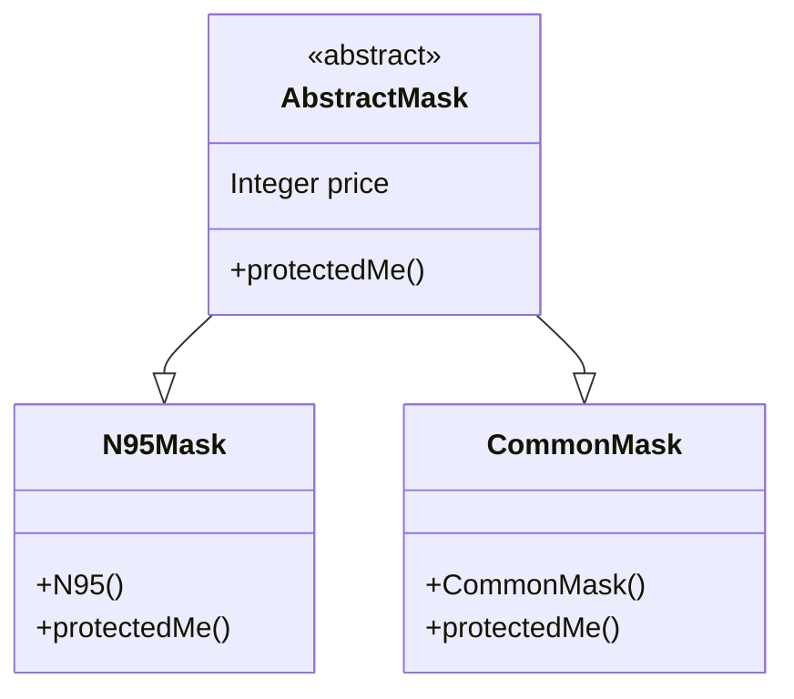

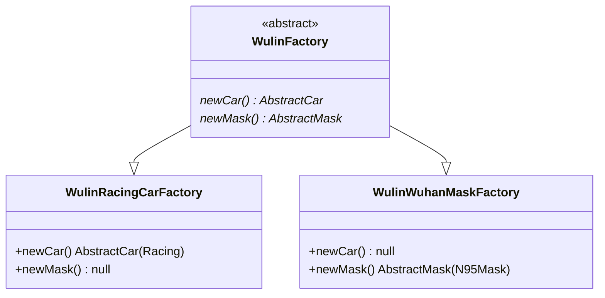

## 何时用接口,何时用抽象类

如果只是方法,可以用接口

如果有一些属性需要向下传递,则需要抽象类

## 09 -创建型模式-工厂-工厂模式的思考

如果只有一个产品,抽象工厂退化为工厂方法模式,如果一个产品下面类型数量不多,退化为简单工厂

## 10 -创建型模式-建造者
构建细节复杂,但是必须暴露给使用者

屏蔽过程,但不屏蔽细节

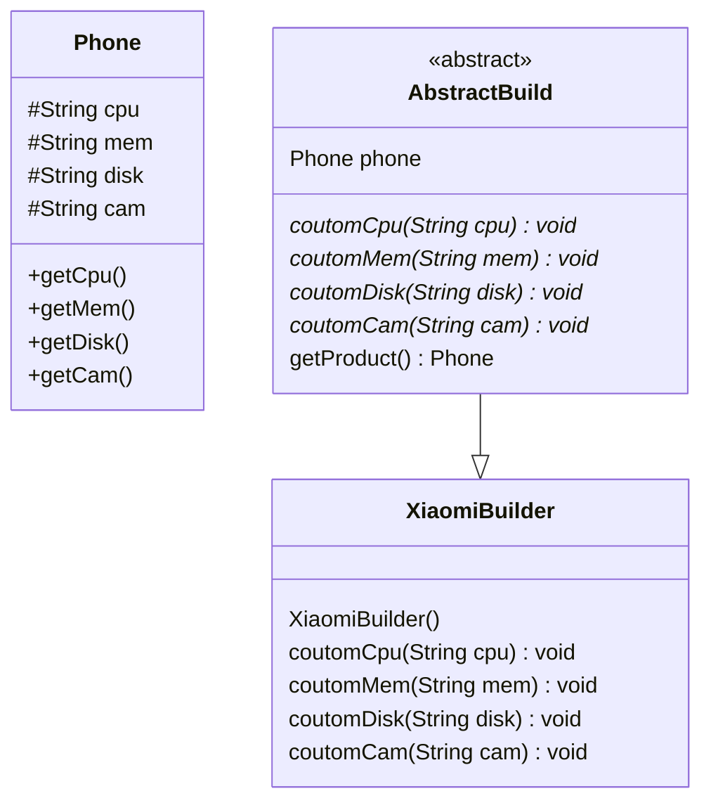

## 11 -结构型模式-适配器
- **结构型模式**关注点“**怎样组合对象/类**？”所以我们关注下类的组合关系
- **类结构型模式**关心类的组合，由多个类可以组合成一个更大的（继承）
- **对象结构型模式**关心类与对象的组合，通过**关联关系**在一个类中定义另一个类的实例对象（组合）
- 根据“**合成复用原则**”，在系统中尽量使用关联关系来替代继承关系，因此大部分结构型模式都是对象结构型模式。

- **适配器模式**(Adapter Pattern):两个不兼容接口之间适配的桥梁
- **桥接模式**(Bridge Pattern):相同功能抽象化与实现化解耦，抽象与实现可以独立升级。
- **过滤器模式**(Filter、Criteria Pattern):使用不同的标准来过滤一组对象
- **组合模式**(Composite Pattern)：相似对象进行组合，形成树形结构
- **装饰器模式**(Decorator Pattern):向一个现有的对象添加新的功能，同时又不改变其结构
- **外观模式**(Facade Pattern)：向现有的系统添加一个接口，客户端访问此接口来隐藏系统的复杂性。
- **享元模式**(Flyweight Pattern):尝试重用现有的同类对象，如果未找到匹配的对象，则创建新对象
- **代理模式**(Proxy Pattern):一个类代表另一个类的功能

将一个接口转换成客户希望的另一个接口，适配器模式使接口不兼容的那些类可以一起工作，适配器模式分为类结构型模式（继承）和对象结构型模式（组合）两种，前者（继承）类之间的耦合度比后者高，且要求程序员了解现有组件库中的相关组件的内部结构，所以应用相对较少些。

别名也可以是Wrapper,包装器

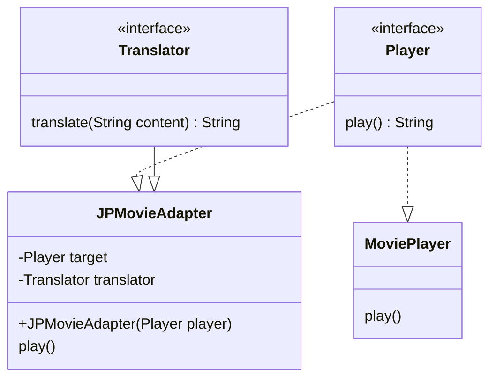

## 12 -结构型模式-适配器一些场景

Tomcat如何将Request流转为标准Request;

·tomcat.Request接口

·serv|et.Request:接口

tomcat===CoyoteAdapte ===ServletRequest

Spring AOP中的AdvisorAdapter是什么

Spring MVC中经典的HandlerAdapter是什么

SpringBoot中WebMvcConfi gurer Adapter为什么存在又取消

## 13 -结构型模式-桥接模式

系统设计期间，如果这个类里面的一些东西，会扩展很多，这个东西就应该分离出来

抽象化(Abstraction)角色：定义抽象类，并包含一个对实现化对象的引用。

扩展抽象化(Refined Abstraction)角色：是抽象化角色的子类，实现父类中的业务方法，并通过组合关系调用实现化角色中的业务方法

实现化(Implementor)角色：定义实现化角色的接口，供扩展抽象化角色调用。

**适配器是在用的过程中,需要添加的,桥接是在设计阶段就要添加的**
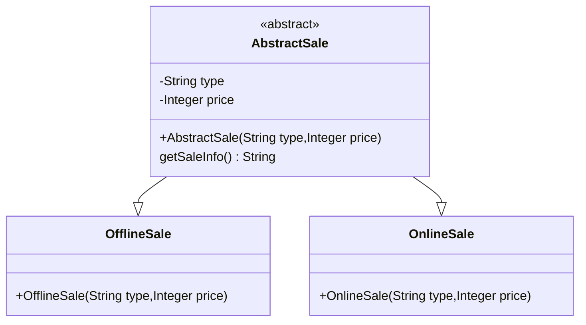

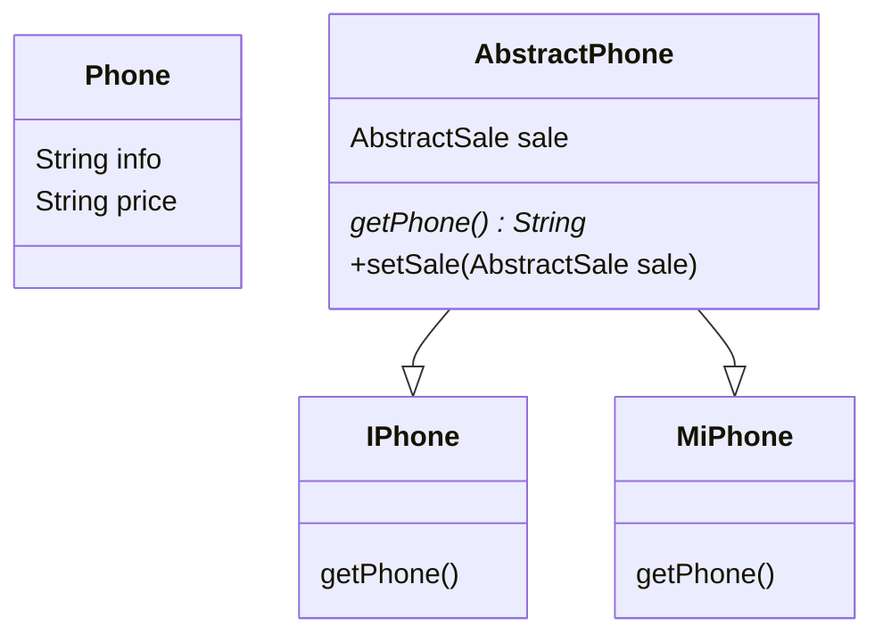

桥接节省了类的创建

真正会引起此类变化的一个维度直接抽取出来,通过组合的方式接起来


## 14 -结构型模式-理解适配器与装饰器
都可以称为Wrapper

适配器是连接两个类,可以增强一个类

装饰器是增强一个类


## 15 -结构型模式-装饰器
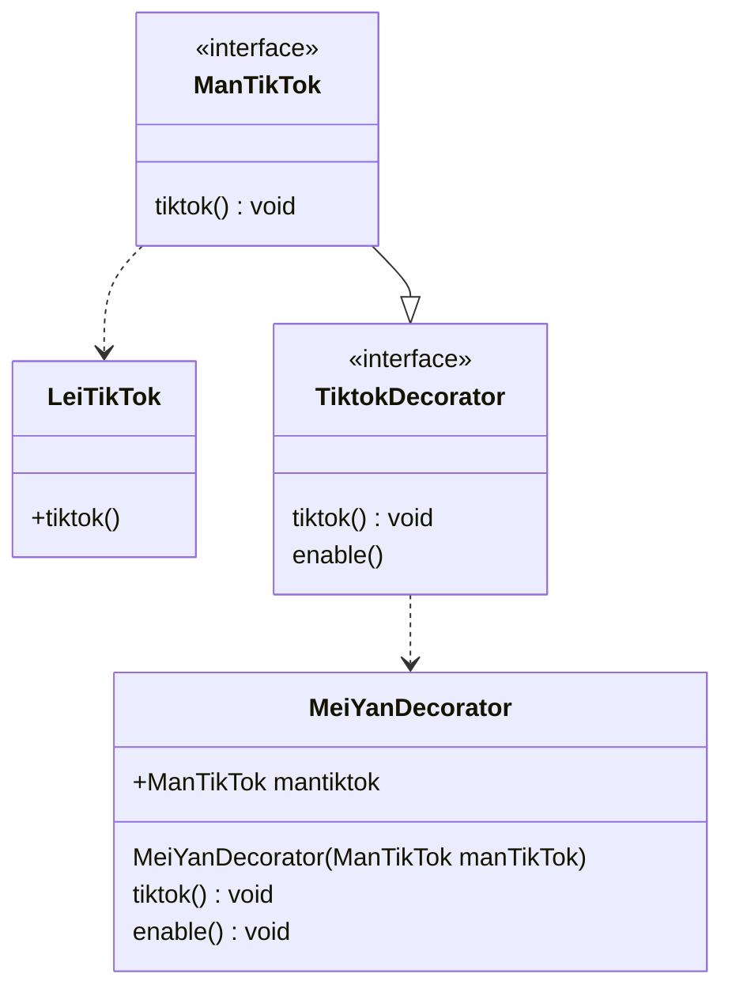

调用别人的美颜功能就是适配器,调用自己写的美颜就是装饰器

已存在的类,在某一天发现功能不够,就可以用装饰器

SpringSessiont中如何进行session与redis关联？HttpRequestWrapper
MyBatisPlus提取了QueryWrapper,这是什么？
Spr ing中的BeanWrapper是做什么？
Spring Webflux中的WebHandlerDecorator?
## 16 -结构型模式-代理模式-静态代理

代理模式(Proxy Pattern),给某一个对象提供一个代理，并由代理对象控制对原对象的引用，对象结构型模式。这种也是静态代理

静态代理和装饰器一摸一样

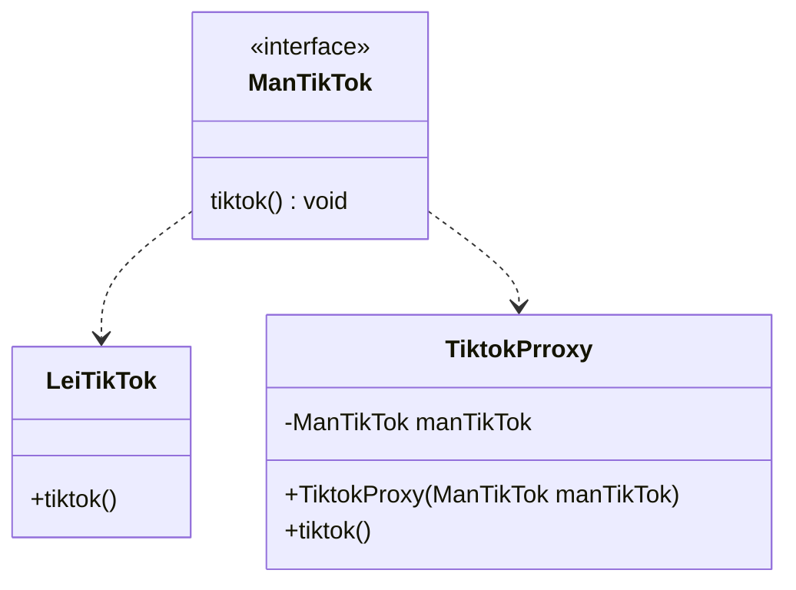

静态代理就是装饰器

装饰器模式是代理模式的一种
## 17 -结构型模式-代理模式-jdk动态代理
静态代理 不同的代理对象,要创建不同的静态代理类

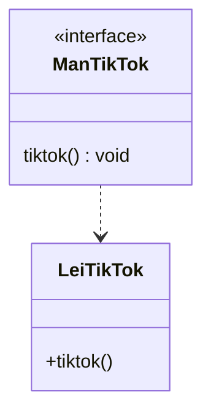

JDK动态代理,代理对象和目标对象的共同点在于都是同一个接口
```java
public class JdkTiktokProxy<T> implements InvocationHandler {
  public static<T> T getProxy(T t) {
    private T target;
    JdkTiktokProxy (T target) {
      this.target=target;
    }
    // 想要获取代理对象,可以调用Proxy的方法,创建代理对象的实例
    // 传入当前被代理对象的类加载器,
    // 当前被代理对象的接口,
    // 执行处理器,当前被代理对象执行目标方法的时候我们使用
    Proxy.newProxyInstance(ClassLoader loader,
                            Class<?>[] interfaces,
                            InvocationHandler h)
    Proxy.newProxyInstance(t.getClass().getClassLoader(),
                            t.getClass().getinterfaces(),
                            new JdkTiktokProxy(t))

    // 实现了invokationHandler接口,可以重写invoke方法
    // 定义目标方法的拦截逻辑
    @Override
    public Object invoke(Object proxy,
                        Method method,
                        Object[] args) throws Throwable {
      //添加增强功能
      // 反射执行                    
      Object invode = method.invoke(target, args);
      return invode;
    }

  }
}
```
只能代理接口的方法,自己的方法不能被代理,JDK缺点就是一定要实现接口

CGlib可以解决这个问题

## 18 -结构型模式-代理模式-cglib

```java
public class CglibProxy {
  public static<T> T createProxy(T t){
    // 1.创建一个增强器
    Enhancer enhancer = new Enhancer();

    // 2.设置要增强哪个类的功能,增强器为这个类动态创建一个子类
    enhancer.setSuperclass(t.getClass);

    //3. 设置回调,参数是一个接口Callback,叫做Methodintercepter,拦截父类的所有方法
    enhancer.setCallback(
      new MethodInterceptor() {
        @Override
        public Object intercept(Object obj,
                                Method method,
                                Object[] args,
                                MethodProxy proxy){
        // 编写拦截逻辑,写增强逻辑
        
        // 目标方法进行执行
        Object invoke = proxy.invokeSuper(obj,args);
        // 注意不要调invoke方法,自己调自己会递归
        }
      }
    )

    Object o = enhancer.create();
    return (T)o;
  }
}
```
## 19 -结构型模式-代理模式-场景
## 20 -结构型模式-外观模式
又称门面模式,为复杂子系统提供一致的接口,使得子系统更容易被访问


分布式系统的网关,将很多东西统一对外暴露

## 20 -结构型模式-组合模式
组合模式基本上一直在使用


## 21 -结构型模式-享元模式

当有大量的对象一个人用完以后,另一个人还要用,这时候要怎么处理

就是"池技术"

享元模式就需要考虑什么可以共享,什么不能共享

享元模式一般和简单工厂搭配,因为产品就一个Connect

### 享元和原型的区别?

享元返回的是本人

原型返回的是克隆

## 22 -行为模式-模板模式

行为型模式分为类行为模式和对象行为模式

类型为模式:通过继承来得到行为

对象行为模式:组合来得到行为

### 行为型模式有哪些?

**模板方法**(Template Method)模式：父类定义算法骨架，某些实现放在子类

策略(Strategy)模式：每种算法独立封装，根据不同情况使用不同算法策略

状态(State)模式：每种状态独立封装，不同状态内部封装了不同行为

命令(Command)模式：将一个请求封装为一个对象，使发出请求的责任和执行请求的责任分割开

职责链(Chain of Responsibility)模式：所有处理者封装为链式结构，依次调用

备忘录(Memento)模式：把核心信息抽取出来，可以进行保存

**解释器**(Interpreter)模式：定义语法解析规则

观察者(Observer)模式：维护多个观察者依赖，状态变化通知所有观察者

中介者(Mediator)模式：取消类/对象的直接调用关系，使用中介者维护

迭代器(Iterator)模式：定义集合数据的遍历规则

访问者(Visitor)模式：分离对象结构，与元素的执行算法

除了**模板方法**模式和**解释器**模式是**类行为型模式**，其他的全部属于**对象行为型**模式

模板方法,定义抽象类,类里面可以实现某些步骤,关键步骤可以留给子类实现

总体还是按照父类的

## 23 -行为模式-策略模式

定义了一系列算法,把每个算法封装起来,可以相互替换,算法的变化不会影响到客户

定义一个算法接口,再具体策略里面实现方法

目前对策略模式的理解还是在重写方法,
## 24 -行为模式-状态模式

把有状态的对象,把复杂的"判断逻辑"提取到不同的状态对象中,允许状态对象在其内部状态变化时改变其行为

### 状态模式和策略模式的区别?
状态模式多了一个状态流转的方法

可以给外界设置状态的方法或直接next流转到下一个状态
## 25 -行为模式-中介者模式

把网状交互关系,换成星状交互关系

之前一个状态变化,需要把其他相关所有都遍历一边,如果用中介者
## 26 -行为模式-观察者模式
观察者又叫发布订阅模式

挨个通知


## 28 -行为模式-备忘录模式
## 29 -行为模式-解释器模式
## 30 -行为模式-命令模式
## 31 -行为模式-迭代器模式
## 32 -行为模式-访问者模式
## 33 -行为模式-访问者模式-幸好很少
## 34 -行为模式-简单责任链模式
## 35 -行为模式-完整责任链模式
## 36 -小总结

Spring源码分析-01-gradle急速安装与配置入门
Spring源码分析-02-源码环境搭建