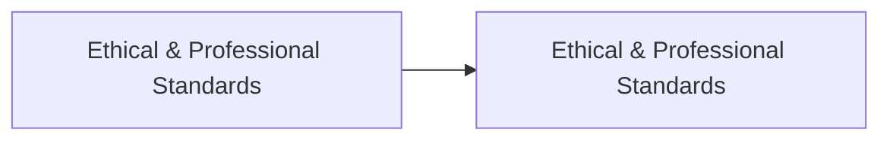
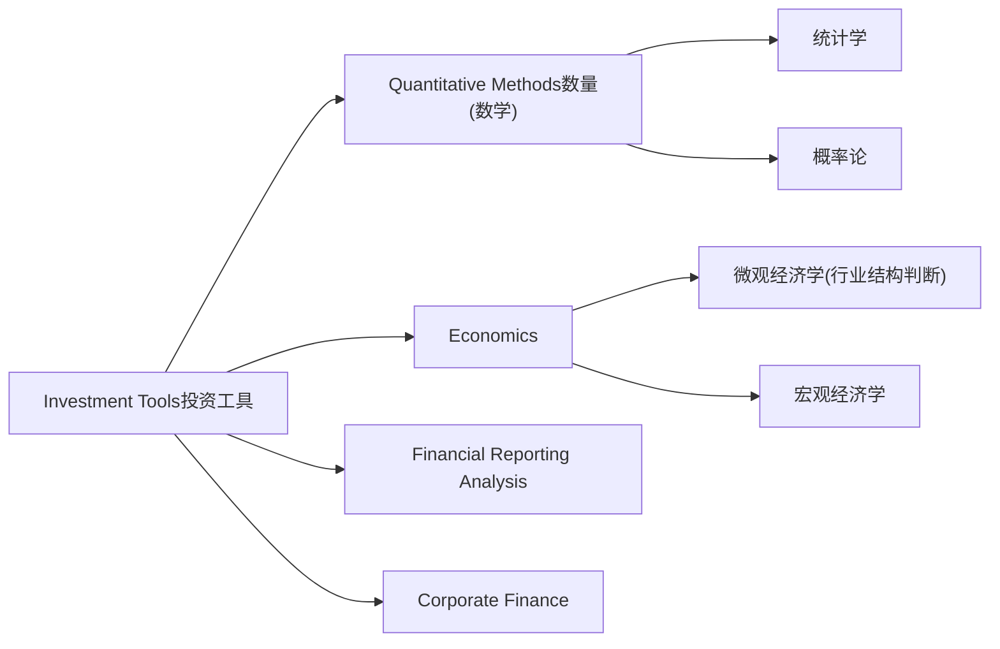
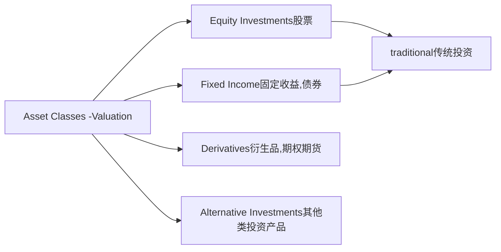
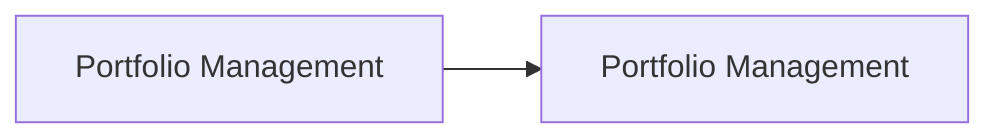

## 01-框架介绍+金融英语

### 01-金融框架+金融英语

CFA全称 charted financial analyst

主流市场上有两类分析师

第一类 sell side 卖方分析师

> 券商,投行研究院(不承诺业绩)
>
> 原则上卖方研究院通常不与业务挂钩,往往一些券商会让研究院的报告质量和经济业务挂钩
> 
> 经济业务:大家拿钱去券商开户,券商帮你做投资,开一个资金账户一个证券账户,他会收取佣金
>
> 投行业务不能挂钩
> 
> 投行业务是承销做IPO或者兼并收购业务
> 
> 1. 如果有内幕消息,偷偷告诉研究员,出了一个非常有价值的报告,对别的研究院不公平
> >
> 2. 劝说别的工资负责人把IPO业务放到我投行部门来做,研究部给一个买入建议,并不独立客观

第二类 bey side 买方分析师

> 基金经理(对业绩承诺)

CFA一级,二级培养卖方分析师

CFA三级 自负盈亏的基金经理

#### 一级和二级 三级主要的区别?

一级的题干会比较的短一些

二级考察的叫做case题,通常情况下是给你一页或者说两页A4纸,当中呢会描述一个场景,后面会跟着六道或者四道题目

三级分为两部分,

第一个部分写作题 essay 不需要完整的写出什么东西,只要达到对应的考点,关键字就能拿分,

第二部分案例题,三级呢可能要两到三页A4

一级基本上是以广度取胜的一个考试,以定性的概念题为主,计算量呢相对来说是比较低的

二级主要培养的就是sell side,教研究员怎么样去写报告的,相关的一些理论知识,思维方法,涉及很多数学吗模型,对股票有一个估值

三级主要培养的就是买方,写IPS, investment policy statement (投资策划建议书/投资政策声明)

规定好我资金经理和客户两者之间的权利义务,了解客户相关的方方面面的基本情况

#### 七块内容 R R T T L L U

**objectives 目标**

1. R : return 收益
2. R : risk 风险

在给定了风险承受力下决定你的收益目标

**constrain 限制**

3. T : time horizon 投资期限
4. T : tax 税务问题
5. L : liquid needs 流动性需求(大额的不定时的现金流出,某一个时间点一次性的这个支出)
6. L : legal and regulatory 法律法规相关 个人投资者不能投资IPO 银行这种低风险承受力的机构不能去投资一些高风险的另类投资或者说衍生品
7. U : unique circumstances 客户的特殊要求

#### 分析师要分析一家公司好还是不好,两种分析思路

1. bottom-up 自下而上
   1. 小散户的思路,出了一个利好消息就去买,利空消息去卖
2. top-down 自上而下
   1. 从最最上层宏观经济进行分析,整体这个国家的经济表现,经济周期是属于哪一个阶段,第二步就是分析行业,经济好的时候投资一些周期性的行业, 经济不好的时候投资一些教育医疗这种防御性的行业,第三步在好的行业当中选择表现好的个股

IPS后就是执行

第一步是做资产大类的配置(Asset Allocation)每一项大类资产要投资多少权重

第二步细分的个体股票的配置呢 security selection

第三步构建组合 PAFOLIO construction 

执行完就是反馈

反馈就是跟踪,关注我整体组合的一个收益

第一件事:计算业绩,收益多少,风险多少

第二件事:评估一下基金经理的业绩,找到一个 benchmark(基准业绩) 和基金经理的真实业绩去进行比较

用大盘股指的业绩作为 benchmark ,假设大盘股指的收益率是8%,基金经理给我带来的收益率呢是10%,投资组合的真实业绩,超过这个 benchmark 8%的部分就是我们所说的 $\alpha$ 

$$ \mathop{\alpha}\limits_{abnormal\ return} = \mathop{R_p}\limits_{10\%} - \mathop{R_B}\limits_{8\%} $$

中文称为超额收益

基金经理的主要目的就是要怎么样获取超额收益,如果这个基因经理的业绩还不如这个指数表现的好肯定不会找他做投资啊,直接买指数基金就好

只有当你真实的业绩超过这个基准业绩benchmark的时候才觉得你表现的比较好

三级有50%的题目教你怎么样去构建组合

#### CFA考试科目

道德是CFA骄傲的部分,都是英文法律法规

一级学完,二三只需要复习

一级数学不难,稍微删除大学数学

分析一家公司从两个角度来判断,1.从外部分析师,对公司不太了解的人认识公司就是看财报

站在内部管理者角度, 第一 钱从哪里来,资金来源

1. 从银行接的钱,是debt

2. 从股东拿的钱是equity

公司希望尽可能低的融资成本,就会决定发债和发股的比例

一级研究平均的融资成本是怎么计算的

第二 钱怎么花?

评价一个项目好坏的五个指标

企业理财中详讲

第三, 公司组织架构

架构是否合理能不能使所有利益相关者利益最大化

确定各种投资品的权重

道德和财务报表分析是重点

#### CFA考试流程

需要的时候再来查视频讲解

### 02-科目框架
道德的题目3分钟一道题

#### 道德

- Framework of Ethics
  - Code of Ethics 总纲性条款,高的要求,做不到也无法惩罚
  - Guidance for Standards I-VII 七条准则,最低要求
      
      Ⅰ.Professionalism 职业精神

      

展开

      Knowledge of the law;对法律法规了解 

      Independence and objectivity;独立客观 

      Misrepresentation;不当陈述 

      Misconduct欺诈行为 
      
  

      Ⅱ.Integrity of capital markets (天) 对资本市场正直诚信

      

展开

      Material nonpublic information;非公开信息,内幕消息MNI 

      Market manipulation操纵市场 
      
  

      Ⅲ.Duty To clients(地)

      

展开

      Loyalty,prudence and care;忠诚,  审慎关心 
      Fair dealing;公平对待 
      Suitability;合适性 
      Performance presentation业绩诚实 
      Preservation of confidentiality保密义务 
      

      
      Ⅳ.Duty To employers(人)

      

展开

      Loyalty; 
      Additional compensation arrangements;额外收入兼职 
      Responsibility of supervisors保证手下员工合规 
      
      

      Ⅴ.Investment

      

展开

      Diligence and reasonable basis;勤勉尽责 合理依据 
      Communication with clients; 
      Record retention 记录保存 
      
  
      Ⅵ.Conflicts of interest 利益冲突interest1.利息,2.利益

      

展开

      Disclosure of conflicts; 披露冲突 
      Priority of transaction;客户交易优先 
      Referral fees介绍费 
      
  
      
      Ⅶ.Responsibility as members

      

展开

      Conduct as members and candidates; 
      Reference to CFA institute,designation 
      
  
  - Global Investment Performance Standards(GIPS)全球业绩衡量标准
    - 教基金经理怎么样去汇报业绩(自愿)
- Framework of Quantitative Methods
  - The Time Value of Money 货币的时间价值
    - 市面上各种利率
    - 年金,时间间隔,方向,数量相同,称为年金
  - Application of Discounted Cash Flow 
  - Statistical Concepts and Market Returns
  - Probability Concepts 概率论
  - Common Probability Distributions
  - Sampling and Estimation 抽样
  - Hypothesis Testing 假设检验
  - Technical Analysis
- Framework of Economics
  - Topics in Demand (需求) and Supply(供给) Analysis
  - The Firm and Market Structures
  - Aggregate Output,Price,and Economic Growth
  - Understand Business Cycles
  - Monetary and Fiscal Policy 货币和财政政策
  - International Trade and Capital Flows
  - Currency Exchange Rates
- Framework of Financial Statement Analysis
  - Introduction
    - Introduction to Financial Statement Analysis
    - Financial Reporting Standards
  - ✔Three major financial statements 站在会计角度衡量
    - Income Statement 利润表(I/S)损益表 净赚多少钱
    - Balance Sheet 资产负债表(B/S)
    - Cash Flow Statement 现金流量表 (CFS C/F)
    - Financial Analysis Techniques 财务报表分析技术
  - ✔Specific categories in financial statements 站在分析师需要关注几个容易被操纵的点
    - Inventories 存货:代表的是公司生产出来要卖的这部分商品 
    - Long--lived Assets 长期资产 一年以上的固定资产
    - Income Taxes 
    - Non-current Liabilities 长期负债
  - Financial Reporting Quality and Financial Statement Analysis应用
- Framework of Corporate Finance 公司金融,企业理财
  - Introduction to Corporate Governance and Other ESG Considerations
  - Capital Budgeting 资本预算
  - Working Capital Management 营运资本 对短期资产和短期负债的管理
  - Cost of Capital 融资成本
  - Measures of Leverage 杠杆
    - 经营杠杆 
    - 财务杠杆
    - 总杠杆
### 03-科目框架201
- Framework of Equity 权益类投资
  - Equity Market Introduction
    - 重点Market Organization and Structure 分类/资产/头寸/指令
    - Security Market Indices 市场指数
    - Market Efficiency
  - Equity Analysis and Valuation
    - Overview of Equity Securities
    - Introduction to Industry and Company Analysis
    - Equity Valuation:Concepts and Basic Tools
    - Discounted cash flow models
      - Multiplier models
      - Asset-based models

- Framework of Fixed Income 各种债券
  - Basic Concepts
    - Fixed-Income Securities:Defining Elements 定义元素
    - Fixed-Income Markets:Issuance,Trading,and Funding 发行,交易,融资
    - Introduction to Fixed-Income Valuation 估值
    - Introduction to Asset-Backed Securities 资产支持证券
  - Analysis of Risk
    - Understanding Fixed-Income Risk and Return
      - Duration 久期(一阶导)& Convexity 凸性(二阶导)
    - Fundamentals of Credit Analysis
- Framework of Derivatives 衍生品
  - Derivative Markets and Instruments
    - Forward
    - Futures
    - Option
    - Swap
    - Other derivatives(credit derivatives,e.g.credit default swap)
  - Basics of Derivative Pricing and Valuation
    - Risk neutral approach 风险中性定价方法
    - Put call Parity 买卖权的一个评价理论
- Framework of Alternative Investments 另类投资
  - Introduction to Alternative Investments
    - Hedge funds 对冲基金 风险大 净资产千万以上
      - Funds of funds FOF 本质还是对冲基金,购买其他对冲基金 使用比较穷投资者,
      - Fee structures  费率高
    - Private equity 私募PE 投资非上市公司
      - Venture capital 风投 投资相对初创企业,未来有了退出机制就可以赚很多,失败率高
      - LBO 杠杆收购 空手套白狼 相对成熟,风险小,收益较低
    - Real estate 房地产
      - REITs
      - Performance,diversification
    - Commodity 大宗商品
      - Investment vehicles
      - Futures pricing
    - Infrastructure 基建
    - Other alternative instruments

  - Framework of Portfolio Management 组合管理
    - Portfolio Management:An Overview 
    - Classical Portfolio Theory
      - Modern Portfolio Theory 现代组合管理理论
      - Capital Market Theory 资本市场理论
    - Basics of Portfolio Planning and Construction 教如何写IPS
      - Portfolio Construction Procedure
      - Investment Policy Statement
    - Introduction to Risk Management 风控 分散风险 FRM更多研究风险发生该概率
    - Technical Analysis
    - Fintech Investment Management 金融科技
### 03-科目框架202
### 03-科目框架203
### 04-金融英语

## 02-财务前导

### 01-框架介绍
### 02-资产负债表利润表
### 03-现金流量表三大支柱
### 04-RatioAnalysis01
### 04-RatioAnalysis02
### 04-RatioAnalysis03

## 03-数量前导+金融计算

### 01-利率的构成
### 02-EAR01
### 02-EAR02
### 02-EAR03
### 03-年金NPVIRR均值方差
### 04-概率论推断性统计学01
### 04-概率论推断性统计学02
### 04-概率论推断性统计学03

## 01-Calculator Guidance

### 01-Introduction
### 02-Setting Up the Calculator & Memory Functions
### 03-Time Value of Money
### 04-Capital Budgeting
### 05-Statistics(Standard Deviation)
### 06-Linear Regression and Covariance
### 07-Probabilities

## 02-Time Value of Money

### 01-Interest Rate（1）
### 02-Interest Rate（2）
### 03-Present Value and Future Value(1)
### 04-Present Value and Future Value(2)
### 05-Evaluation of Cash Flow Stream
### 06-Return & Yield Measurements

## 03-Ethics

### 01-Introduction
### 02-I(B) Independence & Objectivity
### 03-I(C) Misrepresentation
### 04-I(D) Misconduct
### 05-II(A) Material Nonpublic Information
### 06-III(B) Fair Dealing
### 07-III(C) Suitability
### 08-III(E) Preservation of Confidentiality
### 09-IV(A) Loyalty
### 10-V(A) Diligence and Reasonable Basis
### 11-VI(A) Disclosure of Conflicts
### 12-Responsibilities as a CFA member or candidate

## 04-Quantitative Method

### 01-Quantitative MethodsApplication
### 02-Statistical Concept
### 03-Central Tendency(1)
### 04-Central Tendency(2)
### 05-Dispersion
### 06-Probability Concepts
### 07-Bayes'Formula
### 08-Discrete Distribution
### 09-Continuous Distribution
### 10-Sampling
### 11-Point Estimate
### 12-Confidence Interval
### 13-Hypothesis tes

## 05-Economics

### 01-First Insight to Economics
### 02-Demand and supply（1）
### 03-Demand and supply（2）
### 04-Consumer Demand
### 05-Supply Analysis The Firm
### 06-The Firm and Market Structures
### 07-Aggregate output, price, And Economic Growth
### 08-Understanding Business Cycles
### 09-Monetary and Fiscal Policy
### 10-International Trade

## 06-Equity Investments

### 01-First Insight into Equity Investments
### 02-Financial System and Assets (1)
### 03-Financial System and Assets (2)
### 04-Positions and Buy on Margin
### 05-Classification of Financial Markets
### 06-Financial Intermediaries
### 07-Security Market Indices
### 08-Market Efficiency
### 09-Overview of Equity Securities
### 10-Introduction to Industry Analysis
### 11-Equity valuation

## 07-Portfolio Management

### 01-Brief Introduction
### 02-First insight to Portfolio management
### 03-Investment Clients：Individual Clients
### 04-Investment Clients：Institutional Clients
### 05-Asset Allocation（1）
### 06-Asset Allocation（2）
### 07-Security Selection

## 08-Fixed Income

### 01-First Insight to Fixed Income
### 02-Fix Income structure
### 03-Bond Valuation-YTM
### 04-Bond Valuation-Spot Rate
### 05-Bond Valuation-Forward Rate
### 06-Fixed Income Risk and Return（1）
### 07-Fixed Income Risk and Return（2）
### 08-Introduction of SecuritizationMBS
### 09-Introduction of SecuritizationCMOs

## 09-Derivatives

### 01-First Insight to Derivatives
### 02-Forward
### 03-Futures
### 04-Option
### 05-Swap

## 10-Financial Statement Analysis

### 01-人生就是要折腾
### 02-The Source of Financial Accounting
### 03-The Importance of Financial Analysis
### 04-Brief Introduction FRA in CFA Exam
### 05-Accounting Standard and Regulation
### 06-Accounting Elements
### 07-Relationship Among Account Elements
### 08-Accounting Equation
### 09-Double-entry Accounting
### 10-Overview of Income Statement
### 11-Long-term contracts
### 12-Bater Transaction ,gross or net reporting of revenue
### 13-Inventory Valuation Method
### 14-Depreciation Expense
### 15-Current Asset
### 16-None-Current Assets
### 17-Financial Assets
### 18-Current Liabilities
### 19-None-Current Liabilities
### 20-Format of Cash Flow Statement
### 21-Classification of Cash Flow
### 22-Cash Flow Classification & Free Cash Flow
### 23-Statement of Owner’s Equity
### 24-Financial Report Footnote
### 25-Management’s Discussion and Analysis
### 26-Audit Report
### 27-SEC Filings
### 28-Techniques of Financial Analysis
### 29-Financial Ratio and Limitation
### 30-Profitiability Ratio
### 31-Activity Ratios
### 32-Liquidity Ratios
### 33-Solvency Ratios
### 34-Valuation Ratios
### 36-Cash Conversion Cycle
### 35-DuPont Analysis