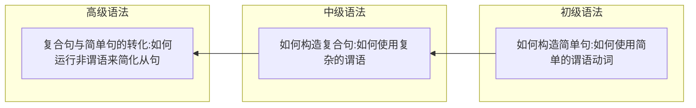

### 序言
英语语法新思维的体系

- 初级：
  - 以**名词短语和动词**作为两大主线。
  - 在名词短语篇中，首先建立起“名词短语”概念，以便于学习剩下各章，包括名词、限定词和形容词。
  - 有了“名词短语”这个概念，读者就能够很好地了**解名词、限定词和形容词**这三者之间的关系，从而慢慢地建立起英语语法体系。
  - 初级分册中的动词内容主要讨论了英语**五种基本句型**，为分析从句打好基础。此外，详尽分析了一般时态和进行时态的思维用法，这些用法尤其适用于口语交际中。

- 中级：
  - 以**从句和谓语动词**作为两大主线。
  - 中级分册中的从句内容主要是介绍 **如何将两个简单句合并成为三大从句，即名词从句、定语从句和状语从句。** 中级分册中的动词内容详尽分析了**完成时态、完成进行时态、虚拟语气和情态动词等**比较复杂的谓语形式，这些灵活多变的谓语形式尤其适用于口语交际中。

- 高级：
  - 以**从句和非谓语动词**作为两大主线。
  - 高级分册中的从句内容主要是**帮助读者分析和构造复杂的难句**，以便于轻松应对各类国内外考试中的阅读理解及写作。相当于英语从句的提高篇。
  - 高级分册中的动词内容详尽分析了**英语中的三大非谓语：不定式、动名词和分词**，并且在最后一章将三大从句与三大非谓语联系起来，考查二者之间的内在联系及相互转化的问题，使得读者不再是孤立地、僵化地看待各个部分的语法规则，而是在构造句子时能够对规则的使用应付自如。

## 绪论 名词短语
### 0.1 引言

世界七大奇迹,中文可以说

1 世界最著名的七大奇迹

2 最著名的世界七大奇迹

3 七大世界最著名的奇迹

用英文可以表达
1 the world's most famous seven wonders

2 the most famous Seven Wonders of the World

3 the seven world most famous wonders

4 the world's seven most famous wonders

那么以上哪个是正确的?

必须要搞清楚"名词短语"的构造规律

### 0.2 名词短语

##### 语言的构造级别

1. 词（word）
2. 短语（phrase）
3. 句子（sentence）
4. 段落（paragraph）
5. 篇章（discourse）

造句要从短语开始

##### 短语的种类

有动词短语（如have been doing）、介词短语（如for you）、名词短语（如my best friend）等等。

其中名词短语最重要,因为是造句中不可缺少的部分

#### 0.2.1 名词短语的功能

##### 名词短语的定义
名词与它的修饰语一起即构成名词短语。

名词短语是英语造句中不可或缺的元素。比如简单句的主语、宾语或表语通常由名词短语来充当。

> There are some red roses on that small table.
> 
>名词短语some red roses在句中充当主语；名词短语that small table在句中充当介词on的宾语。
>
>英文中的介词不能单独使用，其后面必须接宾语，所接的宾语也往往是名词短语
{: .prompt-info }

#### 0.2.2 名词短语的构造——“左二右六”的定语规律

一般来讲，名词前面有两种修饰语。

其一是**限定词**，用来限定名词所指的范围，对名词起泛指或特指、定量或不定量等的限定修饰作用。如these, three, a, the, my和that。

对于这些限定词的用法，将在第二和第三章中详细讨论。
<!-- 到时候这里加一个相对路径引用,方便跳转 -->

其二是**形容词**，是用来表示名词的性质和特征的。比如上文
中的red, close, new, best和small。

在复杂的名词短语中，更常见的是后置修饰语。

一个名词可以带的后置修饰语的种类很多，包括**定语从句、同位语从句、分词短语、不定式、介词短语、形容词短语和副词短语**等等，而且还有这些不同的后置定语复式出现的情况。

名词定语公式

$$
限定词 + 形容词 + 中心名词(headword) + 六类右置定语
\begin{cases}
介词短语 \\
分词短语 \\
不定式短语 \\
形容词短语\\
定语从句 \\ 
同位语从句 \\
\end{cases}
$$

前置定语位置要求严格,必须限定词在形容词左边

$限定词 + 形容词 + 名词$

本篇中，只讨论名词短语中的前置修饰成分，如形容
词和限定词。后置修饰成分将在《英语语法新思维中级教程——
通悟语法》和《英语语法新思维高级教程——驾驭语法》中讨
论。

<!-- 插入相对路径 -->

### 0.3 英语句子五成分论
##### 常见的句子成分
主谓宾定状补

##### 为什么说定语不算真正句子成分
有名词才有定语,定语是用来修饰名词的

因此定语算名词短语的构成成分,暂时称为"短语成分"

又因为 语言层次分为 词、短语、句子、段落和篇章

主语、谓语、宾语、补语和状语 都是在句子层级

定语应该降一档,算到短语里

### 0.4 本篇内容的逻辑安排

第一章 名词
第二章 限定词（一）：冠词
第三章 限定词（二）：数量限定词与个体限定词
第四章 形容词

## 第一章 名词
### 1.1 名词的定义与分类
#### 1.1.1 名词的定义
名词是用来表示人、事物、地点以及抽象事物的名称

人：John, sister, father

事物：water, air, sun, computer

地点：London, theater

抽象事物：love, happiness, imagination, hope

#### 1.1.2 名词的分类

一般来讲，英语中的名词通常分为两大类：专有名词（proper noun）和普通名词（common noun）

##### 专有名词包括

1. 人名及头衔
    >比如：Winston Churchill, the Queen of England, 
    >
    >the  President of the United States, Doctor Mathews, 
    >
    >Professor Samuels等。
2. 著作名称
    >比如：
    >
    >War and Peace（《战争与和平》）
    >
    >The Merchant of Venice（《威尼斯商人》）
    >
    >Pride and Prejudice（《傲慢与偏见》）
3. 月份
    >一年中12个月份的名称：January, February, March, April,
    May, June, July, August, September, October, November,
    December。
    >
    >不知道读者意识到没有：中英文对月份的取名方式是不一样的。英语是采用专有名称来称谓每一个月，比如“1月”是January，“2月”是February，“3月”是March等等。而中文则是简单地用数字来标记“1月”、“2月”、“3月”等等。要注意，这些都是公历或太阳历，用英文说就是the solar calendar。另外，我们中国还用阴历或月历，用英文说就是the lunar calendar。因为上面这些月份的英语名称都指的是阳历，因此如果说到我们汉语中的阴历几月就不能用上面的月份名称了，而要用序数词来表达。比如“阴历二月”就不能说February，而是the second month on the lunar calendar或者简单地说成the second lunar month。比如我们中国的“情人节”是“七夕”，就是在“农历七月初七”。如果要告诉外国朋友，你就不能说the seventh of July*，而要说成the seventh of the seventh lunar month。我们的中秋节是在“农历八月十五日”，用英文说应该是the fifteenth of the eighth lunar month，而不是the fifteenth of August*。中国的春节是在“农历一月初一”，用英文说应该是the first of the first lunar month，而不能说the first of January*。因此，谈到中国的农历传统节日，我们都得采用类似的表达，而不能用上面的专有名称月份来表达。对此，读者不妨注意一下。

4. 星期、四季
    >一周七天是：Sunday, Monday, Tuesday, Wednesday,Thursday, Friday, Saturday。
    >
    >一年四季是：winter, summer, spring, autumn。
5. 节日
    >比如：Christmas, Easter, New Year's Day, Mother's Day,Thanksgiving Day等。
1. 地理名称
   1. 国家及大洲的名称
   >如：America, Africa, Europe, Asia, England, Scotland, China,Peru, Albania等。
   2. 地区、城市的名称
   >如：Rome, Vancouver, Beijing, Florence, California, Florida等。
   3. 江、河、湖泊的名称
   >如：the Atlantic, the Dead Sea, the Pacific, Lake Victoria, Lake Michigan, the Rhine, the Thames, the Nile等。
   4. 山脉、沙漠的名称
   >如：the Himalayas, the Alps, the Sahara等。

##### 普通名词
可以根据**是否可数**分为**可数名词,不可数名词** 

可数与否涉及很多问题,可数名词变复数的问题（见1.3小节），限
定词修饰名词的问题（见第三章），还有是一个名词用作可数与
用作不可数，意义上有差别（见1.2小节）

##### 简单名词和复合名词

复合名词就是由若干单词组合而成构成的名词

>比如girlfriend, roommate和mother-in-law（岳母／婆婆）等等

### 1.2 名词的数（一）：可数与不可数

"数"概念两个角度来讨论

**一是名词可数性**，即区分可数单词（countable noun，在词典中标注为［C］

*侧重于名词的意义方面而不是构成形式方面；*

**二是名词的单数与复数形式**，这一角度侧重于名词的构成形式方面。

这两个角度分别是从意义（meaning）与形式（form）两个方面来讨论名词

形式是由意义决定的，是为意义的表达而服务的.另一方面，特定的意义是通过相应的形式来传递的。

首先从意义的角度来考察可数名词与不可数名词，然后从形式构成的角度来考察名词的单复数变化规则

讨论可数性过程中,重点放在不可数名词的讨论.讨论单复数问题,主要涉及可数名词

#### 1.2.1 常用作不可数的名词

不可数名词有以下规律，笔者这里将其分为五组：

- 第一组：**对于一些无法分割的名词，我们将其看作一个整体，因而作为不可数名词，没有复数变化**（nouns that have nodistinct, separate parts, we look as the whole）。这样的名词主要是一些物质名词

    
    - 或者可以按气体、液体和固体来作出如下分类：
      - 气体：air, fog, oxygen, smoke等。
      - 液体：beer, blood, coffee, cream, gasoline, honey, juice, milk,oil, tea, water, wine等。
      - 固体：bread, butter, cheese, ice, ice cream, meat, beef（牛肉）,chicken（鸡肉）, fish（鱼肉）, chalk, copper, cotton, glass, gold,iron, paper等

- 第二组：一些**因其组成部分太小而不易数的名词**（nouns thathave parts that are too small or insignificant to count）用作不可数名词。这主要也是一些物质名词。
  
  
- 第三组：**表示总称的名词通常不可数**（nouns that are classesor categories of things）。这些名词侧重于表示某类事物的总的概念，而不是具体的事物。如果要具体指出该总称概念下的具体事物，则要用其他不同的名词。
  
  - 第一栏的名词都是表示一个总称的概念，是不可数名词，而第二栏则是表示在这个概念下的具体事物，大部分都是可数的。
  - 
  - 第一栏的名词都是表示一个总称的概念，是不可数名词，而第二栏则是表示在这个概念下的具体事物，都是可数的。对于上面这些不可数名词，英语的初学者常常不注意，误以为是可数名词，因而在词尾加-s
  - character 翻译为特点时不可数,翻译为方块字或人物时可数
- 第四组: 抽象的名词一般是不可数的（nouns that areabstractions）。
  - 
  - 上面这些名词可以有其他不同的意思，因而可以转化为可数名词。关于这一点，我们将在接下来的1.2.2小节中详细讨论。
- 第五组：表示研究学科（subjects of study），一般作为不可数名词。
  - 

#### 1.2.2 可数与不可数的“相对论”

一个名词是可数还是不可数关键在于它所表达的意义,而不是形式

>Read the labels on food products. This information will tellyou how nutritious **the foods** are.
>
>the修饰一个复数名词时必然表示特指，即上文出现过的内容
{: .prompt-info }

##### “不可数名词”转化为“可数名词”规律

- 规律一：对于物质名词或总称的名词，若是表示不同的种类，或者因为特定的意思，或者是液体表示“几杯”或“几瓶”这样的数量，则转化为可数名词。

>They are found in fruits and vegetables, and in bread, rice, pasta,and other foods made from grains.
>
>Protein and fat are found in foods like milk, cheese, meat, fish,and eggs.
>
>food，它属于第三组Group C里面的名词，即表示“食物”这个总称概念时是不可数名词。但若是在表示具体的、不同种类的食物的时候，则作为可数名词

>I like cake, not hamburger.
>
>My mother is making a cake in the kitchen.
>
>cake用作不可数名词，表示“蛋糕”这类物质的总称，cake用作可数名词，表示具体的“一块蛋糕”。

> I don't like milk.
>
> Yogurt contains a higher percentage of lactic acid than other fermented milks.
>
>milk这个物质名词（属于第一组Group A），我们是无法数出“牛奶”的个数的，通常作为不可数名词。但是，如果表示不同种类的“奶制品（milk products）”，则作为可数名词。

以上的例子词义没有改变或改变不大,下面讨论因为意思不同导致可数性不同

> I need some paper to write a letter on.
>
> I have a term paper to write on weekends.
>
> I bought a paper.
> 
>1中，paper是表示供写字用的“纸”，不可数。在例句2中，paper的意思是“论文”，可数。在例句3中，paper相当于newspaper，表示“报纸”，可数。

由不可数转化为可数的名词，意思变化较大的是表示肉类的名词。

> 1) There is lamb on the menu today.
> 
> 2) The lambs were eating quietly.
> 
> 例句1）中，lamb是表示供人们食用的“羔羊肉”，不可数。在例句2）中，lamb的意思是“羔羊”，是一种动物，可数。

> Glass does not rust or rot.
> 
> She drank two glasses of wine.
>
> glass表示“玻璃”时不可数，但表示“玻璃杯”时则可数。

- 二、规律二：对于抽象名词，若是具体化了，则转化为可数名词。并且，此时往往伴随着词义上或大或小的改变。

art（艺术）／an art（一项技术，一门特定的艺术）；
beauty（美丽）／a beauty（一个美人）；
youth（青春）／a youth（一个年轻人）。

- 三、规律三: 从更广泛的意义上来说，当一个名词表示抽象的、总称的概念（abstract or generic concept）时，一般作为不可数名词来用。而当它表示具体的、特定的事物（concrete or particular things）时，则通常用作可数名词。
  
  这就是为什么词典中对于某个单词的某一词义，后面标注的既是可数，也是不可数。此时关键要看如何使用这个词义，如果是当作具体的事物来看，则是可数；如果是当作一个概念来看，则是不可数。

  room 为不可数时,表示空间.

  room 可数时,表示房间

  husband and wife. 看起来单数情况,但前面没有不定冠词a,表示的是夫妻的概念,而不是具体的某人,是作为不可数名词

  boyfriend and girlfriend.类似

  area 面积,地区时 可数 作为整体概念"面积"时,不可数

总的来说，**当名词表示抽象、总称的意义时，一般作为不可数名词来用；而当它们表示具体、特定的意义时，则通常用作可数名词。**

#### 1.2.3 不能按汉语的思维理解英文名词的可数与不可数

汉语中,家具,钱都是可数的,但在英语中,这些统称的名词都是不可数

遇到名词，若对其可数性不敢肯定，可以查词典。词典中标有［C］的表示可数，标有［U］的表示不可数。

#### 1.2.4 不可数名词的度量

**一、不可数名词与量词**

不可数名词不能通过具体的数字,但可以跟量词表示量的概念,不同类型的不可数名词所使用的量词也不一样

1. 常用piece修饰以下抽象名词和物质名词
比如这些名词：advice, bread, baggage, chalk, equipment,furniture, information, jewelry, luggage, music和news等。
>例如：
>a piece of news（一条消息）
>
>two pieces of news（两条消息）
>
>several pieces of furniture（几件家具）
>
>three pieces of luggage（三件行李）

2. 用bottle, cup, drop和glass修饰液态物质
比如这些名词：beer, blood, coffee, milk, tea, water和wine等。
>例如：
>several drops of blood（几滴血）
>
>
>a glass of milk（一杯牛奶）
>
>two glasses of wine（两杯葡萄酒）
>
>two cups of coffee（两杯咖啡）

3. 其他的量词
还有其他的量词修饰关系，
>比如：
>
>a loaf of bread（一长条面包）
>
>a tube of toothpaste（一筒牙膏）
>
>a slice of meat（一片肉）

**二、不可数名词不能被a（n）修饰**
除了能被量词修饰以外，不可数名词一般不能直接被不定冠词a/an修饰。比如“一条消息”不能说成a news*，“一个建议”不能说成an advice*，“一个好天气”不能说成a nice weather*，“一件家具”不能说成a furniture*等等。

**三、不可数名词不能被基数词修饰**
可数名词因为可以数出具体的数目，因而可以被基数词修饰，比如说one book或two books等。不可数名词因为不能数出具体的数目，因而不可以被基数词修饰，比如“两条消息”不能说成two news*，“五件家具”不能说成five furnitures*等等。

关于可数名词与不可数名词被限定词修饰的搭配关系，我们将在第二章和第三章中详细讨论。

### 1.3 名词的数（二）：单数与复数

#### 1.3.1 英语名词的单数与复数的概念

英语语言要区分名词的单数（singular，词典中一般缩写成sg.）和复数（plural，词典中一般缩写成pl.）

英语只是把“一以上”算作复数

1 one half day 半天（单数）

2 one day 一天（单数）

3 one and a half days 一天半（复数）

英语中也有“双数”的概念，比如限定词both, either和neither都只能用来指“二”，不能指“二以上”的复数概念。关于它们的用法，详见第三章。还有each可以指“二或二以上”的复数概念，而every只能指“三或三以上”的复数概念。

#### 1.3.2 只用作单数的名词

在英语中，只用作单数的名词主要包括不可数名词与专有名词。这两类名词一般没有复数的变化形式。它们作主语时，谓语要用单数第三人称形式。

#### 1.3.3 只用作复数的名词

这些名词没有词形的变化，但都是当作复数名词来用。它们作主语时，谓语要用复数形式。

**一、“二合一”的复数名词**
这些名词表示由相等的两个部分合在一起构成的工具、仪器或服装。最常见的这种“二合一”的名词有：
1. 工具和仪器
>glasses（眼镜）
>
>spectacles（眼镜）
>
>binocular（双筒望远镜，双目显微镜）
>
>scales（天平）
>
>clippers（理发剪，指甲刀）
>
>forceps（钳子，镊子〈尤指外科医生用的镊子〉）
>
>pincers（铁钳，钳子〈比如家用的老虎钳〉）
>
>tongs（钳子，夹子，镊子〈比如火钳子〉）
>
>tweezers（小钳〈比如女用的夹眉毛的小钳子〉）
>
>scissors（剪刀）
>
>shears（大剪刀）

1. 服装
>jeans（牛仔裤）
>
>trousers（长裤）
>
>shorts（短裤）
>
>trunks（男士泳裤）
>
>briefs（内裤）
>
>pants（短裤）
>
>slacks（休闲裤）
>
>pajamas（睡衣）

对于这些名词，要说明数量，我们往往要用pair（如a pair of）表示。

>比如：
>
>That's a nice pair of pants. 那是一条漂亮的短裤。
>
>As I'm shortsighted I always carry two pairs of glasses. 因为
>
>我近视，所以我总是随身携带两副眼镜。
>
>Both pairs of scissors need sharpening. 两把剪刀都该磨磨了。

既然是复数名词，所以要用复数的代词来指代，这点不同于汉语。在汉语中，这些名词往往是单数概念的
>比如我们问：
>
>A：我的眼镜在哪里？
>
>B：它不就在你的鼻子上戴着嘛！
>
>这里，我们不会说“它们”，但在英语中却要用they来指代，

**二、“单形复义”的名词**
有些名词虽然没有复数的标记，但用作复数，即形式上是单数但是表达复数的意义。具体包括：

- people
  - :人们,人民 相当于person的复数
  - :民族,部族 普通名词,可以有复数(-s)
- cattle
  - 牛群 作主语时谓语用复数形式
- police
  - 警察部队,警方 集体名词 谓语动词用复数
  - 表示个别,具体的"警官" a police officer/ a policeman(policewoman)
  - 复数形式是police officers/policemen/policewomen
- poultry
  - 家禽 如鸡、鸭、鹅 指这些活体的动物时，要当作复数名词来用。
  - 表示家禽的肉，则要当作单数名词来用
- livestock
  - “农场里饲养的牲畜”，是一个集体名词，当作复数名词，用复数谓语。

**三、“the＋形容词”——表示一类人的复数名词**
在英文中，“the＋形容词”表示一类人，此时当作复数名词，作主语时，谓语要用复数。

**四、复数专有名词**
在英文中，有些专有名词只用作复数。
>比如：
>
>22 the Alps 阿尔卑斯山脉
>
>23 The Himalayas are the roof of the world. 喜马拉雅山脉是世界屋脊。
>
>24 The Great Lakes are a series of five lakes between the USAand Canada. 五大湖是位于美国和加拿大之间的五个湖。
>
>25 The Niagara Falls are the falls on the Niagara River. 尼亚加拉瀑布是位于尼亚加拉河上的一个瀑布群。

#### 1.3.4 规则的复数名词

一、一般在词尾加-s

二、以-s, -x, -ch, -sh结尾的名词加-es

>比如：class/classes, box/boxes, match/matches, bush/bushes等。
>
>特别注意：以-ch结尾的名词，若-ch发/k/音，则加-s，例如：stomach/stomachs。

三、以“辅音字母＋y”结尾的名词，变-y为-i，再加-es；而以“元音字母＋y”结尾的名词，则加-s

>比如：country/countries, family/families, baby/babies,lady/ladies;
>
>play/plays, boy/boys, guy/guys, donkey/donkeys,monkey/monkeys, key/keys等。

四、有关以-o结尾的名词

这类名词的单数变复数稍微有些复杂，因为有的是加-es，有的是加-s，而有的是加-es或-s均可。

1．一般**加-es的名词**有：
>
>tomato/tomatoes（西红柿）
>
>hero/heroes（英雄）
>
>Negro/Negroes（黑人）
>
>veto/vetoes（否决）
>
>这些一般是以“辅音字母＋-o”结尾的名词。

2．一般**加-s的名词**有：

>dynamo/dynamos（发电机）
>
>kilo/kilos（千克）
>
>kimono/kimonos（和服）
>
>memo/memos（备忘录）
>
>
>
>piano/pianos（钢琴）
>
>photo/photos（照片）
>
>soprano/sopranos（女高音歌手）
>
>solo/solos（独奏曲）
>
>tobacco/tobaccos（烟叶）
>
>以上这些一般是以“辅音字母＋-o”结尾的外来词或缩写词。
>
>另外还有以“元音字母＋-o”结尾的名词变复数也是加-s的：
>
>bamboo/bamboos（竹子）
>
>cuckoo/cuckoos（布谷鸟，杜鹃鸟）
>
>radio/radios（收音机）
>
>studio/studios（工作室，演播室）
>
>zoo/zoos（动物园）

3．**少数名词后加-s或加-es均可**：
>
>memento/memento(e)s（纪念品）
>
>motto/motto(e)s（座右铭）
>
>volcano/volcano(e)s（火山）
>
>manifesto/manifesto(e)s（宣言）

五、有关以-f或-fe结尾的名词

1．一般变f, fe为v，再加-es的词有下面12个：

>calf/calves（小牛）
>
>half/halves（一半）
>
>knife/knives（小刀）
>
>leaf/leaves（树叶）
>
>life/lives（生命）
>
>loaf/loaves（一条，一只）
>
>self/selves（自身）
>
>sheaf/sheaves（一捆，一束）
>
>shelf/shelves（架子）
>
>thief/thieves（贼）
>
>wife/wives（妻子）
>
>wolf/wolves（狼）

2．一般直接加-s的名词有：

>belief/beliefs（信仰）
>
>chief/chiefs（首领）
>
>cliff/cliffs（悬崖）
>
>proof/proofs（证据）
>
>reef/reefs（暗礁）
>
>roof/roofs（屋顶）
>
>safe/safes（保险箱）

3．少数名词后加-s或变f, fe为v加-es均可：

>dwarf/dwarfs/dwarves（矮人）
>
>handkerchief/handkerchiefs/handkerchieves（手帕）
>
>hoof/hoofs/hooves（蹄）
>
>scarf/scarfs/scarves（围巾）
>
>wharf/wharfs/wharves（码头）
>
>另外要注意：beef（牛肉）／beefs（牢骚，抱怨）／
>
>beeves（菜牛，＝beef cattle）。

#### 1.3.5 不规则的复数名词

一、以-a结尾的拉丁语名词，词尾变为-ae或-as（少数词）。
>例如：
>
>alga/algae（海藻）
>
>alumna/alumnae（女校友／女毕业生）
>
>antenna/antennae/antennas（天线）
>
>formula/formulae/formulas（公式）
>
>larva/larvae/larvas（幼虫）

二、以-ex或-ix结尾的拉丁语名词，在词尾直接加-es，或把-ex
和-ix变为-ices。
>例如：
>
>apex/apexes/apices（顶点，最高点）
>
>appendix/appendixes/appendices（附录，阑尾）
>
>index/indexes/indices（索引）

三、以-is结尾的希腊语名词，变-is为-es。
>例如：
>
>analysis/analyses（分析）
>
>basis/bases（基础）
>
>crisis/crises（危机）
>
>diagnosis/diagnoses（诊断）
>
>thesis/theses（论文）

四、以-on或-um结尾的名词，变-on或-um为-a，有的可在词尾直接加-s。

>例如：
>
>bacterium/bacteria（细菌）
>
>criterion/criteria/criterions（标准）
>
>datum/data（数据）
>
>erratum/errata（错误，错字勘误表）
>
>medium/media/mediums（媒介，介质）
>
>memorandum/memoranda/memorandums（备忘录）
>
>phenomenon/phenomena（现象）

五、变-oo-为-ee-。

>例如：
>
>foot/feet（脚）
>
>tooth/teeth（牙齿）
>
>goose/geese（鹅）

六、变-ouse为-ice。
>例如：
>
>mouse/mice（老鼠）
>
>louse/lice（虱子）

七、以-us结尾的拉丁语名词，变-us为-i，有的可在词尾直接加-
es。

>例如：
>
>alumnus/alumni（男校友）
>
>bacillus/bacilli（杆菌）
>
>cactus/cacti/cactuses（仙人掌）
>
>fungus/fungi/funguses（真菌）
>
>genius/genii/geniuses（天才）
>
>nucleus/nuclei/nucleuses（原子核）
>
>stimulus/stimuli（刺激物）
#### 1.3.6 复合名词变复数

一、“man/woman＋名词”构成的复合名词

由“man/woman＋名词”构成的复合名词，两个词均须变为复数。
>例如：
>
>man teacher/men teachers（男老师）
>
>man doctor/men doctors（男医生）
>
>man servant/men servants（男仆）
>
>woman pilot/women pilots（女飞行员）
>
>woman journalist/women journalists（女记者）

二、以-man/-woman/-child结尾的复合名词

以-man/-woman/-child结尾的复合名词变复数时，将-man/-woman/-child变为复数。

>例如：
>
>fireman/firemen（消防员）
>
>chairwoman/chairwomen（女主席）
>
>horseman/horsemen（骑兵）
>
>grandchild/grandchildren（孙子／女）
>
>policeman/policemen（警察）
>
>Englishman/Englishmen（英国人）
>
>Frenchman/Frenchmen（法国人）
>
>但是German不是一个合成词，所以其复数形式是在词尾直接加-s，即Germans。

三、“名词＋介词或介词短语”构成的复合名词

“名词＋介词或介词短语”构成的复合名词变复数时，将主体名词（或者说中心名词）变为复数。

>例如：comrade-in-arms/comrades-in-arms（战友）
>
>注意：不是comrades-in-arm*。这里的arms要用复数形式。
>
>（详见1.3.8小节）
>
>passer-by/passers-by（过路人）
>
>runner-up/runners-up（亚军）
>
>looker-on/lookers-on（旁观者）
>
>mother-in-law/mothers-in-law（岳母／婆婆）
>
>editor-in-chief/editors-in-chief（总编辑）
>
>bride-to-be/brides-to-be（即将成为新娘的人，准新娘）

四、由短语动词演变成的复合名词由动词短语演变成的

由动词短语演变成的复合名词，一般没有主体名词，变复数时在词尾加-s。

>例如：
>forget-me-not/forget-me-nots（勿忘我）
>
>go-between/go-betweens（中间人）
>
>grown-up/grown-ups（成年人）
>
>take-off/take-offs（起飞）
>
>assistant director/assistant directors（助理导演）
>
>babysitter/babysitters（保姆）
>
>breakdown/breakdowns（崩溃，衰落）
>
>close-up/close-ups（特写镜头）
>
>grown-up/grown-ups（成年人）
>
>takeover/takeovers（接管）
>
>sit-in/sit-ins（静坐抗议）
>
>stand-by/stand-bys（可以信任的人）

五、“名词＋形容词”构成的复合名词

“名词＋形容词”构成的复合名词变复数时，变名词为复数。
>例如：
>
>notary public/notaries public（公证员）
>
>secretary general/secretaries general（秘书长）
>
>Attorney General/Attorneys General（［美］司法部长，大法
>
>官／［英］总检察长）
>
>consul general/consuls general（总领事）

#### 1.3.7 单复数同形的名词（零复数名词）

一类是动物名称，另一类是国籍名称。

一、动物名称

1．永远用作零复数

>sheep（绵羊）从来没有sheeps*这个词形。
>
>deer（鹿）从来没有deers*这个词形。

2．通常用作零复数

>bison（北美野牛）a bison/two bison
>
>grouse（松鸡）a grouse/two grouse
>
>quail（鹌鹑）a quail/two quail
>
>salmon（三文鱼，大马哈鱼）a salmon/two salmon
>
>cod（鳕鱼，也叫做codfish。在英国，满大街的快餐Fish and Chips〈炸鱼和炸薯条〉就是常用这种鱼做的。）a cod/two cod

3．零复数和规则复数均可

>antelope（羚羊）复数可以是antelope，或者是antelopes。
>
>reindeer（驯鹿）复数可以是reindeer，或者是reindeers。圣诞节前夜，圣诞老人骑的就是这种鹿。
>
>fish（鱼）复数可以是fish，或者是fishes。
>
>flounder（比目鱼）复数可以是flounder，或者是flounders。
>
>herring（鲱鱼）复数可以是herring，或者是herrings。还要注意，有一个常用的俚语red herring（遮眼法，转移注意力的东西），表示提出不相干的事实或论点，以分散对主题的注意力。
>
>shrimp（虾）复数可以是shrimp，或者是shrimps。

对于这些名词，用零复数往往是把那些动物当作整体来看，而采用规则复数则表示不同的个体及种类。

二、国籍名称

以-ese结尾的国籍名词常用零复数。

>常见的这类名词有：
>
>Chinese（中国人）这是每个中国的英语学习者都应该知道的。“一个中国人”是one Chinese，“13亿中国人”是1.3 billion Chinese。这里的复数还是用Chinese，而不是Chineses*。其他的词还有：
>
>Japanese（日本人）one Japanese/ten Japanese
>
>Lebanese（黎巴嫩人）one Lebanese/ten Lebanese
>
>Portuguese（葡萄牙人）one Portuguese/ten Portuguese
>
>Vietnamese（越南人）one Vietnamese/ten Vietnamese
>
>Swiss（瑞士人）one Swiss/ten Swiss
>
>British（英国人）one British/ten British

>注意，这类名词不同于不变形的不可数名词（如music），不可数名词是永远用作单数的，没有复数。这类名词也不同于不变形的复数可数名词（如people），复数可数名词是永远用作复数的，没有单数。而我们这里讨论的单复数同形的名词（如sheep），是既可以用作单数，也可以用作复数的，只是没有形式的变化。
{: .prompt-info }

因此，没有形式变化的名词有三类：

- 第一类是不可数名词，如music，它们没有词形的变化，只能用作单数。
- 第二类是复数可数名词，如people，它们没有词形的变化，只能用作复数。
- 第三类是单复数同形的名词，如sheep，它们没有词形的变化，但既可以用作单数，也可以用作复数。

请读者注意区分这三类名词，大家不妨记住这里的三个名词：music, people和sheep，通过这三个例子来帮助我们记住它们背后的用法规则。
#### 1.3.8 有新词义的复数名词

在英文中，有些名词在变成复数的时候，词义会有所变化；或者说当这些名词用于某个特定的意思时，通常用其复数形式。

1 l) arm（手臂）
2) arms（＝weapons 武器，军事）

2 1) custom（风俗）
2) customs（海关）

3 1) damage（损坏，损失）
2) damages（赔偿金）

4 1) letter（信）
2) letters（文学）

5 1) minute（分钟）
2) minutes（会议记录）

6 1) spirit（精神）
1) spirits（烈酒）

7 1) premise（前提）
1) premises（房屋，营业场所）

8 1) security（安全）
2) securities（证券）

9 1) line（行）
2) lines（台词）

这类名词在英文中很多，大家在今后的英语学习过程中要注意勤查词典，并注意积累。

扑克牌里有四种花色，汉语分别叫做“红桃”、“黑桃”、“梅花”和“方片”，在英语中则用四个大家非常熟悉的词heart（心脏）、spade（铁铲）、club（俱乐部）和diamond（钻石）来表示，但是要用它们的复数形式，即hearts（红桃）、spades（黑桃）、clubs（梅花）和diamonds（方片），比如“梅花尖”，英文要说the ace of clubs；“红桃勾”，英文要说the jack of hearts等等。

我们的“收入”要用复数名词说成earnings，而不是earning*；我们的“储蓄存款”要用复数名词说成savings，而不是saving*。甚至是作定语时也要用复数，比如a savings bank（储蓄银行）；asavings account（储蓄账户）

若是要“祝贺”别人，就要用复数说成congratulations，而不说congratulation*。就连最简单而常见的“谢谢”，你也要说成Many thanks. 或Thanks a lot. 或Thanks. 而从不说Thank a lot.*或Thank.*

### 1.4 名词的格（一）：'s所有格的构成及逻辑语义关系
#### 1.4.1 's所有格的构成
#### 1.4.2 's所有格的逻辑语义关系
#### 1.4.3 名词所有格修饰的名词被省去
### 1.5 名词的格（二）：of属格的构成及逻辑语义关系
#### 1.5.1 of属格的构成
#### 1.5.2 of属格的逻辑语义关系

## 第二章 限定词（一）：冠词
### 2.1 引言：Story-telling
### 2.2 冠词的位置与读音
### 2.3 冠词的用法概述
### 2.4 英语中四种泛指的表达模式
#### 2.4.1 不可数名词不加冠词表示泛指
#### 2.4.2 复数名词不加冠词表示泛指
#### 2.4.3 单数名词与定冠词the连用可以表示泛指
#### 2.4.4 单数名词与不定冠词a/an连用可以表示泛指
### 2.5 定冠词the的特指用法
#### 2.5.1 情景／文化特指（situational/cultural reference）
#### 2.5.2 上下文共指（textual co-reference）
### 2.6 不定冠词a/an的用法
#### 2.6.1 不定冠词的泛指与非泛指用法
#### 2.6.2 不定冠词a/an与不可数名词
#### 2.6.3 不定冠词a/an与数词one
#### 2.6.4 不定冠词a/an与this
### 2.7 用／不用冠词的意义区别（the hospital/hospital）
### 2.8 其他使用冠词的场合
### 2.9 其他不用冠词的场合

## 第三章 限定词（二）：数量限定词与个体限定词
### 3.1 数量限定词（一）：a few，few/a little，little
### 3.2 数量限定词（二）：some/any
### 3.3 个体限定词（一）：each/every
### 3.4 个体限定词（二）：another/other
### 3.5 个体限定词（三）：either/neither
### 3.6 限定词总结（一）：限定词中的“二”与“三”
### 3.7 限定词总结（二）：限定词与可数／不可数名词
### 3.8 限定词总结（三）：限定词与of短语
### 3.9 限定词总结（四）：限定词之间的位置关系
### 3.10 限定词与形容词的区别

## 第四章 形容词
### 4.1 形容词在名词短语中的位置
#### 4.1.1 前置修饰名词
#### 4.1.2 后置修饰名词
### 4.2 形容词的比较级和最高级的构成形式
#### 4.2.1 单音节词
#### 4.2.2 双音节词
#### 4.2.3 多音节词
#### 4.2.4 不具有等级的形容词
### 4.3 形容词的比较级和最高级的用法
#### 4.3.1 形容词比较级的用法
#### 4.3.2 形容词最高级的用法
### 4.4 Interesting or interested?
#### 4.4.1 -ing形容词与-ed形容词的特点
#### 4.4.2 -ing形容词可以修饰“人”
#### 4.4.3 -ed形容词可以修饰“物”

## 第五章 动词分类（一）：实义动词与（情态）助动词
### 5.1 实义动词（notional verb）
### 5.2 助动词（auxiliary verb）
#### 5.2.1 助动词be，do和have
#### 5.2.2 用作实义动词的be，do和have
### 5.3 情态助动词（modal verb）
### 5.4 陈述句的否定
#### 5.4.1 谓语中含有be动词或情态动词的否定
#### 5.4.2 谓语动词是实义动词的否定
#### 5.4.3 否定的缩写
### 5.5 一般疑问句
#### 5.5.1 谓语动词中含有be动词或情态动词的提问
#### 5.5.2 谓语动词是实义动词的提问
### 5.6 特殊疑问句
#### 5.6.1 不与名词连用的疑问词
#### 5.6.2 要与名词连用的疑问词
#### 5.6.3 how的用法详解
## 第六章 动词分类（二）：英语的五种基本句型
### 6.1 引言：“人咬狗”是条新闻
### 6.2 五种基本句型概述
#### 6.2.1 主语＋谓语
#### 6.2.2 五种基本句型概述
### 6.3 句型一：主语＋系动词＋表语
### 6.4 句型二：主语＋谓语
### 6.5 句型三：主语＋谓语＋宾语
### 6.6 句型四：主语＋谓语＋间接宾语＋直接宾语
### 6.7 句型五：主语＋谓语＋宾语＋宾语补足语

## 第七章 英文时态（一）：一般时态
### 7.1 引言：一个时态错误就是一个政策问题
### 7.2 英文时态体系概述
#### 7.2.1 英文时态的构成：四时四态
#### 7.2.2 时态学习技巧
### 7.3 一般现在时态——并非表示现在
#### 7.3.1 用法一：表示普遍的事实或真理（expressing a generaltruth）
#### 7.3.2 用法二：表示重复活动（expressing a regularly occurring event）
#### 7.3.3 用法比较：表示重复活动的一般现在时态和现在完成进行时态
#### 7.3.4 用法三：一般现在时表示正在发生的动作
#### 7.3.5 用法四：一般现在时表示将来发生的动作
#### 7.3.6 用法五：一般现在时表示过去发生的动作
#### 7.3.7 用法六：一般现在时代指现在完成时
### 7.4 被遗忘了的一般过去时态
#### 7.4.1 引言
#### 7.4.2 基本用法一：过去发生的短暂动作或状态
#### 7.4.3 基本用法二：过去发生的重复或延续活动
#### 7.4.4 用法比较：一般过去时和现在完成时用于“for＋时间段”的区别
#### 7.4.5 口语用法一：“我不知道”——"I don't know" or "I didn't know"?
#### 7.4.6 口语用法二：“我忘记了”——"I forget" or "I forgot"?
#### 7.4.7 口语用法三：“我以为”——"I think" or "I thought"?
#### 7.4.8 口语用法四：根据上下文的语境灵活地使用一般过去时
#### 7.4.9 口语用法五：礼貌表达
### 7.5 一般将来时态——预测、计划和意愿
#### 7.5.1 引言
#### 7.5.2 will表示将来——预测
#### 7.5.3 be going to表示将来——预测
#### 7.5.4 be going to表示“计划”与will表示“意愿”
#### 7.5.5 现在进行时表示将来
#### 7.5.6 一般现在时表示将来
#### 7.5.7 其他表示将来的句型结构

## 第八章 英文时态（二）：进行时态
### 8.1 引言
#### 8.1.1 进行时态的构成
#### 8.1.2 进行时态的意义
#### 8.1.3 进行时态的使用语境
### 8.2 现在进行时——不一定正在进行
#### 8.2.1 用法一：说话时刻正在进行的动作（action happening exactly now）
#### 8.2.2 用法二：在目前一段时期内持续的一种暂时的情况（action happening around now）
#### 8.2.3 用法三：用于表示“改变”的动词，强调“逐渐变化”的过程
#### 8.2.4 用法四：用于强烈的感情色彩的表达
#### 8.2.5 用法五：表示将来确定的安排
#### 8.2.6 用法六：与always等连用，表示多次重复，且含有感情色彩
### 8.3 过去进行时——回顾过去讲故事
#### 8.3.1 常见用法：用来设置故事的背景
#### 8.3.2 少见用法：两个过去同时在持续的动作
#### 8.3.3 典型用法：描述一个过去的特定时刻正在发生的事情
#### 8.3.4 口语用法：表示委婉的请求或提建议
### 8.4 将来进行时——想象未来
#### 8.4.1 典型用法：将来某一特定时刻正在持续的事
#### 8.4.2 口语用法：将来计划好的事
#### 8.4.3 少见用法：表示背景动作——提供另外一个短动作发生的事件背景
#### 8.4.4 难点用法1：用在疑问句中，表示客气地询问
#### 8.4.5 难点用法2：用来表示客观的将来，以避免与表示“意愿”的will do混淆
### 8.5 难点：深入分析进行时的思维特征
#### 8.5.1 进行时态的核心含义（grammatical aspect）
#### 8.5.2 进行时态与动词体（lexical aspect）

### 附录 答案解析
### 结语