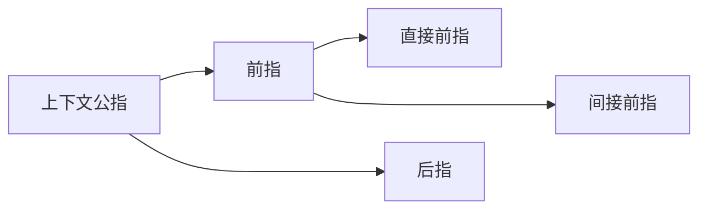
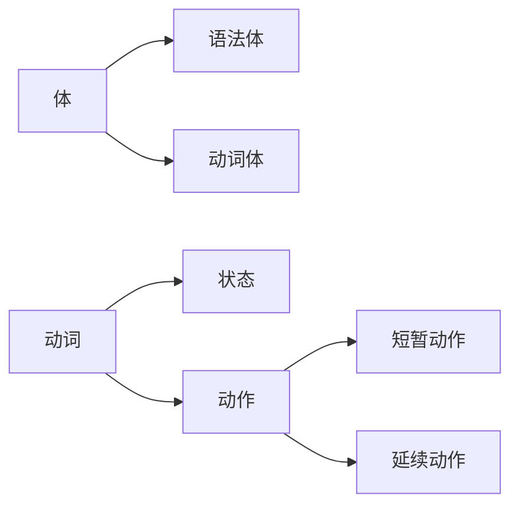

### 序言
英语语法新思维的体系

- 初级：
  - 以**名词短语和动词**作为两大主线。
  - 在名词短语篇中，首先建立起“名词短语”概念，以便于学习剩下各章，包括名词、限定词和形容词。
  - 有了“名词短语”这个概念，读者就能够很好地了**解名词、限定词和形容词**这三者之间的关系，从而慢慢地建立起英语语法体系。
  - 初级分册中的动词内容主要讨论了英语**五种基本句型**，为分析从句打好基础。此外，详尽分析了一般时态和进行时态的思维用法，这些用法尤其适用于口语交际中。

- 中级：
  - 以**从句和谓语动词**作为两大主线。
  - 中级分册中的从句内容主要是介绍 **如何将两个简单句合并成为三大从句，即名词从句、定语从句和状语从句。** 中级分册中的动词内容详尽分析了**完成时态、完成进行时态、虚拟语气和情态动词等**比较复杂的谓语形式，这些灵活多变的谓语形式尤其适用于口语交际中。

- 高级：
  - 以**从句和非谓语动词**作为两大主线。
  - 高级分册中的从句内容主要是**帮助读者分析和构造复杂的难句**，以便于轻松应对各类国内外考试中的阅读理解及写作。相当于英语从句的提高篇。
  - 高级分册中的动词内容详尽分析了**英语中的三大非谓语：不定式、动名词和分词**，并且在最后一章将三大从句与三大非谓语联系起来，考查二者之间的内在联系及相互转化的问题，使得读者不再是孤立地、僵化地看待各个部分的语法规则，而是在构造句子时能够对规则的使用应付自如。

## 绪论 名词短语
### 0.1 引言

世界七大奇迹,中文可以说

1 世界最著名的七大奇迹

2 最著名的世界七大奇迹

3 七大世界最著名的奇迹

用英文可以表达
1 the world's most famous seven wonders

2 the most famous Seven Wonders of the World

3 the seven world most famous wonders

4 the world's seven most famous wonders

那么以上哪个是正确的?

必须要搞清楚"名词短语"的构造规律

### 0.2 名词短语

##### 语言的构造级别

1. 词（word）
2. 短语（phrase）
3. 句子（sentence）
4. 段落（paragraph）
5. 篇章（discourse）

造句要从短语开始

##### 短语的种类

有动词短语（如have been doing）、介词短语（如for you）、名词短语（如my best friend）等等。

其中名词短语最重要,因为是造句中不可缺少的部分

#### 0.2.1 名词短语的功能

##### 名词短语的定义
名词与它的修饰语一起即构成名词短语。

名词短语是英语造句中不可或缺的元素。比如简单句的主语、宾语或表语通常由名词短语来充当。

> There are some red roses on that small table.
> 
>名词短语some red roses在句中充当主语；名词短语that small table在句中充当介词on的宾语。
>
>英文中的介词不能单独使用，其后面必须接宾语，所接的宾语也往往是名词短语
{: .prompt-info }

#### 0.2.2 名词短语的构造——“左二右六”的定语规律

一般来讲，名词前面有两种修饰语。

其一是**限定词**，用来限定名词所指的范围，对名词起泛指或特指、定量或不定量等的限定修饰作用。如these, three, a, the, my和that。

对于这些限定词的用法，将在第二和第三章中详细讨论。
<!-- 到时候这里加一个相对路径引用,方便跳转 -->

其二是**形容词**，是用来表示名词的性质和特征的。比如上文
中的red, close, new, best和small。

在复杂的名词短语中，更常见的是后置修饰语。

一个名词可以带的后置修饰语的种类很多，包括**定语从句、同位语从句、分词短语、不定式、介词短语、形容词短语和副词短语**等等，而且还有这些不同的后置定语复式出现的情况。

名词定语公式

$$
限定词 + 形容词 + 中心名词(headword) + 六类右置定语
\begin{cases}
介词短语 \\
分词短语 \\
不定式短语 \\
形容词短语\\
定语从句 \\ 
同位语从句 \\
\end{cases}
$$

前置定语位置要求严格,必须限定词在形容词左边

$限定词 + 形容词 + 名词$

本篇中，只讨论名词短语中的前置修饰成分，如形容
词和限定词。后置修饰成分将在《英语语法新思维中级教程——
通悟语法》和《英语语法新思维高级教程——驾驭语法》中讨
论。

<!-- 插入相对路径 -->

### 0.3 英语句子五成分论
##### 常见的句子成分
主谓宾定状补

##### 为什么说定语不算真正句子成分
有名词才有定语,定语是用来修饰名词的

因此定语算名词短语的构成成分,暂时称为"短语成分"

又因为 语言层次分为 词、短语、句子、段落和篇章

主语、谓语、宾语、补语和状语 都是在句子层级

定语应该降一档,算到短语里

### 0.4 本篇内容的逻辑安排

第一章 名词
第二章 限定词（一）：冠词
第三章 限定词（二）：数量限定词与个体限定词
第四章 形容词

## 第一章 名词
### 1.1 名词的定义与分类
#### 1.1.1 名词的定义
名词是用来表示人、事物、地点以及抽象事物的名称

人：John, sister, father

事物：water, air, sun, computer

地点：London, theater

抽象事物：love, happiness, imagination, hope

#### 1.1.2 名词的分类

一般来讲，英语中的名词通常分为两大类：专有名词（proper noun）和普通名词（common noun）

##### 专有名词包括

1. 人名及头衔
    >比如：Winston Churchill, the Queen of England, 
    >
    >the  President of the United States, Doctor Mathews, 
    >
    >Professor Samuels等。
2. 著作名称
    >比如：
    >
    >War and Peace（《战争与和平》）
    >
    >The Merchant of Venice（《威尼斯商人》）
    >
    >Pride and Prejudice（《傲慢与偏见》）
3. 月份
    >一年中12个月份的名称：January, February, March, April,
    May, June, July, August, September, October, November,
    December。
    >
    >不知道读者意识到没有：中英文对月份的取名方式是不一样的。英语是采用专有名称来称谓每一个月，比如“1月”是January，“2月”是February，“3月”是March等等。而中文则是简单地用数字来标记“1月”、“2月”、“3月”等等。要注意，这些都是公历或太阳历，用英文说就是the solar calendar。另外，我们中国还用阴历或月历，用英文说就是the lunar calendar。因为上面这些月份的英语名称都指的是阳历，因此如果说到我们汉语中的阴历几月就不能用上面的月份名称了，而要用序数词来表达。比如“阴历二月”就不能说February，而是the second month on the lunar calendar或者简单地说成the second lunar month。比如我们中国的“情人节”是“七夕”，就是在“农历七月初七”。如果要告诉外国朋友，你就不能说the seventh of July*，而要说成the seventh of the seventh lunar month。我们的中秋节是在“农历八月十五日”，用英文说应该是the fifteenth of the eighth lunar month，而不是the fifteenth of August*。中国的春节是在“农历一月初一”，用英文说应该是the first of the first lunar month，而不能说the first of January*。因此，谈到中国的农历传统节日，我们都得采用类似的表达，而不能用上面的专有名称月份来表达。对此，读者不妨注意一下。

4. 星期、四季
    >一周七天是：Sunday, Monday, Tuesday, Wednesday,Thursday, Friday, Saturday。
    >
    >一年四季是：winter, summer, spring, autumn。
5. 节日
    >比如：Christmas, Easter, New Year's Day, Mother's Day,Thanksgiving Day等。
1. 地理名称
   1. 国家及大洲的名称
   >如：America, Africa, Europe, Asia, England, Scotland, China,Peru, Albania等。
   2. 地区、城市的名称
   >如：Rome, Vancouver, Beijing, Florence, California, Florida等。
   3. 江、河、湖泊的名称
   >如：the Atlantic, the Dead Sea, the Pacific, Lake Victoria, Lake Michigan, the Rhine, the Thames, the Nile等。
   4. 山脉、沙漠的名称
   >如：the Himalayas, the Alps, the Sahara等。

##### 普通名词
可以根据**是否可数**分为**可数名词,不可数名词** 

可数与否涉及很多问题,可数名词变复数的问题（见1.3小节），限
定词修饰名词的问题（见第三章），还有是一个名词用作可数与
用作不可数，意义上有差别（见1.2小节）

##### 简单名词和复合名词

复合名词就是由若干单词组合而成构成的名词

>比如girlfriend, roommate和mother-in-law（岳母／婆婆）等等

### 1.2 名词的数（一）：可数与不可数

"数"概念两个角度来讨论

**一是名词可数性**，即区分可数单词（countable noun，在词典中标注为［C］

*侧重于名词的意义方面而不是构成形式方面；*

**二是名词的单数与复数形式**，这一角度侧重于名词的构成形式方面。

这两个角度分别是从意义（meaning）与形式（form）两个方面来讨论名词

形式是由意义决定的，是为意义的表达而服务的.另一方面，特定的意义是通过相应的形式来传递的。

首先从意义的角度来考察可数名词与不可数名词，然后从形式构成的角度来考察名词的单复数变化规则

讨论可数性过程中,重点放在不可数名词的讨论.讨论单复数问题,主要涉及可数名词

#### 1.2.1 常用作不可数的名词

不可数名词有以下规律，笔者这里将其分为五组：

- 第一组：**对于一些无法分割的名词，我们将其看作一个整体，因而作为不可数名词，没有复数变化**（nouns that have nodistinct, separate parts, we look as the whole）。这样的名词主要是一些物质名词

    
    - 或者可以按气体、液体和固体来作出如下分类：
      - 气体：air, fog, oxygen, smoke等。
      - 液体：beer, blood, coffee, cream, gasoline, honey, juice, milk,oil, tea, water, wine等。
      - 固体：bread, butter, cheese, ice, ice cream, meat, beef（牛肉）,chicken（鸡肉）, fish（鱼肉）, chalk, copper, cotton, glass, gold,iron, paper等

- 第二组：一些**因其组成部分太小而不易数的名词**（nouns thathave parts that are too small or insignificant to count）用作不可数名词。这主要也是一些物质名词。
  
  
- 第三组：**表示总称的名词通常不可数**（nouns that are classesor categories of things）。这些名词侧重于表示某类事物的总的概念，而不是具体的事物。如果要具体指出该总称概念下的具体事物，则要用其他不同的名词。
  
  - 第一栏的名词都是表示一个总称的概念，是不可数名词，而第二栏则是表示在这个概念下的具体事物，大部分都是可数的。
  - 
  - 第一栏的名词都是表示一个总称的概念，是不可数名词，而第二栏则是表示在这个概念下的具体事物，都是可数的。对于上面这些不可数名词，英语的初学者常常不注意，误以为是可数名词，因而在词尾加-s
  - character 翻译为特点时不可数,翻译为方块字或人物时可数
- 第四组: 抽象的名词一般是不可数的（nouns that areabstractions）。
  - 
  - 上面这些名词可以有其他不同的意思，因而可以转化为可数名词。关于这一点，我们将在接下来的1.2.2小节中详细讨论。
- 第五组：表示研究学科（subjects of study），一般作为不可数名词。
  - 

#### 1.2.2 可数与不可数的“相对论”

一个名词是可数还是不可数关键在于它所表达的意义,而不是形式

>Read the labels on food products. This information will tellyou how nutritious **the foods** are.
>
>the修饰一个复数名词时必然表示特指，即上文出现过的内容
{: .prompt-info }

##### “不可数名词”转化为“可数名词”规律

- 规律一：对于物质名词或总称的名词，若是表示不同的种类，或者因为特定的意思，或者是液体表示“几杯”或“几瓶”这样的数量，则转化为可数名词。

>They are found in fruits and vegetables, and in bread, rice, pasta,and other foods made from grains.
>
>Protein and fat are found in foods like milk, cheese, meat, fish,and eggs.
>
>food，它属于第三组Group C里面的名词，即表示“食物”这个总称概念时是不可数名词。但若是在表示具体的、不同种类的食物的时候，则作为可数名词

>I like cake, not hamburger.
>
>My mother is making a cake in the kitchen.
>
>cake用作不可数名词，表示“蛋糕”这类物质的总称，cake用作可数名词，表示具体的“一块蛋糕”。

> I don't like milk.
>
> Yogurt contains a higher percentage of lactic acid than other fermented milks.
>
>milk这个物质名词（属于第一组Group A），我们是无法数出“牛奶”的个数的，通常作为不可数名词。但是，如果表示不同种类的“奶制品（milk products）”，则作为可数名词。

以上的例子词义没有改变或改变不大,下面讨论因为意思不同导致可数性不同

> I need some paper to write a letter on.
>
> I have a term paper to write on weekends.
>
> I bought a paper.
> 
>1中，paper是表示供写字用的“纸”，不可数。在例句2中，paper的意思是“论文”，可数。在例句3中，paper相当于newspaper，表示“报纸”，可数。

由不可数转化为可数的名词，意思变化较大的是表示肉类的名词。

> 1) There is lamb on the menu today.
> 
> 2) The lambs were eating quietly.
> 
> 例句1）中，lamb是表示供人们食用的“羔羊肉”，不可数。在例句2）中，lamb的意思是“羔羊”，是一种动物，可数。

> Glass does not rust or rot.
> 
> She drank two glasses of wine.
>
> glass表示“玻璃”时不可数，但表示“玻璃杯”时则可数。

- 二、规律二：对于抽象名词，若是具体化了，则转化为可数名词。并且，此时往往伴随着词义上或大或小的改变。

art（艺术）／an art（一项技术，一门特定的艺术）；
beauty（美丽）／a beauty（一个美人）；
youth（青春）／a youth（一个年轻人）。

- 三、规律三: 从更广泛的意义上来说，当一个名词表示抽象的、总称的概念（abstract or generic concept）时，一般作为不可数名词来用。而当它表示具体的、特定的事物（concrete or particular things）时，则通常用作可数名词。
  
  这就是为什么词典中对于某个单词的某一词义，后面标注的既是可数，也是不可数。此时关键要看如何使用这个词义，如果是当作具体的事物来看，则是可数；如果是当作一个概念来看，则是不可数。

  room 为不可数时,表示空间.

  room 可数时,表示房间

  husband and wife. 看起来单数情况,但前面没有不定冠词a,表示的是夫妻的概念,而不是具体的某人,是作为不可数名词

  boyfriend and girlfriend.类似

  area 面积,地区时 可数 作为整体概念"面积"时,不可数

总的来说，**当名词表示抽象、总称的意义时，一般作为不可数名词来用；而当它们表示具体、特定的意义时，则通常用作可数名词。**

#### 1.2.3 不能按汉语的思维理解英文名词的可数与不可数

汉语中,家具,钱都是可数的,但在英语中,这些统称的名词都是不可数

遇到名词，若对其可数性不敢肯定，可以查词典。词典中标有［C］的表示可数，标有［U］的表示不可数。

#### 1.2.4 不可数名词的度量

**一、不可数名词与量词**

不可数名词不能通过具体的数字,但可以跟量词表示量的概念,不同类型的不可数名词所使用的量词也不一样

1. 常用piece修饰以下抽象名词和物质名词
比如这些名词：advice, bread, baggage, chalk, equipment,furniture, information, jewelry, luggage, music和news等。
>例如：
>a piece of news（一条消息）
>
>two pieces of news（两条消息）
>
>several pieces of furniture（几件家具）
>
>three pieces of luggage（三件行李）

2. 用bottle, cup, drop和glass修饰液态物质
比如这些名词：beer, blood, coffee, milk, tea, water和wine等。
>例如：
>several drops of blood（几滴血）
>
>
>a glass of milk（一杯牛奶）
>
>two glasses of wine（两杯葡萄酒）
>
>two cups of coffee（两杯咖啡）

3. 其他的量词
还有其他的量词修饰关系，
>比如：
>
>a loaf of bread（一长条面包）
>
>a tube of toothpaste（一筒牙膏）
>
>a slice of meat（一片肉）

**二、不可数名词不能被a（n）修饰**
除了能被量词修饰以外，不可数名词一般不能直接被不定冠词a/an修饰。比如“一条消息”不能说成a news*，“一个建议”不能说成an advice*，“一个好天气”不能说成a nice weather*，“一件家具”不能说成a furniture*等等。

**三、不可数名词不能被基数词修饰**
可数名词因为可以数出具体的数目，因而可以被基数词修饰，比如说one book或two books等。不可数名词因为不能数出具体的数目，因而不可以被基数词修饰，比如“两条消息”不能说成two news*，“五件家具”不能说成five furnitures*等等。

关于可数名词与不可数名词被限定词修饰的搭配关系，我们将在第二章和第三章中详细讨论。

### 1.3 名词的数（二）：单数与复数

#### 1.3.1 英语名词的单数与复数的概念

英语语言要区分名词的单数（singular，词典中一般缩写成sg.）和复数（plural，词典中一般缩写成pl.）

英语只是把“一以上”算作复数

1 one half day 半天（单数）

2 one day 一天（单数）

3 one and a half days 一天半（复数）

英语中也有“双数”的概念，比如限定词both, either和neither都只能用来指“二”，不能指“二以上”的复数概念。关于它们的用法，详见第三章。还有each可以指“二或二以上”的复数概念，而every只能指“三或三以上”的复数概念。

#### 1.3.2 只用作单数的名词

在英语中，只用作单数的名词主要包括不可数名词与专有名词。这两类名词一般没有复数的变化形式。它们作主语时，谓语要用单数第三人称形式。

#### 1.3.3 只用作复数的名词

这些名词没有词形的变化，但都是当作复数名词来用。它们作主语时，谓语要用复数形式。

**一、“二合一”的复数名词**
这些名词表示由相等的两个部分合在一起构成的工具、仪器或服装。最常见的这种“二合一”的名词有：
1. 工具和仪器
>glasses（眼镜）
>
>spectacles（眼镜）
>
>binocular（双筒望远镜，双目显微镜）
>
>scales（天平）
>
>clippers（理发剪，指甲刀）
>
>forceps（钳子，镊子〈尤指外科医生用的镊子〉）
>
>pincers（铁钳，钳子〈比如家用的老虎钳〉）
>
>tongs（钳子，夹子，镊子〈比如火钳子〉）
>
>tweezers（小钳〈比如女用的夹眉毛的小钳子〉）
>
>scissors（剪刀）
>
>shears（大剪刀）

1. 服装
>jeans（牛仔裤）
>
>trousers（长裤）
>
>shorts（短裤）
>
>trunks（男士泳裤）
>
>briefs（内裤）
>
>pants（短裤）
>
>slacks（休闲裤）
>
>pajamas（睡衣）

对于这些名词，要说明数量，我们往往要用pair（如a pair of）表示。

>比如：
>
>That's a nice pair of pants. 那是一条漂亮的短裤。
>
>As I'm shortsighted I always carry two pairs of glasses. 因为
>
>我近视，所以我总是随身携带两副眼镜。
>
>Both pairs of scissors need sharpening. 两把剪刀都该磨磨了。

既然是复数名词，所以要用复数的代词来指代，这点不同于汉语。在汉语中，这些名词往往是单数概念的
>比如我们问：
>
>A：我的眼镜在哪里？
>
>B：它不就在你的鼻子上戴着嘛！
>
>这里，我们不会说“它们”，但在英语中却要用they来指代，

**二、“单形复义”的名词**
有些名词虽然没有复数的标记，但用作复数，即形式上是单数但是表达复数的意义。具体包括：

- people
  - :人们,人民 相当于person的复数
  - :民族,部族 普通名词,可以有复数(-s)
- cattle
  - 牛群 作主语时谓语用复数形式
- police
  - 警察部队,警方 集体名词 谓语动词用复数
  - 表示个别,具体的"警官" a police officer/ a policeman(policewoman)
  - 复数形式是police officers/policemen/policewomen
- poultry
  - 家禽 如鸡、鸭、鹅 指这些活体的动物时，要当作复数名词来用。
  - 表示家禽的肉，则要当作单数名词来用
- livestock
  - “农场里饲养的牲畜”，是一个集体名词，当作复数名词，用复数谓语。

**三、“the＋形容词”——表示一类人的复数名词**
在英文中，“the＋形容词”表示一类人，此时当作复数名词，作主语时，谓语要用复数。

**四、复数专有名词**
在英文中，有些专有名词只用作复数。
>比如：
>
>22 the Alps 阿尔卑斯山脉
>
>23 The Himalayas are the roof of the world. 喜马拉雅山脉是世界屋脊。
>
>24 The Great Lakes are a series of five lakes between the USAand Canada. 五大湖是位于美国和加拿大之间的五个湖。
>
>25 The Niagara Falls are the falls on the Niagara River. 尼亚加拉瀑布是位于尼亚加拉河上的一个瀑布群。

#### 1.3.4 规则的复数名词

一、一般在词尾加-s

二、以-s, -x, -ch, -sh结尾的名词加-es

>比如：class/classes, box/boxes, match/matches, bush/bushes等。
>
>特别注意：以-ch结尾的名词，若-ch发/k/音，则加-s，例如：stomach/stomachs。

三、以“辅音字母＋y”结尾的名词，变-y为-i，再加-es；而以“元音字母＋y”结尾的名词，则加-s

>比如：country/countries, family/families, baby/babies,lady/ladies;
>
>play/plays, boy/boys, guy/guys, donkey/donkeys,monkey/monkeys, key/keys等。

四、有关以-o结尾的名词

这类名词的单数变复数稍微有些复杂，因为有的是加-es，有的是加-s，而有的是加-es或-s均可。

1．一般**加-es的名词**有：
>
>tomato/tomatoes（西红柿）
>
>hero/heroes（英雄）
>
>Negro/Negroes（黑人）
>
>veto/vetoes（否决）
>
>这些一般是以“辅音字母＋-o”结尾的名词。

2．一般**加-s的名词**有：

>dynamo/dynamos（发电机）
>
>kilo/kilos（千克）
>
>kimono/kimonos（和服）
>
>memo/memos（备忘录）
>
>
>
>piano/pianos（钢琴）
>
>photo/photos（照片）
>
>soprano/sopranos（女高音歌手）
>
>solo/solos（独奏曲）
>
>tobacco/tobaccos（烟叶）
>
>以上这些一般是以“辅音字母＋-o”结尾的外来词或缩写词。
>
>另外还有以“元音字母＋-o”结尾的名词变复数也是加-s的：
>
>bamboo/bamboos（竹子）
>
>cuckoo/cuckoos（布谷鸟，杜鹃鸟）
>
>radio/radios（收音机）
>
>studio/studios（工作室，演播室）
>
>zoo/zoos（动物园）

3．**少数名词后加-s或加-es均可**：
>
>memento/memento(e)s（纪念品）
>
>motto/motto(e)s（座右铭）
>
>volcano/volcano(e)s（火山）
>
>manifesto/manifesto(e)s（宣言）

五、有关以-f或-fe结尾的名词

1．一般变f, fe为v，再加-es的词有下面12个：

>calf/calves（小牛）
>
>half/halves（一半）
>
>knife/knives（小刀）
>
>leaf/leaves（树叶）
>
>life/lives（生命）
>
>loaf/loaves（一条，一只）
>
>self/selves（自身）
>
>sheaf/sheaves（一捆，一束）
>
>shelf/shelves（架子）
>
>thief/thieves（贼）
>
>wife/wives（妻子）
>
>wolf/wolves（狼）

2．一般直接加-s的名词有：

>belief/beliefs（信仰）
>
>chief/chiefs（首领）
>
>cliff/cliffs（悬崖）
>
>proof/proofs（证据）
>
>reef/reefs（暗礁）
>
>roof/roofs（屋顶）
>
>safe/safes（保险箱）

3．少数名词后加-s或变f, fe为v加-es均可：

>dwarf/dwarfs/dwarves（矮人）
>
>handkerchief/handkerchiefs/handkerchieves（手帕）
>
>hoof/hoofs/hooves（蹄）
>
>scarf/scarfs/scarves（围巾）
>
>wharf/wharfs/wharves（码头）
>
>另外要注意：beef（牛肉）／beefs（牢骚，抱怨）／
>
>beeves（菜牛，＝beef cattle）。

#### 1.3.5 不规则的复数名词

一、以-a结尾的拉丁语名词，词尾变为-ae或-as（少数词）。
>例如：
>
>alga/algae（海藻）
>
>alumna/alumnae（女校友／女毕业生）
>
>antenna/antennae/antennas（天线）
>
>formula/formulae/formulas（公式）
>
>larva/larvae/larvas（幼虫）

二、以-ex或-ix结尾的拉丁语名词，在词尾直接加-es，或把-ex
和-ix变为-ices。
>例如：
>
>apex/apexes/apices（顶点，最高点）
>
>appendix/appendixes/appendices（附录，阑尾）
>
>index/indexes/indices（索引）

三、以-is结尾的希腊语名词，变-is为-es。
>例如：
>
>analysis/analyses（分析）
>
>basis/bases（基础）
>
>crisis/crises（危机）
>
>diagnosis/diagnoses（诊断）
>
>thesis/theses（论文）

四、以-on或-um结尾的名词，变-on或-um为-a，有的可在词尾直接加-s。

>例如：
>
>bacterium/bacteria（细菌）
>
>criterion/criteria/criterions（标准）
>
>datum/data（数据）
>
>erratum/errata（错误，错字勘误表）
>
>medium/media/mediums（媒介，介质）
>
>memorandum/memoranda/memorandums（备忘录）
>
>phenomenon/phenomena（现象）

五、变-oo-为-ee-。

>例如：
>
>foot/feet（脚）
>
>tooth/teeth（牙齿）
>
>goose/geese（鹅）

六、变-ouse为-ice。
>例如：
>
>mouse/mice（老鼠）
>
>louse/lice（虱子）

七、以-us结尾的拉丁语名词，变-us为-i，有的可在词尾直接加-
es。

>例如：
>
>alumnus/alumni（男校友）
>
>bacillus/bacilli（杆菌）
>
>cactus/cacti/cactuses（仙人掌）
>
>fungus/fungi/funguses（真菌）
>
>genius/genii/geniuses（天才）
>
>nucleus/nuclei/nucleuses（原子核）
>
>stimulus/stimuli（刺激物）
#### 1.3.6 复合名词变复数

一、“man/woman＋名词”构成的复合名词

由“man/woman＋名词”构成的复合名词，两个词均须变为复数。
>例如：
>
>man teacher/men teachers（男老师）
>
>man doctor/men doctors（男医生）
>
>man servant/men servants（男仆）
>
>woman pilot/women pilots（女飞行员）
>
>woman journalist/women journalists（女记者）

二、以-man/-woman/-child结尾的复合名词

以-man/-woman/-child结尾的复合名词变复数时，将-man/-woman/-child变为复数。

>例如：
>
>fireman/firemen（消防员）
>
>chairwoman/chairwomen（女主席）
>
>horseman/horsemen（骑兵）
>
>grandchild/grandchildren（孙子／女）
>
>policeman/policemen（警察）
>
>Englishman/Englishmen（英国人）
>
>Frenchman/Frenchmen（法国人）
>
>但是German不是一个合成词，所以其复数形式是在词尾直接加-s，即Germans。

三、“名词＋介词或介词短语”构成的复合名词

“名词＋介词或介词短语”构成的复合名词变复数时，将主体名词（或者说中心名词）变为复数。

>例如：comrade-in-arms/comrades-in-arms（战友）
>
>注意：不是comrades-in-arm*。这里的arms要用复数形式。
>
>（详见1.3.8小节）
>
>passer-by/passers-by（过路人）
>
>runner-up/runners-up（亚军）
>
>looker-on/lookers-on（旁观者）
>
>mother-in-law/mothers-in-law（岳母／婆婆）
>
>editor-in-chief/editors-in-chief（总编辑）
>
>bride-to-be/brides-to-be（即将成为新娘的人，准新娘）

四、由短语动词演变成的复合名词由动词短语演变成的

由动词短语演变成的复合名词，一般没有主体名词，变复数时在词尾加-s。

>例如：
>forget-me-not/forget-me-nots（勿忘我）
>
>go-between/go-betweens（中间人）
>
>grown-up/grown-ups（成年人）
>
>take-off/take-offs（起飞）
>
>assistant director/assistant directors（助理导演）
>
>babysitter/babysitters（保姆）
>
>breakdown/breakdowns（崩溃，衰落）
>
>close-up/close-ups（特写镜头）
>
>grown-up/grown-ups（成年人）
>
>takeover/takeovers（接管）
>
>sit-in/sit-ins（静坐抗议）
>
>stand-by/stand-bys（可以信任的人）

五、“名词＋形容词”构成的复合名词

“名词＋形容词”构成的复合名词变复数时，变名词为复数。
>例如：
>
>notary public/notaries public（公证员）
>
>secretary general/secretaries general（秘书长）
>
>Attorney General/Attorneys General（［美］司法部长，大法
>
>官／［英］总检察长）
>
>consul general/consuls general（总领事）

#### 1.3.7 单复数同形的名词（零复数名词）

一类是动物名称，另一类是国籍名称。

一、动物名称

1．永远用作零复数

>sheep（绵羊）从来没有sheeps*这个词形。
>
>deer（鹿）从来没有deers*这个词形。

2．通常用作零复数

>bison（北美野牛）a bison/two bison
>
>grouse（松鸡）a grouse/two grouse
>
>quail（鹌鹑）a quail/two quail
>
>salmon（三文鱼，大马哈鱼）a salmon/two salmon
>
>cod（鳕鱼，也叫做codfish。在英国，满大街的快餐Fish and Chips〈炸鱼和炸薯条〉就是常用这种鱼做的。）a cod/two cod

3．零复数和规则复数均可

>antelope（羚羊）复数可以是antelope，或者是antelopes。
>
>reindeer（驯鹿）复数可以是reindeer，或者是reindeers。圣诞节前夜，圣诞老人骑的就是这种鹿。
>
>fish（鱼）复数可以是fish，或者是fishes。
>
>flounder（比目鱼）复数可以是flounder，或者是flounders。
>
>herring（鲱鱼）复数可以是herring，或者是herrings。还要注意，有一个常用的俚语red herring（遮眼法，转移注意力的东西），表示提出不相干的事实或论点，以分散对主题的注意力。
>
>shrimp（虾）复数可以是shrimp，或者是shrimps。

对于这些名词，用零复数往往是把那些动物当作整体来看，而采用规则复数则表示不同的个体及种类。

二、国籍名称

以-ese结尾的国籍名词常用零复数。

>常见的这类名词有：
>
>Chinese（中国人）这是每个中国的英语学习者都应该知道的。“一个中国人”是one Chinese，“13亿中国人”是1.3 billion Chinese。这里的复数还是用Chinese，而不是Chineses*。其他的词还有：
>
>Japanese（日本人）one Japanese/ten Japanese
>
>Lebanese（黎巴嫩人）one Lebanese/ten Lebanese
>
>Portuguese（葡萄牙人）one Portuguese/ten Portuguese
>
>Vietnamese（越南人）one Vietnamese/ten Vietnamese
>
>Swiss（瑞士人）one Swiss/ten Swiss
>
>British（英国人）one British/ten British

>注意，这类名词不同于不变形的不可数名词（如music），不可数名词是永远用作单数的，没有复数。这类名词也不同于不变形的复数可数名词（如people），复数可数名词是永远用作复数的，没有单数。而我们这里讨论的单复数同形的名词（如sheep），是既可以用作单数，也可以用作复数的，只是没有形式的变化。
{: .prompt-info }

因此，没有形式变化的名词有三类：

- 第一类是不可数名词，如music，它们没有词形的变化，只能用作单数。
- 第二类是复数可数名词，如people，它们没有词形的变化，只能用作复数。
- 第三类是单复数同形的名词，如sheep，它们没有词形的变化，但既可以用作单数，也可以用作复数。

请读者注意区分这三类名词，大家不妨记住这里的三个名词：music, people和sheep，通过这三个例子来帮助我们记住它们背后的用法规则。
#### 1.3.8 有新词义的复数名词

在英文中，有些名词在变成复数的时候，词义会有所变化；或者说当这些名词用于某个特定的意思时，通常用其复数形式。

1 l) arm（手臂）
2) arms（＝weapons 武器，军事）

2 1) custom（风俗）
2) customs（海关）

3 1) damage（损坏，损失）
2) damages（赔偿金）

4 1) letter（信）
2) letters（文学）

5 1) minute（分钟）
2) minutes（会议记录）

6 1) spirit（精神）
1) spirits（烈酒）

7 1) premise（前提）
1) premises（房屋，营业场所）

8 1) security（安全）
2) securities（证券）

9 1) line（行）
2) lines（台词）

这类名词在英文中很多，大家在今后的英语学习过程中要注意勤查词典，并注意积累。

扑克牌里有四种花色，汉语分别叫做“红桃”、“黑桃”、“梅花”和“方片”，在英语中则用四个大家非常熟悉的词heart（心脏）、spade（铁铲）、club（俱乐部）和diamond（钻石）来表示，但是要用它们的复数形式，即hearts（红桃）、spades（黑桃）、clubs（梅花）和diamonds（方片），比如“梅花尖”，英文要说the ace of clubs；“红桃勾”，英文要说the jack of hearts等等。

我们的“收入”要用复数名词说成earnings，而不是earning*；我们的“储蓄存款”要用复数名词说成savings，而不是saving*。甚至是作定语时也要用复数，比如a savings bank（储蓄银行）；asavings account（储蓄账户）

若是要“祝贺”别人，就要用复数说成congratulations，而不说congratulation*。就连最简单而常见的“谢谢”，你也要说成Many thanks. 或Thanks a lot. 或Thanks. 而从不说Thank a lot.*或Thank.*

### 1.4 名词的格（一）：'s所有格的构成及逻辑语义关系

对于名词所有格，我们首先介绍它的构成，然后讨论它的逻辑语义关系。此外涉及名词所有格修饰的名词被省去的情况。
#### 1.4.1 's所有格的构成
首先要明确的是，名词所有格“'s”主要用来表示有生命的名词的所属关系。所以它通常用在姓名、人称、不定代词、集体名词和高等动物等这样的名词后面。

>比如：
>
>姓名（names）：Mary's brother, Jones's car
>
>人称（personal nouns）：my brother's car, the lawyer's office,children's reading, women's wear
>
>不定代词（indefinite pronouns）：nobody's fault, everyone'sresponsibility
>
>集体名词（collective nouns）：the party's decision, thecommittee's decision, the company's accounts
>
>高等动物（animals）：the horse's mouth, the horse'sstable（马棚）, a bird's nest（鸟窝）

一、单数名词
单数名词的所有格，在词尾加“'s”。
>比如：
>
>1 my sister's boyfriend 我姐姐的男朋友
>
>2 the people's choice 人民的选择
>
>3 a woman's intuition 女人的直觉
>
>4 the actress's boyfriend 这个女演员的男朋友
>
>注意，对于像actress这样以-s结尾的单数名词，其所有格同样是在词尾加“'s”
>

二、复数名词

对于复数名词的所有格的构成，要分下面两种情况：

一是，不以-s或-es结尾的特殊变化的复数名词，在词尾加`'s`。
>比如：
>
>5 the Children's Day 儿童节
>
>6 the children's books 儿童读物
>
>7 women's wear 女装
>
>8 Tom and John are men's names. “汤姆”和“约翰”都是男子名。

二是，以-s结尾的复数名词，在词尾加`'`构成所有格。
>比如：
>
>9 her friends' money 她朋友的钱
>
>10 The stars' concert was a sell-out. 这些明星们的音乐会门票已售完。

三、复合名词
复合名词的所有格，在最后一个词的词尾加`'s`构成。
>比如：
>
>11 my father-in-law's company 我岳父的公司
>
>12 everyone else's viewpoints 其他人的看法
>
>13 Henry the Eighth's wives 亨利八世的妻子们
>
>14 the Prince of Charles's car 查尔斯王子的车
>
>15 the President of America's secretary 美国总统的秘书
>
>16 My brother-in-law's cousin is a singer. 我姐夫的表弟是一位歌手。

四、并列名词
对于由and连接的并列名词，当表示“共有”的情况下，只需在最后一个名词的词尾加“'s”；若表示“各自所有”，则须在每个名词的词尾加“'s”。
>比如：
>
>17 John and his wife's bank savings 约翰和他妻子的共有存款
>
>18 John's and his wife's bank savings 约翰和他妻子各自的存款
>
>19 Clint and John's bedroom 克林特和约翰共有的房间
>
>20 Clint's and John's bedrooms 克林特和约翰各自的房间
>
>21 Rachel: I'm Carol's ex-husband's sister's roommate.
>
>Doctor: I'm your roommate's brother's ex-wife's obstetrician.
>
>二人都用了相当复杂的名词所有格。雷切尔这么做显然是为了和这位大帅哥套近乎。雷切尔与罗斯的妹妹莫尼卡（Monica）是室友关系，罗斯的前妻是凯萝尔，于是她说自己是“凯萝尔的前夫的妹妹的室友”。如此复杂的“远方”关系，雷切尔用了多个名词所有格方能表达清楚。

#### 1.4.2 's所有格的逻辑语义关系

名词所有格，顾名思义，主要就是用来表示“所属关系”。不过，除此以外，名词所有格还可以表达其他的逻辑语义关系。

**一、所属关系**
所谓“所属关系”，就是指某人所拥有的人或物。在以上讨论的例子中，“'s”主要是用来表示所属关系。

除了表示所属关系之外，名词所有格还可以表示下列逻辑语义关系，包括主谓关系、动宾关系和同位关系等

**二、主谓关系**

> How will Bhutto's death affect the world?

名词短语`Bhutto's death`相当于说`Bhutto died`，表示“布托死了”，即相当于一个主谓关系。

所谓“主谓关系”，是指所有格名词（如Bhutto）相当于主语，而被修饰的名词（如death）相当于一个谓语。此时，这个被修饰的名词通常都是由一个动词转化过来的，比如death对应的动词die。

>the visitor's departure＝the visitor departed
>
>the teacher's request（此处的request是名词）＝the teacher request...（此处的request是动词）
>
>Britain's decision＝Britain decided...

**三、动宾关系**

>Bhutto's assassination rocks Pakistan.

这里的名词短语`Bhutto's assassination`相当于说`assassinate Bhutto`，表示“刺杀布托”，即相当于一个动宾关系。显然，这里的`Bhutto's assassination`不是上面所说的主谓关系，即不是表示“布托刺杀别人”。

由上可知,所谓“动宾关系”，是指被修饰的名词（如assassination）相当于一个谓语，且是及物动词（如assassinate）。而所有格名词（如Bhutto）相当于这个及物动词的宾语。此时，这个被修饰的名词通常都是由一个动词转化过来的，比如assassination是由动词assassinate转化而来。

>the children's education＝(somebody) educated the children
>
>the boy's punishment＝(somebody) punished the boy

**四、同位关系**

>For Washington, Bhutto's loss is incalculable.

名词短语`Bhutto's loss`相当于`the loss of Bhutto`，表示“失去了布托这一损失”或“损失了布托”。这里loss是中心词，表示“损失”，而Bhutto's是用来详述具体损失了什么东西，补充说明loss，即相当于一个同位语。

显然，这里的Bhutto's loss既不是上面所说的主谓关系来表示“布托失去了（什么东西）”，也不是动宾关系来表示“某人弄丢了布托”。

**五、表示时间或距离**
所有格“'s”用在表示时间的名词后面。

>比如：
>
>16 today's newspaper 今天的报纸
>
>17 tomorrow's weather 明天的天气
>
>18 tonight's TV 今晚的电视节目
>
>19 last night's storm 昨夜的暴风雨
>
>20 a hard day's work 一整天的辛勤劳动
>
>21 a week's holiday 一周的假期
>
>22 a month's salary 一个月的薪水
>
>23 three hours' delay 三小时的耽搁
>
>24 I am very tired after a hard day's work. 苦工作了一天之
>
>后，我感到非常疲惫。
>
>25 My birthday is in two weeks' time. 我的生日是在两周之后。
>
>26 Let's have ten minutes' break. 我们休息10分钟吧。
>
>27 My college is fifteen minu
>
>28 Each morning, people swarm into the offices and factories of America, seeking a day's work for a day's pay. 每天早晨，人们涌进美国的办公室工厂，来寻找日薪工作。

**六、表示重量或价值等度量**
所有格“'s”用在表示度量的名词后面
>比如：
>
>29 two pounds' weight 两磅重
>
>30 a ton's weight 一吨重
>
>31 a ton's steel 一吨钢材
>
>32 two dollars' worth of sugar 两块钱的白糖
>
>33 ten dollars' worth of meat 10块钱的肉

七、表示国家、城市、国际组织或地理名词等
>34 China's population 中国的人口
>
>35 China's industrial development 中国的工业发展
>
>36 China's exports and imports in January 中国1月份的进出口额
>
>37 America's West Coast 美国的西海岸
>
>38 Jinmao Tower, Shanghai's tallest building 金茂大厦，上海的第一高楼
>
>39 the city's weather 这个城市的天气
>
>40 the European Union's exports 欧盟的出口额
>
>41 the world's three most famous tenors 世界最著名的三大男高音
>
>42 the world's seven wonders 世界七大奇迹
>
>43 the earth's surface 地球的表面
>
>44 the sea's depth 海洋的深度
>
>45 the moon's shadow 月球的阴影
>
>46 the sun's ray 太阳的光线

八、用于交通工具及其部件的所属关系
>47 the car's exhaust 汽车的排气管
>
>48 the plane's engine 飞机的发动机
>
>49 the yacht's mast 游艇的桅杆
>
>50 the ship's boiler 轮船上的锅炉

#### 1.4.3 名词所有格修饰的名词被省去

三种情况下,名词所有格所修饰的名词被省去

**一、避免名词重复**

具体来说，若名词所有格所修饰的名词已经出现过，则在第二次出现的所有格后面的名词可以省去，以避免重复。
>1 This bike is mine, not Michael's (＝Michael's bike). 这辆自行车是我的，不是迈克尔的。
>
>2 This is my room and that is my sister's (＝my sister's room).这是我的房间，那是我姐姐的房间。
>
>3 I don't know her name, but I can tell you her husband's (＝
>
>her husband's name). 我不知道她的名字，但是我可以告诉你她丈夫的名字。

**二、表示店铺或教堂**

具体来说，在一些表示店铺或教堂的名词的所有格后面可省去名词，此时所有格表示相应的场所，且一般要在所有格名词前加定冠词the。

>例如：
>
>4 at the baker's (＝baker's shop) 在面包店
>
>5 at the butcher's (＝butcher's shop) 在肉铺
>
>6 at the chemist's (＝chemist's store) 在药店
>
>7 at the florist's (＝florist's shop) 在花店
>
>8 at the dentist's (＝dentist's clinic) 在牙医诊所
>
>9 at the doctor's (＝doctor's clinic) 在医生的诊所
>
>10 I'm going to the dentist's tomorrow afternoon (＝dentist'sclinic). 明天下午我要去看牙医。
>
>11 I want to pay a visit to the St. Paul's (＝St. Paul'sCathedral). 我想去拜访一下圣保罗大教堂。

**三、表示某人的住宅**

具体来说，在人名后的所有格省去名词时，表示某人的住宅。
>比如：
>
>12 go to my sister's (＝my sister's home) 去我姐姐家
>
>13 I called at my uncle's yesterday (＝my uncle's home). 我昨天拜访了我叔叔家。

### 1.5 名词的格（二）：of属格的构成及逻辑语义关系

首先介绍它的构成，然后讨论它的逻辑语义关系

#### 1.5.1 of属格的构成
其基本构成是：`N1＋of＋N2`。这里N1表示第一个名词，N2表示第二个名词。一般来说，of属格主要用于以下两种情形：

**一是，表示无生命物体的名词的所有关系。**
>比如：
>
>1 the roof of the church 教堂的屋顶
>
>2 the name of the song 歌曲的名字
>
>3 the title of the book 书名
>
>4 the leg of the table 桌子腿

总体来说，'s所有格主要是用于有生命的名词，而of属格主要是用于无生命的名词。

**二是，当有生命的名词后面接短语或从句修饰时，也用of属格。**
>比如：
>
>5 What is the name of the boy sitting next to her?
>
>boy被分词短语sitting next to her所修饰，此时要表示“这个男孩的名字”就不能用's所有格，说成What is the boy sitting next to her's name?*而是要借助of属格来表达。如果没有这个分词短语修饰boy，我们则可以直接用's所有格这么说：What is the boy's name?”
>
>6 The mother of the boy in a red suit is president of our company.
>
>这里同样不能用's所有格说成The boy in a red suit's mother is president of our company. 如果没有介词短语in a red suit修饰boy，则可以直接说the boy's mother。

#### 1.5.2 of属格的逻辑语义关系
最熟悉的应该是它表示的“所有关系”，译成“……的”

**一、主谓关系：从右往左翻译**

基本结构是N1＋of＋N2，这里N1是由**不及物动词**变化过来的名词，表示某个行为，这一行为是由N2来发出的。或者说，N2是N1行为的执行者。

>2 the arrival of my mother
>
>这里第一个名词arrival是由不及物动词arrive变化过来的，它表示一个行为；而第二个名词my mother则是这个行为的执行者，即相当于说my mother arrived。
>
>我妈妈到了
>
>3 the emergence of a strong center party 一个强大的中间党派的出现
>
>4 the rise of the U. S. Superpower 超级大国美国的兴起我们看到，在以上这些例子中，第一个名词（如emergence和rise）都是由不及物动词变化过来的，此时只能是表示主谓关系，翻译时从右往左理解。
>
>5 the arrival of the train 火车到达
>
>6 the growth of agriculture 农业增长

**二、动宾关系：从左往右翻译**

其基本结构是N1＋of＋N2，这里N1是由**及物动词**变化过来的名词，与上述“主谓关系”相反，N2是N1行为的承受者，而不是执行者。

>7 America's invasion of Iraq
>
>invasion是由及物动词invade变化过来的，这个短语相当于说America invaded Iraq，即第二个名词Iraq是该动作的承受者。
>
>8 William's conquest of England = William conquered England，即动宾关系。
>
>9 a statement of the facts = someone stated the facts，即动宾关系
>
>一个名词（如conquest,statement和discussion）都是由及物动词变化过来的，此时一般表示动宾关系，翻译时从左往右理解。
>
>从以上的讨论我们看到，若动词是不及物动词，则必作主谓关系理解，如the arrival of the train。但如果动词既可作及物又可作不及物动词使用，则会产生麻烦。
>
>11 the shooting of the rebels
>
>这里的动词shoot既可作及物又可作不及物动词，因此，theshooting of the rebels既可以理解成动宾关系，即“Someone shootsthe rebels”，也可以理解为主谓关系“The rebels were shooting”。具体如何理解，就需要根据上下文来确定。
>
>主谓关系：叛乱者开枪扫射
>
>动宾关系：开枪打死这些叛乱者
>
>12 The reminiscences of the Prime Minister were very amusing.
>
>我们就不知道是“这位总理在回忆”还是“别人在回忆这位总理”。对于这种情况下，我们一般的原则是：
>
>凡是可以理解为动宾关系的of短语，就不妨这样理解，除非有相反的证明。如the examination of the fireman我们就作为动宾关系理解为“某人正在检查消防队员”。同样，the scrutiny of the tenants作为动宾关系理解为“在调查房客”。尽管对于上述短语，我们倒过来理解也是完全合理的，如分别理解成the firemen's examination或the tenants'scrutiny。事实上，对某些词项来说，倒转过来理解更为可取，如the examination of the experts（专家们来检查）。
>
>综上所述，对于不及物动词，则必然是从右往左按主谓关系翻译。而对于既可作及物又可作不及物的动词，则一般按动宾关系从左往右翻译，除非上下文语境有相反的证明。

**三、同位关系**

其结构是N1＋of＋N2，这里N2表示N1的具体内容，二者互为同位说明。

>the city of Rome
>
>Rome is a city或者说The city that I mean is Rome. 这与the people  of Rome中的of表达的逻辑关系显然是不同的。

## 第二章 限定词（一）：冠词
限定词与名词的关系最为密切，因为它必然是修饰某个名词，以限定名词所指的范围，对名词起泛指或特指、定量或不定量等限定修饰作用。

>英文中的限定词包括：
>
>**冠词**：the, an和a；
>
>基数词和序数词：one/first, two/second, three/third等；
>
>指示限定词：this, that, these和those；
>
>物主限定词：my, your, his, her, our和their；
>
>**数量限定词**：a few, a little, much, many, a lot of, some, any,enough, several, most和all等；
>
>**个体限定词**：each, every, either, neither和both等；
>
>名词属格：Mary's, John's和his father's等。
{: .prompt-tip }

### 2.1 引言：Story-telling

在英语中，man如果表示“成年男子（anadult male human being）”时，一般要加冠词a来修饰，比如说aman。如果表示“全人类（the human race, mankind）”，则不需要用冠词a修饰。

out of the question表示“不可能”，而out ofquestion才表示“毫无疑问”。

### 2.2 冠词的位置与读音

英语中的冠词有三个，其中两个是不定冠词a和an，一个是定冠词the。

但若从语音的角度来说，英语中的冠词应该有四个：除了两个不定冠词a和an外，定冠词the也有两个。

一个是用在辅音前（before the consonant）的the，读成［ðə］；一个是用在元音前（before the vowel）的the，读成［ði］。

此外，不定冠词a用在以辅音音素（并非辅音字母）开头的名词前；不定冠词an用在以元音音素（并非元音字母）开头的名词前。所以，从上述读音的角度来看，定冠词the如同不定冠词a（n）一样，在元音和辅音之前的读音是有区别的，尽管拼写上都是the。

>2 1) a university, a unique person
>
>2) an unkind old lady
>
>
>这里的三个词university, unique和unkind虽然都是以字母u开头的单词，但是前两个u读成［ju］，是辅音，所以用不定冠词a；而unkind中的u读成［ʌ］，是元音，所以用不定冠词an。

>3 1) an hour
>
>2) an honor
>
>这里的hour和honor两个词虽然是以辅音字母h开头，但因为h不发音，两个单词都是读成元音，所以冠词用an。
### 2.3 冠词的用法概述

对于冠词的学习要时刻注意以下四个特点：

一、冠词的用法必须与名词结合起来讨论

正确划分英语名词的可数与不可数对掌握冠词的用法至关重要。将普通名词划分为可数名词和不可数名词是正确运用冠词的前提。

对于冠词的用法，关注三类名词：不可数名词、单数名词和复数名词。

二、区分特指与泛指

对于冠词的学习，除了要结合名词以外，还要搞清楚**特指**（specific reference）和**泛指**（generic reference）这两个关键的概念。

所谓泛指，也叫类指，顾名思义，是表示一类事物，或某类事物的总称。所谓特指，是表示某类事物中的具体的某一个或某一些。

>1 1) The lion is a dangerous animal.
>
>2) The lion escaped from the zoo.
>
>在例句1）中，the lion是表示“狮子”这类动物，而不是指具体的某头狮子。在例句2）中，the lion是指具体的一头狮子，即就是这个动物园里的某头狮子。

对于the来说，就是特指和泛指。定冠词主要是表示特指的用法，其次才是表示泛指的用法。但对于不定冠词a/an来说，不能表示特指，主要是用来表示泛指。

三、结合篇章和语境

此外，对于冠词用法的讨论有时不能仅局限于单个句子的层面，而要从篇章、语境以及文化背景等角度来分析。关于这一点，我们在2.5节中将会有详细讨论。

四、与其他问题相结合

最后，冠词的用法有时还会涉及其他问题。比如讨论数量限定词few/a few和little/a little等的结构的时候，有没有冠词意思上会有区别。讨论主谓一致时也会涉及冠词，比如：a number ofpeople are.../the number of people is...。

### 2.4 英语中四种泛指的表达模式

名词可以分为**不可数名词、复数名词和单数名词**。冠词与这三类名词的不同搭配，就会产生冠词的**特指**概念和**泛指**概念。

具体来说就是：

**不可数名词不加冠词**表示泛指；

**复数名词不加冠词**表示泛指；

**单数名词与定冠词the连用**可以表示泛指；

**单数名词与不定冠词a/an连用**可以表示泛指。

#### 2.4.1 不可数名词不加冠词表示泛指
不可数名词在表示泛指时，不可与定冠词the连用。如果与the连用，此时不可数名词是表示特指。

>Life is hard sometimes.
>
>I am studying the life of Beethoven.

#### 2.4.2 复数名词不加冠词表示泛指
复数名词同不可数名词一样，在表示泛指时，不可与定冠词the连用。如果与the连用，此时复数名词是表示特指。

>Books become more and more expensive.
>
>Move the books off that chair and sit down.
>该句的意思是泛指一切书都在涨价，即这里的books是表示泛指，所以不能说The books become more and moreexpensive.*
>
>这里的books是专指“椅子上的那些书”，所以是特指，要说成the books。

一般来说，“the＋复数名词”不能用作泛指，而只能表示特指。有两种特殊的表示复数名词概念的结构，是与the连用的，却可以表示泛指：一是 `the＋国籍名词`，二是`the＋形容词`。

一、the＋国籍名词

该结构是指一个国籍的、一个种族集团的人。

>The Chinese are a great people.

不是所有的国籍名词都可以这样用，比如我们不能说theGerman are...*。这样用的国籍名词只限于以-ese, -sh和-ch结尾的词

>具体的包括：
>
>以-ese结尾的国籍名词：Chinese, Japanese
>
>以-sh结尾的国籍名词：British, Cornish, Danish, English, Irish,Spanish, Turkish, Welsh
>
>以-ch结尾的国籍名词：Dutch, French.

二、the＋形容词

“the＋形容词”表示一类人，是泛指，相当于在形容词的后面省去了people，所以被看作是复数名词，作主语时，谓语要用复数。

>The poor are causing the nation's leaders great concern.
>
>
>这里的the poor是复数的概念，表示“穷人们”这类人，即是一个泛指的概念，而不是专指某些穷人。

#### 2.4.3 单数名词与定冠词the连用可以表示泛指

之前谈的是不可数名词和复数名词在表示泛指时的用法，即均不能与the连用。

定冠词the与单数名词连用时，可以表示泛指。在语气上显得比较正式或文雅

>The tiger is becoming almost extinct.
>
>
>The tiger is sleeping in the cage.
>
>
>例句1）中，我们想到的是“老虎”这类动物，并不是特定的一只只老虎。在例句2）中，我们心里想的是“老虎”这类动物中特定的一只，比如就指眼前所看到的这只老虎。
>

对于“the＋单数名词”，到底是表示泛指还是表示特指，一定是要根据上下文的语境来判断的。

正因为“the＋单数名词”既可以表示泛指也可以表示特指，所以，在特指还是泛指的理解上有时会出现模棱两可的现象。

当man表示“人类”而不是“男人”时，相当于mankind，不用冠词，表示泛指。

>Man is a social animal. 人是社会的动物

#### 2.4.4 单数名词与不定冠词a/an连用可以表示泛指

一、单数名词与不定冠词a/an连用可以表示泛指

`a/an＋单数可数名词`可以表示泛指，不定冠词a/an的泛指用法指的是某一类事物中任何一个具有代表性的成员，所以我们可以用any来替换a/an。

1) A tiger is a dangerous animal.
2) The tiger is a dangerous animal.
3) Tigers are dangerous animals.

其中例句2）和例句3）都是我们上面讨论过的，分别是单数名词tiger与the连用表示泛指，以及复数名词tigers不与the连用表示泛指。在例句1）中，我们采用单数名词tiger与不定冠词a连用也可以表示泛指。所以，对于这三个例句，我们想到的都是“老虎”这类动物，而不是特定的一只只老虎。因此，这三句的译文都一样，表示“老虎是比较危险的动物”。

二、关于a（n）的泛指用法的深入讨论

不定冠词a/an的泛指用法指的是某一类事物中任何一个具有代表性的成员，所以我们可以用any来替换a/an。

a/an与单数名词连用表示泛指，这主要是限于用在主语的位置，如果是处在其他位置则不表示泛指。甚至即使是在主语位置，也不一定都是表示泛指的概念。

### 2.5 定冠词the的特指用法

>1 Have you fed the cat?
>
>比如这句话发生的场景是在家里，听话者知道说话者这里说的cat就是特指自家的宠物猫，而不是别处的猫，更不是泛指所有的猫。这里的the就是表示在“家里”这样的特定情景下的特指。
>
> I went to New York City last week. The traffic is awful.
> 
> 显然，这句话里的the traffic不是泛指所有的交通，而是专指纽约市的交通。这里the的指代关系就是通过上下文来建立起来的，是属于上下文共指（textual co-reference）。

定冠词the的意义在于它所修饰的名词是某一具体所指物，并且说话者和听话者都可以依靠某种信息来确定或者说“还原”这一具体所指物。这些信息来源包括情景、文化、上下文以及句子结构。

#### 2.5.1 情景／文化特指（situational/cultural reference）

这一类特指，必须依赖于说话者和听话者双方共有的知识。

是否需要加冠词the，要看该句用在什么语境下，或者说用在什么样的文化背景下。说话者有或者没有相关的背景知识，就决定了他用或者不用the来特指。显然有冠词the与没有冠词the的意思完全不同。

如果是出名的人,就用the,如果是不出名的人就用a去修饰

情景／文化背景知识是有不同的大小范围的。比如对于保罗·麦卡特尼，英美人都知道，但绝大多数中国人都不知道。再比如对于“太阳（sun）”这个天体，那是全人类都知道的。因此，根据说话者与听话者共有知识的范围大小，“情景／文化特指”这一类特指用法又可以进一步分类。具体阐述如下：

一、一般常识（general knowledge）／较大情景

指的就是说话者与听话者共同具有的较大情景的知识。由于这样的一般常识，因而定冠词the所指的对象究竟是什么，这对双方来说都是不言而喻的。比如说到太阳（sun），我们要用the来定指，因为说话者与听话者双方都知道这个所指物，这是不言而喻的。

>17 the North Pole 北极
>
>18 the Equator 赤道
>
>19 the earth 地球
>
>20 the moon 月亮
>
>21 the sky 天空
>
>22 the universe 宇宙
>
>23 the Renaissance （欧洲14至16世纪的）文艺复兴
>
>24 the Pope 罗马教皇

二、具体知识（specific knowledge）／局部情景（local use）

说话者与听话者共有的知识只是局限在一个特定的较小的范围内，比如对于同一个家庭或村庄的成员来说是独一无二的。

三、即时情景用法（immediate situation）

在说话的时刻，所指为双方唯一看到或听到的。此时，定冠词the的所指是从语言以外的实境（the extralinguistic situation）中推知的。

>The roses are very beautiful.
>
>这句话是在花园里说的，指的是眼前看到的这些玫瑰花。

#### 2.5.2 上下文共指（textual co-reference）

上下文共指，就是指听话者或读者可以根据上下文找到所指。它可分为前指（anaphoric reference）和后指（cataphoricreference）。前指又可分为直接前指（direct anaphora）和间接前指（indirect anaphora）。

**一、直接前指**

前文中已经提过的信息使后文中的某个名词短语特指某个事物，这即是前指。

直接前指是指前面提到的某个事物，在后文中再次提到，这样前后两个名词短语是一种共指关系（co-reference），指代同一个事物。

由于第一次提到的物体通常是不定指的，所以常用不定冠词a/an来限定。可是一旦那个物体在话语中已经谈到过，就可以把它看作“从上文中已得知的东西”，此后再提到它时就要用定冠词。这就是传统语法书上所说的，“第一次提到的单数可数名词前面用不定冠词a或an，这一名词再次出现时则要用定冠词the”。

>I had a banana and an apple. I ate the banana and gave the apple to Clint.

**二、间接前指／话题与定冠词the**

间接前指，表示所指的对象间接地成为听话者知识的一部分。这种知识不是通过上面讨论的那样的直接谈及而获得，而是从已经谈到的事物中推断得到的。

此时，在上文中往往会提到的一个与下文有紧密联系的概念或谈论的话题，然后下文围绕这个话题展开讨论。

>John bought a bicycle, but when he rode it one of the wheelscame off.
>
>
>首先，根据普通常识，我们了解bicycles是有wheels的；其次，因为a bicycle已提及，所以，这句中的the wheels可以理所当然地认为是属于the bicycle的，因而用the来限定下文的wheels。

**三、后指／结构特指**

后指，也叫结构特指（structural reference），往往出现在带有后置定语的名词短语中。一般来说，被某个后置定语所修饰的名词的前面要用定冠词the。

>The brick house  <u>on the corner</u> is mine.
>
>这里的名词短语brick house被介词短语on the corner修饰，所以有the来限定brick house，说成the brick house。

>What makes us different from women of past decades is ourrange of choices.
>
>这里的名词women被介词短语of past decades修饰，但并没有the来限定women，没有说成the women。
> 
> 决定一个名词的前面是否要有the来限定，并不完全是看该名词的后面是否有后置定语修饰，主要还是**看这个被后置定语修饰的名词是表达一个泛指概念还是特指概念**。具体来说，得分成两种情况：如果被后置定语修饰的名词是表达一个没有限制的、广泛的、不可预知的人或事物，此时名词的前面依然不用the来限定；如果被后置定语修饰的名词是表达某个被限定的、特殊的、听者或读者（listener/reader）可以断定很熟悉或可以明白与之有关的人或事物，此时名词的前面需要用the来限定。

1) People who drink and drive should go to prison.
2) The people who made this mess should be ashamed ofthemselves.

在例句1）中，这里的people说的是任何醉酒驾车的人，具体是哪些人并不重要，即是一个泛指概念，因此这里没有the来限定people。在例句2）中，这里的people表达的是一个明确的、特殊的群体，即是那些把这弄得一团糟的人，是一个特指概念。作为读者的你是熟悉这些people的，因此这里有the来限定people。

### 2.6 不定冠词a/an的用法
#### 2.6.1 不定冠词的泛指与非泛指用法
在三类名词（即单数名词、复数名词和不可数名词）当中，不定冠词仅用于限定单数可数名词。

当根据说话者和听话者的共有知识不能统一确认所指事物的时候，我们就会用a/an来修饰一个名词。

在2.4节中，我们讨论了a/an表示泛指的用法，此用法一般仅限于处在主语位置的`a/an＋单数名词`。

**一、用在主语中，具有泛指功能**

>A tiger is a dangerous animal. 老虎是一种非常危险的动物。

**二、用在补足语中，表示分类，具有描述功能**

在英语中，单数可数名词在作表语时，通常需要一个冠词。如果用不定冠词a/an，则具有描述的功能，而没有所指功能。

>Bill is an engineer.
>
>比尔是一名工程师
>
>Bill is engineer.*

**三、用在宾语中，具有所指功能**

不定冠词用于泛指（generic reference）也是它的所指功能（referring role）的一种。为了分析清楚不定冠词a/an在宾语位置的所指功能，我们有必要搞清楚冠词所指的确定性（specific or nonspecific）与说话者或听话者之间的关系。我们可以通过下列表格给出两者之间的四种关系

>Student: How did I do on the test?
>
>Teacher: Well, actually you didn't do very well. Don't you have a tutor?
>
>Student: Yes. Mary's been tutoring me for two weeks now. It's been difficult to meet though, because I don't have a car. Mary does have a small Toyota, but it isn't always reliable.

对于the test，显然说话者（这里是学生）与听话者（这里是老师）都明白这一测验的具体所指，所以用定冠词the修饰test，说成the test。由此可见，对说话者与听话者都是定指的概念，需要用the，这就是我们前面讨论的特指用法。

对于a tutor，说话者问“你不是有辅导老师吗？”说话者并不知道听话者的辅导老师是谁，比如他只是因为知道每个新生都配有辅导老师这样一个学校规定而知道该学生应该是有辅导老师的，所以对于说话者——这位老师来说，a tutor是不定指，但对于听话者——这个学生来说，他当然知道自己的辅导老师是谁（He has a particular teacher in his mind.），所以对于听话者来说atutor是定指的。如果老师知道该学生的辅导老师是谁，他就会问成Don't you have the tutor? 因为“这个辅导老师（the tutor）”是“说话双方共享的信息”，所以该用the。

对于a car，这里相当于any car，表示的是“汽车”这类交通工具，而不是指具体某一辆汽车，所以对双方来说都是非定指。

对于a small Toyota，说话者自然知道具体是指哪一辆汽车，但听话者并不知道。所以对说话者来说是定指，对听话者来说是不定指。

翻译

学生：我上次考试考得怎么样？
老师：噢，实际上你考得不太好。你不是有辅导老师吗？
学生：是有，玛丽一直在辅导我，有两个星期了。不过我们见面很困难，因为我没有汽车，而她虽然有辆丰田，但经常坏。

只有**当被限定的名词对说话者与听话者双方来说都是定指的**（speaker—specific, listener—specific），我们才可以用定冠词the。

综上所述，不定冠词a/an仅用于单数名词的前面。具体用法如下：

1. 用于主语位置，表示泛指（generic usage）。比如：Atiger is a large cat.
2. 用于补语位置，表示分类。比如：He is a teacher.
3. 用于宾语位置，会产生歧义，即用于定指与不定指意义不同。比如：I read a great book last week. 这对于说话者来说是定指，但对于听话者来说是不定指。再比如：I don't have a car. 这对说话者和听话者都是不定指。

关于“特指”、“泛指”、“定指／不定指”这几个概念之间的相互关系：

特指是对于说话双方来说都是定指的（speaker—specific, listener—specific）；

泛指是对于说话双方来说都是不定指的（speaker—nonspecific, listener—nonspecific）。

在特指与泛指这两个极端情形之间存在着两类过渡的指代状态，即对于说话者或听话者某一方来说是定指而对于另一方是不定指，具体来说就是：

对说话者来说是不定指／对听话者来说是定指或对说话者来说是定指／对听话者来说是不定指。

对于the来说，就是特指和泛指。

定冠词主要是表示特指的用法，其次才是表示泛指的用法。

但对于不定冠词a/an来说，不能表示特指，而主要是用来表示泛指以及两种不同的定指／不定指的指代关系。

#### 2.6.2 不定冠词a/an与不可数名词

在三类名词（即单数名词、复数名词和不可数名词）当中，不定冠词仅用于限定单数可数名词，不可数名词的前面通常不用a/an。但是，**出于特定的意义表达的需要，就要用a/an来限定不可数名词**。

在下列三种情况下，a/an可以与不可数名词连用：

一、很多不可数名词与a/an连用，是表示“一种”或“一类”。

A cheese that I like is Camembert.

二、对于饮料类的不可数名词，与a/an连用时，是表示“一杯”这样的饮料。

I'd like a beer, please. 我要一杯啤酒

三、有些不可数名词，当它们与a/an连用时，会有特别的意思，或者说意思会发生改变。

glass表示“玻璃”这种物质，但a glass则是表示“一个玻璃杯”。同样，iron表示“铁”这种物质，但an iron表示“一个电熨斗”等等。

#### 2.6.3 不定冠词a/an与数词one
不定冠词在历史上起源于非重读形式的one，在当代英语的许多语境中，不定冠词的这种数词功能仍是非常主要的。所以，在下列并列结构中，one可作为a的强调形式的等同词而替代a。

1) a mile or two
2) one or two miles

分别讨论三种宜用one的情况以及三种不宜用one的情况

一、强调数量“一”时用one

当我们想加强口吻或引人注意的时候，我们用one强调“只有一个／不超过一个（one only/not more than one）”的意思，而a/an则没有这个意思，它显得比较平淡、中性。也就是说，one比a/an更强调数量。

二、因为one强调数量，所以常用于准确的对照数字

用one，我们仅考虑到有关数字的方面，或只想强调只是一个而不是两个或三个。所以，当我们想准确地对照数字时，我们就要用one。

三、讲故事中用one

在讲故事或讲述某种经历时，我们常用one来强调人或事物，作为我们将要讲到的一个重要话题。

>注意，one day还可以表示“将来的某一天（at some futuredate）”：

四、表示类指意义的a/an不能换成one

1) A shotgun is no good.
2) One shotgun is no good.

在例句1）中，a shotgun是表示类指意义，意思是说“猎枪这种武器”不合适，需要别的武器。在例句2）中，one shotgun是强调数量，意思是说“一支猎枪”不够，需要两支或更多的猎枪。

五、表示度量的a/an不能换成one

我们可以用a/an来表示度量，以表示价格、速度或比率等概念。这时的a/an相当于per（每，每一），不能换成one。

1) The rent is $100 a week.
2) The rent is $100 one week.*

这里的不定冠词a是表示度量，所以不能用one，故例句2）不对。

六、表示数量的固定搭配中的a不能换成one

各种数量词中也含有不定冠词a，此时不能换成one，比如：afew, a little, a great many以及a large number of等等。因为这些是固定短语，所以不能把其中的a替换成one，比如不能说：one few*或one little*等。

#### 2.6.4 不定冠词a/an与this

在口头叙述中，当说话者想强调某个人、某个地方或某件事，并使他们变得更加生动时，就可以用this代替a。这个用法在讲笑话时尤为常见。但请注意，在正式的口语或书面语形式中不能使用这种说法。

### 2.7 用／不用冠词的意义区别（the hospital/hospital）

有一类表示家居生活和社会事业机构的名词，如hospital（医院）等，在有冠词修饰（如the hospital）和没有冠词修饰（如hospital）的两种不同情况下，意思往往是不同的。

当我们不用冠词时，表示的是人们去这些地方做在这些地方应该做的事，或者说做的事情与这些地方密切相关。

比如：inhospital（在医院）就是因为“生病”，

in prison（在监狱）就是因为“犯罪”，

go to church（去教堂）就是为了“礼拜祷告”，

go totemple（去庙里）就是为了“拜佛求签”等等。

此时这些名词只表示一种抽象的概念，说话人并非特指具体的、实际的建筑物或地点，而主要是强调在该处所的活动。

另一方面，当我们使用冠词时，则表示人们去这些地方不是要做与该处所密切相关的事，而是由于其他原因。

比如：in thehospital（在医院）不是因为“生病”，而是因为照顾病人或者是其他原因；

in the prison（在监狱）不是因为“犯罪”，而是要放火烧监狱；

go to the church（去教堂）不是为了“礼拜祷告”，而是为了放火烧教堂；

go to the temple（去庙里）不是为了“拜佛求签”，而是为了放火烧庙等等。

此时这些名词是表示具体的、实际的建筑物或地点，即强调的是处所，而不是活动。简言之，对于表示处所或社会事业机构类的名词（如prison,church和college等），使用冠词the，是强调处所，指的是实际的建筑物或地点；不用冠词the，是强调活动，不是指实际的建筑物或地点，而是指与它们相关的社会事业机构

列举常见名词

**一、家居生活类名词**

1) at table
2) at the table

例1）中，在“餐桌边”的主要活动就是“就餐”，所以at table表示“吃饭，进餐”。在例2）中，at the table表示“在桌子边”，但不是在就餐，而是干别的。

1) go to bed
2) go to the bed

1）上床睡觉
2）到床边

l) go to bed
2) lie down on the bed

1）上床睡觉（不是要干别的）
2）躺在床上（不是为了睡觉，而是为了休息等等）

1) in bed
2) in the bed

1）在睡觉
2）卧在床上

**二、处所、建筑物或社会事业机构**

1) go to hospital (as patients)
2) redecorate the hospital

1）生病住院
2）重新装修这个医院

1) in hospital
2) in the hospital

1）住院
2）（因事）在医院里

1) come out of hospital
2) come out of the hospital

1）（病愈）出院
2）（因事）从医院出来

1) go to prison
2) walk around the prison

1）犯罪入狱
2）绕着这个监狱走

1) be in/at church (to pray)
2) admire the church

1）在教堂做礼拜（强调活动）
2）非常欣赏这座教堂（指具体的建筑物）

1) go to/be in town
2) The town is very old.

1）去／在城里
2）这个小城很破旧。

**三、关于上学（class, school, college和university等）**

1) go to school
2) go to the school

1）上学
2）（因事）去学校

1) in school
2) in the school

1）在校念书
2）在学校里

1) go to class
2) The class works hard.

1）去上课
2）全班同学学习认真。

1) in class
2) in the class

1）在上课
2）在这个班级

1) go to college
2) the gates of the college

1）上大学
2）这个学院的大门

1) at desk
2) at the desk

1）在读书，做作业
2）在课桌边，在课桌旁

**四、关于sea的表达**

1) go to sea (as sailors)
2) go to the sea

1）当水手，做海员；出海航行，出航（以水手的身份）
2）去海边，去海滨

1) be at sea (as passengers or crew)
2) be at the sea

1）在海上航行；茫然，迷惑
2）在海边

1) by sea
2) by the sea

1）乘船
2）在海边

有冠词与没有冠词的意义差别的区分规律是：**一般来讲，没有冠词修饰的名词，这个名词往往具有一种抽象意义或者总称意义；有冠词修饰的名词，此时的名词都是具体特指某个事物或其他意思。**

1) in office
2) in the office

1）在职；上台执政
2）在办公室里

1) out of office
2) out of the office

1）离职；下台，在野，不执政
2）离开办公室

1) behind time
2) behind the time(s)

1）晚点，迟了
2）过时，落伍，落后于时代

1) in red
2) in the red

1）穿着红色的衣裳
2）负债，亏损

1) by day
2) by the day

1）白天
2）按日计算，论日

1) in secret
2) in the secret

1）秘密地，私下地
2）参与秘密，参与阴谋

1) in front of
2) in the front of

1）在……（外部）的前面
2）在……（内部）的前部

1) take place
2) take the place

1）发生
2）代替

1) out of question
2) out of the question

1）毫无疑问，没有问题
2）完全不可能

1) men of age
2) men of an age

1）成年人
2）同龄人

1) keep house
2) keep the house

1) keep house
2) keep the house

1）管理家务
2）守在家里

1) with child
2) with a (the) child

1）怀孕
2）带着孩子／和这个小孩在一起

### 2.8 其他使用冠词的场合

一、形容词或副词的最高级、序数词以及only用作形容词加名词连用时，它们的前面一般要用the。

二、在乐器、乐团、合唱团及流行音乐团体前加the

三、定冠词the与姓氏连用

我们可以把定冠词the与姓氏连用，然后要在姓氏的后面添加复数-s。

>比如：7 the Smiths
>
>这个短语要表达的意思主要有两种：一是表示夫妇两人（husband and wife），二是可以表示全家人，即包括孩子在内（including children）。所以，the Smiths可以表示“史密斯夫妇”，也可以表示“史密斯一家人”。具体的意思可依据上下文而定。此外，如果是名门望族的姓氏，则除了表示上述两个意思之外，往往还表示整个家族。
>
>比如： the Kennedys

四、表示强调时，会用the

### 2.9 其他不用冠词的场合

一、关于职业、身份或头衔

表示某人的职业，一般是用不定冠词a/an。

表示独一无二的身份或职务的名称在句中所出现的位置，它们通常是出现在**补足语**的位置（包括主语补足语、宾语补足语以及系动词后的表语位置）和同位语位置，此时尤其会省去the。若是出现在其他位置，如宾语位置或主语位置，则需要加the。

省去the的两个条件是：一是要表示独一无二的职务头衔，二是要出现在句子的补足语或同位语的位置。

1．独一无二的头衔出现在表语位置

2．独一无二的头衔出现在主语补足语的位置

3．独一无二的头衔出现在宾语补足语的位置

4．独一无二的头衔出现在同位语的位置

二、关于球类、棋类运动

表示球类、棋类运动项目的名词前面不加冠词。

三、关于其他限定词与冠词
下面这些限定词彼此排斥，不能同时出现在名词的前面。

>1．冠词：the，an，a
>
>2．物主形容词：my，your，his，her，our，their
>
>3．指示形容词：this，that，these，those
>
>4．名词属格：Tom's，John's
{: .prompt-info }

所以下面这些表达都是错误的：

>19 the my book*
>
>20 Tom's the book*
>
>21 my the money*
>
>22 our the problems*
{: .prompt-danger }

如果一个名词的前面已经有了物主词、指示词或名词所有格，则不能再有冠词修饰它了

但要注意的是，所有格本身可以有冠词。比如我们可以说：

>23 the boss's wife 老板的妻子

三、特殊名词

在下列这些特殊名词前不加the：

1．nature：泛指自然界（动植物及无生命的物质的世界），不加冠词。比如“在大自然中”要说成in nature，而不nature*。

2．society：泛指我们在其中生活的这个社会，一般不加冠词。比如“在社会中”要说成in society，而不是in the society*。

3．space：泛指星球之间的空间，不加冠词。比如“在宇宙太空中”要说成in space，而不是in the space*。

4．man：泛指整个人类时，不加冠词。

5．history：泛指人类的整个历史时，不用冠词。比如“在历史上”要说成in history，而不是in the history*。

四、关于星期

表示星期几的名词前面一般是不加冠词的，而是直接用介词on加上一个星期的名称，即“on＋星期名称”。比如：on Monday, on Tuesday或on Wednesday等等。

五、关于四季

指一般的四季而不是具体指某年的某一段时间时，通常不加冠词。

>比如：in spring（在春天）
>
>in summer（在夏天）
>
>in autumn（在秋天）
>
>in winter（在冬天）
{: .prompt-info }

六、关于昼夜的各段时间

表示昼夜的各段时间的名词主要有：
>dawn/daybreak（黎明／破晓）
>
>sunrise（日出）
>
>sunset（日落）
>
>noon（正午）
>
>dusk/twilight（黄昏）
>
>night（夜晚）
>
>midnight（午夜）
>
>以上这些名词尤其是当它们出现在at，by，after和before之后
>
>时，往往不加冠词。比如（以at为例）：
>
>at dawn（在黎明时）
>
>at daybreak（在破晓时）
>
>at sunrise（在日出时）
>
>at sunset（在日落时）
>
>at noon（在正午时）
>
>at dusk/twilight（在黄昏时）
>
>at night（在夜晚）
>
>at midnight（在午夜）

>如果是用在其他介词之后，或者是在其他场合，这些名词前
>
>则往往要加冠词。比如：
>
>watch the dawn（看黎明到来）
>
>The sunrise was splendid. （日出很壮观。）
>
>We admired the sunset. （我们欣赏日落。）
>
>see nothing in the dusk（在黄昏时什么也没看见）
>
>wake up in the night（在夜里醒来）
>
>all through the night（整整一夜）

若是表示特定的某一天的某个时间段，往往用不定冠词，并且用介词on，此时这些名词的前面通常都会有形容词修饰。

> on a rainy morning 在一个下雨的早晨

七、关于进餐

指一般日常惯例的用餐时，通常不加冠词。

> have rice for dinner 晚餐吃米饭
> 
>for breakfast/lunch（早餐／午餐吃……）
>
>stay for breakfast（留下来吃早餐）
>
>before lunch（午餐前）
>
>after dinner（晚餐后）

如果指需要特别提出的某一次用餐，则常用the来强调。

> The dinner after his retirement party was quite lavish.

八、关于交通工具的名词

接在by之后的交通工具名词，其前面不加冠词。但是这些名词在其他场合要加冠词。

>1) by bicycle
>
>2) take the bicycle
>
>
>
>1) by bus
>
>2) be on the bus
>
>
>
>1) by car
>
>2) be in the car
>
>
>
>1) by boat
>
>2) take the boat
>
>
>
>1) by train
>
>2) take the train
>
>
>
>1) by plane
>
>2) be on the plane

若用在介词in或者on后，以及用在动词后，这些名词的前面一般都须用冠词限定。需要提醒大家注意的是，“步行”是on foot，而不用其他介词。

九、关于通讯工具的名词

接在by之后的通讯工具名词，其前面不加冠词。但是这些名词在其他场合要加冠词。

>1) by radio
>
>2) a talk on the radio
>
>
>
>1) by telephone
>
>2) John is on the telephone.
>
>
>
>1) by post
>
>2) put a letter in the post
>
>
>
>1) by mail
>
>2) send the letter through the mail
>
>
>
>1) by satellite
>
>2) The satellite is replacing cable TV.

十、平行结构

如果两个名词一起放在同一平行结构里，即使是单数可数名词，也通常不加冠词。

>62 face to face 面对面；当着面
>
>63 back to back 背对背
>
>64 arm in arm 手挽着手
>
>65 hand in hand 手牵手
>
>66 eye to eye/eyeball to eyeball 面对面地，针锋相对地
>
>67 toe to toe 脚尖挨脚尖，摩肩接踵
>
>68 shoulder to shoulder/side by side 并肩地
>
>69 inch by inch 逐渐地，一步一步地
>
>70 day after day (＝day by day) 日复一日
>
>71 dentist after dentist 一个牙医接着一个牙医
>
>72 from person to person 挨个地
>
>73 from door to door 挨家挨户
>
>74 from top to toe 从头到脚，完完全全
>
>75 from father to son 从父亲到儿子

上面带有重复名词的短语,这样的短语往往具有副词的功能，在句中用作状语，修饰动词。

## 第三章 限定词（二）：数量限定词与个体限定词
### 3.1 数量限定词（一）：a few，few/a little，little

一、与名词的搭配关系

从与名词的搭配来看，a few和few的后面只能接**复数名词**，而a little和little的后面只能接**不可数名词**。

>1 a few days, few boys
>
>2 a little water, little money

二、肯定／否定之别

从肯定及否定的角度来看，a few和a little的意思是**肯定的**，相当于some，表示“有一些”的意思。而few和little的意思是**否定的**，表示“很少，几乎没有”。

>His theory is rather difficult; few people understand it.
>
>＝His theory is rather difficult; almost no people understand it.
>
>他的理论很深奥，没什么人能够理解。
>
>His theory is rather difficult, but a few people understand it.
>
>他的理论很深奥，但有一些人能够理解。
>
>I have little interest in English, so I am very poor at it. 
>
>我对英文没什么兴趣，所以学得很不好。
>
>I have a little interest in English, so I like learning it. 
>
>我对英文有些兴趣，所以我喜欢学。

三、与only或very的搭配关系

我们只能说：`only a little`或`only a few`，而不能说：only few*或only little*。但为了强调否定意义，我们可说：very few或very little。

### 3.2 数量限定词（二）：some/any

**一、与名词的搭配关系**

some和any均可以与不可数名词及可数名词复数连用，表示“一些”。some一般用在肯定句中，而any一般用在否定句中。

除了上述与不可数名词及复数名词搭配外，some和any都可以与单数名词搭配，此时均有特殊的含义和用法。具体详述如下。

**二、特殊用法一：any与单数名词搭配**

当any的后面接**单数名词**时，它的意思是 **“无论哪一个，任何一个”** ，此时可用于任何类型的句子。比如用于下面的肯定句中：

**三、特殊用法二：some与单数名词搭配**

some可与**单数可数名词**连用，这时的some表示不确定的 **“某一个”** 的意思。

some的这一特殊用法可表示强烈的感情色彩，它往往暗示缺乏兴趣，甚至是蔑视的态度。

> I don't want to spend my life in some lonely little village. 我可不想把自己的一生消磨在一个偏僻的小山村里

**四、特殊用法三：some与数词连用**

在限定复数名词时，some的后面还可以先接一个**数词**，然后再接**名词**，此时some表示“大约”的意思。这一用法常常暗指这是一个给人以深刻印象的很大的数字。

$$some(大约) + 数词 + 名词$$

### 3.3 个体限定词（一）：each/every

一、与名词的搭配关系

从与名词的搭配来看，each和every的后面都只能**接单数可数名词**，这就是为什么要称它们为“个体”限定词的原因。它们**不能修饰不可数名词和复数名词**。比如我们说：every/each boy，而不说：every/each boys*。此时若作主语，**句子的谓语动词显然要用单数**。

二、二者用法上的差异

1．二者在词性上的差别

each不仅用作限定词，而且也可用作代词；而every只能用作限定词。因此，**each用作代词可以单独使用，而every只能与名词连用，不能单独使用**。

>Each has a gift.
>
>却不能说：
>
>Every has a gilt.*

each用作代词，后面加of短语。此时of的后面须加限定词，然后再接复数名词。不能说：each of boys*，而要说：each ofthese/the/my boys。但谓语依然用单数，因为each是主语核心词。

> Each of the boys has a gift.

each用作代词，可跟在主语后面，作主语的同位语，但此时的谓语动词用复数，因为复数名词（如这里的boys）是主语核心词。

> The boys each have a gift.

2．二者在意思上有两点区别

首先，each可以用来指两个或两个以上的事物。而every却总是指三个或三个以上的事物，不能指两个。

尽管each和every都可作“每一个”讲，但两者的意思并不完全一样。every强调整体，相当于all的意思；而each则表示个别的概念。当我们用each时，我们强调的是一个一个不同的人或事物。

>We want every student to succeed in the exam.
>
>这里用every是强调整体，即表示希望“所有的学生”都能通过考试。
>
>
>
>Each student has his own personal dream in his mind.
>
>用each是强调个体差别，因为每个人的梦想必然是不同的。

3．与数词的搭配关系

each不与数词连用，而every可与数词连用，然后再加复数名词。

>every two days
>
>每两天／每隔一天

可以用“every＋序数词＋单数名词”这个结构，来表示同样的意思。

### 3.4 个体限定词（二）：another/other
一、与名词的搭配关系

another 不能修饰不可数名词及复数名词，只能与**单数可数名词**连用，表示不确定的“另一个”，“再一个”。

然而，other可与单数名词、复数名词以及不可数名词连用，表示不确定的“另外的”，“其余的”人或物。

二、与数词的搭配关系

二者都可以与数词连用，但在语序和意思上都不相同。

数词要置于another的后面，但要放在other的前面。具体来说就是采用下面的结构：

1. another ＋ 数词 ＋ 复数名词

2. 数词 ＋ other ＋ 复数名词

>another three days 另外三天
>
>three other days 另外三天

从语义上来看，两种结构所表达的意思完全不同。

`another＋数词＋名词复数`这一结构的基本意思是“在原有基础上的一个延续”。

`数词＋other＋复数名词`并不像“another＋数词＋复数名词”结构那样具有一种“累加延续”的效果，而只是单纯地表示“其他的，另外的”。

与`another＋数词＋名词复数`这一结构意思相同的另一种结构是：`数词＋more＋复数名词`。

>1) another three days
>
>2) three more days
>
>3) three other days
>
>1）还有三天
>
>2）还有三天
>
>3）其他三天

三、other本身的其他用法

1．other之前可以有其他限定词修饰

常见的置于other前面的限定词包括：some，any，every，enough，one/two/three…，no，many和his/my/their等。

>every other day＝every two days 每隔一天

2．other/others

词尾不带-s的other只能作限定词来用，其后面必须接名词，而不能单独使用。

3．other/the other

`other＋名词`表示不确定的“其他的，另外的”。若有了定冠词the限定，`the other＋名词`则表示特定范围内的“剩下其余的”。

other表示不确定的，the other表示确定的。这一区别同样适用于others/the others

### 3.5 个体限定词（三）：either/neither

一、与名词的搭配关系

二者都是与单数可数名词连用，谓语动词用单数。

>1 Either day is OK. （不说：...are OK.）
>
>两天中的哪一天都行。〔两者中〕任一个;
>
>2 Neither day is OK. （不说：...are OK.）
>
>两天中的哪一天都不行。 两者都不（的）;

作限定词的用法。此时，二者均不能再与其他的限定词（如冠词、物主代词或指示形容词等）连用。

二、二者用作代词

二者不直接接名词，而是**单独使用**或**接of短语**。

>Come over on Saturday or Sunday. Either is OK. 你周六或周日过来，哪天都行。
>
>Either of the answers is right. 两个答案都对。
>
>Neither of my children has done that. 我的两个孩子都没做那件事。
>
>Either of the answers is right. 两个答案都对。

结构中有三点须注意：

1. 名词前面必须有限定词。比如我们不说：either of answers,neither of children。
2. 名词必须用复数。比如我们不说：either of the answer, neitherof my child。
3. 谓语动词通常用单数。 比如不说Either of the answers are* right.

三、词义差别

either有两个意思。首先，either的基本意思是`两个当中的任何一个`，`这个或那个（one or the other）`。

另外，either有时候也指`两个中的每一个（each of two）`，特别是在与end和side连用时。

neither只有一个意思，即“两者都不（not one and not theother）”。

四、either...not相当于neither

### 3.6 限定词总结（一）：限定词中的“二”与“三”

一、都：both vs. all

在英文中，both只表示“两者都”，而all表示“三个或三个以上都”。

二、都不：neither vs. none

在英文中，neither只表示“两者都不”，而none表示“三者或三者以上都不”。

三、另外一个：the other vs. another

the other是表示“确定的另外一个”，常用来表示“两个中的另外一个”。因为总共就只有两个，所以若确定其中一个，则另外一个也就随之确定了。因此，常常构成这样的搭配：one...the other

another是表示“不确定的另外一个”，必然是指“三个或三个以上的另一个”。因为总共有三个或三个以上，所以即使确定了其中一个，剩下的依然是不确定的。

四、每一个：each vs. every

each表示两个**或两个以上**的“每一个”，而every表示从三个算起的“每一个”。

### 3.7 限定词总结（二）：限定词与可数／不可数名词

一、只与单数可数名词搭配的限定词

这样的限定词有： a，an，each，every，either，neither，another和one等等。

二、只与复数可数名词搭配的限定词

这样的限定词有：both，few，a few，fewer，a number of，many，several，these，those，two及two以上的基数词等等。

三、只与不可数名词搭配的限定词

这样的限定词有：little，a little，less，much，a bit of和agreat amount/deal of等等。

四、既可以与不可数名词也可以与复数可数名词搭配的限定词

这样的限定词有：a lot of，lots of，plenty of，more，most和all等等。

五、同时与单数可数名词、复数可数名词和不可数名词均可搭配的限定词

这样的限定词有：any，some，no，the，物主限定词（如your和my等），名词属格（如Tom's和my mother's）等等。

### 3.8 限定词总结（三）：限定词与of短语

有很多数量或个体限定词同时还可以用作代词，此时它们的后面可以接of短语连用。
结构是

$$数量或个体词＋of＋特指限定词＋复数名词或不可数名词$$

>of的后面必须有一个“特指限定词”，然后才能接名词，否则就是错误的。
{: .prompt-info }

**“特指限定词”主要有下列四类：**

一是，指示限定词，如this，that，these和those；

二是，物主限定词，如my，your，his，her，its，their和our。

三是，名词所有格，如Mike's，Mary's和the teacher's等。

四是，定冠词the。

注意，这四类限定词不能没有，也不能同时出现两个或以上。

具体用法如下

一、all/most/some/any of＋特指限定词＋复数可数或不可数名词

二、many/a few/few/several/both/two/three of＋特指限定词＋复数可数名词

三、much/a little/little of＋特指限定词＋不可数名词

其他本身就带有of的数量词如a lot of，lots of，acouple of，plenty of，a number of和a great deal of等，则必须直接与名词连用，名词的前面不需要加特指限定词修饰。

四、特别关注：all和both

数量限定词中，all（指“三个或三个以上都”）与both（指“两个都”）的用法较为特殊。

>1) All students are smart.
>
>2) All of my students are smart.
>
>3) All my students are smart. （all的独特用法）
>
>不正确
>
>All of students are smart.*
>
>1) Both students are smart.
>
>2) Both of my students are smart.
>
>3) Both my students are smart. （both的独特用法）
>
>不正确
>
>Both of students are smart.*

五、特别关注：不定代词与of短语

不定代词none，someone，anyone以及everyone，都是两个词合起来写成的一个词。它们还分别有分开写的形式：no one，some one，any one以及every one，都是两个词构成的不定代词。它们与of短语的搭配关系不同。

一是，合起来写的someone，anyone和everyone的后面不能接of短语。但是，分开写的no one不能接of短语。

二是，分开写的some one，any one和every one的后面必须接of短语。但是，合起来写的none要接of短语。

### 3.9 限定词总结（四）：限定词之间的位置关系

限定词分为三类：前位限定词、中位限定词和后位限定词

**一、前位限定词**

1. 种类

前位限定词主要是用来说明名词的数量，主要有三种：

1）**表示倍数关系的数量形容词。**

>例如：
>
>3 half my salary 我工资的一半
>
>4 twice my salary 我工资的两倍
>
>5 double my salary 我工资的两倍
>
>6 three times my salary 我工资的三倍

2）**表示几分之几的数词。**
>
>例如：
>
>7 one third my salary 我工资的三分之一
>
>8 two-thirds my salary 我工资的三分之二

3）**个体形容词：all和both。**

>例如：
>
>9 all my salary 我全部的工资
>
>10 both my salaries 我的两份工资

2. 共存性

前位限定词一般互相排斥，不能共存。

>比如不能说：
>
>11 all half my salary*
>
>12 half double her income*

**二、中位限定词**

1. 种类

**1）冠词：the，an和a。**

>13 all the book 所有的书
>
>14 half an hour 半小时
>
>15 twice the size 两倍的号码

**2）物主形容词：my，your，his，her，our和their。**

>16 all my money 我所有的钱
>
>17 all his money 他所有的钱

**3）指示形容词：this，that，these和those。**

>18 all these problems 所有这些问题
>
>19 twice that size 那个号码的两倍
>
>20 four times this amount 这个数量的四倍

**4）名词属格：John's和his father's等。**

>21 all John's money 约翰所有的钱
>
>由此可知，中位限定词就是我们前面说的“四分之一”。

2. 共存性

中位限定词亦彼此排斥，不能同时出现。

>比如不能说：
>
>22 my the money*
>
>23 our these problems*

**三、后位限定词**

1. 种类

**1）基数词或序数词：one/first，two/second，three/third和four/fourth等。**

>例如：
>
>24 the two children 那两个孩子
>
>25 his fourth birthday 他的四岁生日

**2）一般序数词：next，last，past，previous，subsequent，other和another等。**

>例如：
>
>26 my next plan 我的下一个计划
>
>27 our last meeting 我的最后一次会议
>
>28 your previous mistakes 你从前的错误
>
>29 her subsequent response 她接下来的反应

**3）数量限定词：few，many，several，little，less和more等。**

>例如：
>
>30 my many friends 我的许多朋友
>
>31 our several achievements 我们的几项成就
>
>32 the few friends that I have 我的几个朋友

2. 共存性

不同于相互排斥的前位和中位限定词，后位限定词可以**同时出现**在名词前。

>例如：
>
>33 my next two plans 我的下面两个计划
>
>34 several other people 其他几个人

但也有先后顺序问题，一般采用如下顺序：

**1）序数词／一般序数词＋基数词。**

>例如：
>
>35 the first two weeks 前两个星期
>
>36 during the next 50 years 在接下来的50年里

**2）序数词／一般序数词＋数量限定词。**

>例如：
>
>37 during the past few years 在过去的几年里

**3）一般序数词与基数词的位置关系**

基数词／数量限定词一般置于other的前面，如：two other people和many other people。
基数词一般置于another的后面，如：another ten minutes（又过了10分钟）。

### 3.10 限定词与形容词的区别

一、限定词用以限定**名词所指的范围，对名词起泛指或特指、定量或不定量等限定修饰作用**；而形容词则是用来表示**名词的性质、特征的**。

>1 many/few/his children 许多／几乎没有／他的孩子
>
>2 naughty/lovely/clever children 淘气的／可爱的／聪明的孩子

二、限定词一般**不用作表语**（少数表示数量的限定词few，many和much除外），而绝大多数形容词都可用作表语。

除了few，little，many和much外，限定词**没有比较级和最高级形式**，而大多数形容词有比较级和最高级形式。

限定词总是**位于名词之前**，而形容词作定语时有的可置于被修饰词之后。

## 第四章 形容词
### 4.1 形容词在名词短语中的位置
#### 4.1.1 前置修饰名词

一、单个形容词在名词短语中的位置

若是单个形容词作定语修饰一个名词,结构通常是

$$限定词＋形容词＋名词$$

修饰something，anything，nothing，everything，somebody/someone，anybody/anyone，nobody/no one和everybody/everyone等不定代词的形容词要后置

> I have something important to say. 我有一些重要的事情要说。

二、多个形容词修饰名词时的词序排列

一个中心名词若有多个形容词修饰，此时这些形容词先后的位置关系要遵循一定的规则。规则一般是

$$观点形容词（opinion adjective）＋描绘形容词（descriptiveadjective）$$

“观点形容词”，即完全是**表述个人主观上对事物的看法**的形容词。如：good，lovely，beautiful，handsome，comfortable等。

“描绘形容词”，又称为描述事实形容词（factadjective），即用来**描述事物本身固有特征**的形容词，是对事物进行客观上的表述，如事物的颜色（blue，yellow，dark，white）、事物的形状（round，square）等。

描绘形容词又有以下进一步的分类

**限定词**（my, the, three, this）—**观点形容词**（beautiful,famous）—**尺寸大小**（large, small, long）—**形状**（round, square）—**新旧**（new, old, ancient）—**颜色**（white, yellow）—**国籍、出处或产地—质地材料**—中心名词。

#### 4.1.2 后置修饰名词

形容词短语作定语，一般只能置于被修饰名词的后面，即充当后置定语。

形容词短语的构成主要可以有两类

一类是`形容词＋补足语`构成的形容词短语，即在一个形容词的后面接一个**介词短语**或一个**非谓语动词短语**作它的补足语。非谓语动词有两种,不定式或动名词

三小类

“形容词＋介词短语”

>a jacket  <u>similar to yours</u>

“形容词＋不定式短语”

>parents <u>eager to support their children's efforts</u> 

“形容词＋动名词短语”

>a waiter busy <u> serving the guests</u>

有时候构成形容词短语的中心形容词与其补足语之间也可能会插入其他成分，因而造成形容词与其补足语被分隔。

还有一种不同于上述形容词短语分隔的情况，即是把单个的形容词提到名词前，而把形容词的补足语留在名词的后面。

另一类是多个形容词并列使用，从而也构成形容词短语。

两个或两个以上的形容词（短语）并列作定语，一般是放在被修饰词的后面，而且还用逗号将形容词与句子的其他部分隔开。这时，作定语的形容词通常是对所修饰词作补充性的说明或解释。

> He bought a set of furniture, simple and beautiful.

有时，这样的并列形容词不是修饰名词，而是修饰动词或整个句子，此时具有状语的意味。

>A man approached the official, timid and hesitant.
>
>这里的timid and hesitant就是一个并列的形容词，作状语

### 4.2 形容词的比较级和最高级的构成形式

形容词（以及副词）具有原级、比较级和最高级这样的三个等级比较。构成形容词的比较级和最高级有两种方式：一种是在词尾加-er构成比较级，加-est构成最高级；另一种方式是在形容词的前面加more构成比较级，加most构成最高级。这两种构成方式与形容词的音节数目有关。

#### 4.2.1 单音节词

一、一般直接在词尾加-er和-est，分别构成比较级和最高级

二、以-e结尾的词，直接在词尾加-r和-st，分别构成比较级和最高级

三、以-y结尾的词应先变y为i，再加-er和-est分别构成比较级和最高级

四、以“一个元音＋辅音”结尾的词，要先双写词尾的辅音字母，然后再加-er和-est分别构成比较级和最高级

#### 4.2.2 双音节词

一、以-y结尾的双音节形容词，要先变y为i，再加-er和-est分别构成比较级和最高级

像slowly这样的副词中的-ly，不同于像early这样的形容词中的-ly。前者是后缀-ly（slow＋-ly→slowly），而后者是该词不可缺少的组成部分（并不是ear＋-ly→early）。这种以后缀-ly结尾的副词（尽管是以-y结尾的双音节词）通常是分别在词前加more和most来构成比较级和最高级。所以，slowly在构成比较级和最高级时，应为more slowly和most slowly。再比如：strongly—more strongly—most strongly。

二、其他绝大多数双音节词是分别在词前加more和most构成比较级和最高级

三、少数几个双音节词则分别可以用上述两种基本方法来构成比较级和最高级

常见的这样的双音节词有：common，cruel，friendly，funny，handsome，mature，noisy，pleasant，polite，quiet，stupid和tired；以-ow结尾的词有：hollow，narrow和shallow；以-er结尾的词有：clever和tender；以-le结尾的词有：feeble，gentle和noble等等。

此外，值得一提的是，在英文中，几乎所有的双音节形容词（除了以-y结尾的词外），都可以在其前面加more和most来分别构成比较级和最高级。

#### 4.2.3 多音节词

一、三个或更多音节的词都是分别在其前面加more和most来构成比较级和最高级

二、特殊形式的比较级和最高级

少数词的比较级和最高级的变化是不规则的

1. farther (farthest)/further (furthest)

这四个词都可以指实际的距离,further/furthest可用于抽象意义，表示“进一步的，更多的，更深入的”，常与抽象名词连用。

>17 further discussion（继续讨论）
>
>18 further debate（继续争论）
>
>19 further delays（继续拖延／耽搁）
>
>20 further demands（进一步的要求）
>
>21 further information（更多的信息）
>
>22 further study（深入研究）

2. older (oldest)/elder (eldest)

elder和eldest主要是用来表示家庭成员之间的长幼关系，而并非指年龄的大小。

>24 my elder brother/sister（我的哥哥／姐姐）
>
>25 his eldest son/daughter（他的长子／长女）

有than的比较级的句子中一般不用elder，而要用older。

> I am seven years older than Rex. （不用elder）我比雷克斯大七岁。

3. later，latter，latest，last

later：一般用来表示时间上“较迟的”。

latter：则是表示顺序上的“后者”，与former（前者）相对应。

latest：意思是“最近的，最新的”，主要用来指新近的事物。

last：主要有两个意思，一是指“在目前之前的一个（the oneor ones before the present one）”，或者指“一系列事物中的最后一个（after all others）”。

#### 4.2.4 不具有等级的形容词

表示绝对的含义，因此没有比较级和最高级形式。

常见的这些词包括：absolute（完全的，绝对的），alone（单独的，独一无二的），dead（死的，无感觉的），empty（空的，空洞的），equal（平等的），eternal（永恒的，不变的），final（最终的，决定性的），horizontal（水平的），perfect（完美的），primary（第一位的），pregnant（怀孕的，富有的），round（圆的，球形的），single（单一的），square（正方形的），straight（直的），supreme（最高的，至高的），unique（唯一的，独特的）和unanimous（意见一致的，无异议的）。

尽管没有“等级差别”，但我们还是可以用下面一些表示“接近的”副词来修饰。比如：nearly, almost, the most closely和more nearly等等。

### 4.3 形容词的比较级和最高级的用法
#### 4.3.1 形容词比较级的用法

**一、than的比较级句型**

首先需要明确以下几点

第一，在than的**前面**必须有**形容词或副词的比较级形式**；
第二，被比较的两个对象应该是**同类事物**，即“事物的可比性”。

1．常见的句型是：`A＋比较级＋than＋B`。A，B一般是两个同类的、彼此独立的人或事物。

2．也可以不是两个同类事物的比较，而是某一事物自身相比。此时句子的结构为：`A＋比较级＋情形1＋than＋情形2`。

3．若被比较的对象不是彼此独立的人或事物，而是具有“一事物包含另一事物”这样的所属关系，此时我们要用other或else将其与整体区别开来，以免造成逻辑上的矛盾。

> Iron is more useful than any other metal. 铁比其他任何金属都有用。

**二、比较级与the**

比较级的前面一般不需加定冠词the，但在有介词短语of the two出现在比较级句中的时候，比较级的前面必须加定冠词the。

>I think this painting is the more interesting of the two.

**三、more and more句型**

用more and more双重比较来表示事物持续不断的变化，相当于汉语中的“越来越”。

>The city is becoming more and more beautiful. 这座城市变得越来越美丽了。

more and more不可用在单音节词前。如不说：more and more fat*。

在more and more结构中，不能重复使用形容词或副词。如不能说：more beautiful and more beautiful*。

**四、可以修饰比较级的词**

比较级前可以用以下表示程度的词或短语来进行修饰：a bit，a little bit，a little，a lot，a great deal，any，even，far，by far（还可用在最高级的前面），much，very much，no，rather，still和slightly等等。

这些词一般不用来修饰比较级：very，many，quite和fairly等。

>My girlfriend is very older than me.*

五、否定意义的词＋比较级

`否定意义的词＋比较级` 表达一个最高级的意思。这样的词有：few，nothing，never和not等。

>It couldn't be worse.

never与比较级连用，是在对这个比较级的词进行强调，意思也相当于这个词的最高级，且要用在完成时的句子中。

#### 4.3.2 形容词最高级的用法

最高级用于两者以上的事物之间进行比较

一般的结构是：`the＋形容词／副词的最高级＋比较范围`。

最高级的句型有

**一、the＋最高级＋in＋地方**

>It is the most expensive car in the world.
>

**二、the＋序数词＋最高级＋in＋地方**

> The Yangtze River is the longest river in China, but it is the third longest river in the world.

**三、the＋形容词／副词的最高级＋of＋所属范围**

>The youngest of the family is most successful. 全家年龄最小的那位最有成就。

**四、最高级前面的定冠词the加与不加**

1．形容词的最高级修饰名词用在**名词之前，一般要加the**。

> This is the most interesting book of all. 这是所有的书里最有趣的一本。

2．most有时用在形容词前，并非表示最高级，而是**表示“非常，很”之意**，相当于very，very much。此时，**most的前面一般不用定冠词the**。

> The story is most interesting. 这个故事非常有趣
> 
### 4.4 Interesting or interested?
#### 4.4.1 -ing形容词与-ed形容词的特点

interesting往往是与事物联系在一起的，而interested往往是与人联系在一起的。

1．-ing形容词主要是用来描述**引起人某种感觉的事物**，因此，句子的主语通常是事物或作定语修饰事物（用于修饰人的情况较少）；

2．-ed形容词主要是用来描述**人的感觉**，表示“人对事物产生某种感觉”，句子的主语通常是人或有情绪的动物，或用来修饰人或有情绪的动物（一般不指事物）。

这个规律可以打破

#### 4.4.2 -ing形容词可以修饰“人”

一般来说，用-ing形容词修饰人，是说明这个人能够引起的某种情绪

>a boring man
>
>a bored man
>
> 一个烦人的人
> 
> 一个烦闷的人
#### 4.4.3 -ed形容词可以修饰“物”

实际修饰的是人

## 第五章 动词分类（一）：实义动词与（情态）助动词

动词的词义和在谓语中的作用，我们可以把动词分为**实义动词**（notional verb）、**助动词**（auxiliary verb）和**情态助动词**（modal verb）。

### 5.1 实义动词（notional verb）

特点:

1. 从词义来看,具备完整的词汇意义
2. 从在谓语中的作用来看,实义动词能单独充当句子的谓语,除助动词和情态2动词外,其他均是实义动词

### 5.2 助动词（auxiliary verb）
#### 5.2.1 助动词be，do和have

特点:

1. 从词义来看,不具备词汇意义
2. 在谓语中的作用来看,不能单独充当句子的谓语,必须和实义动词相连,帮助构成各种时态,语态,语气,否定和疑问

be do have 各自的变化形式

>1．be: am, is, are, was, were, been, being
>
>2．do: does, did
>
>3．have: has, had, having

#### 5.2.2 用作实义动词的be，do和have

不要混淆be作为系动词和助动词、do作为实义动词和助动词以及have作为实义动词和助动词。

### 5.3 情态助动词（modal verb）

特点:

1. 从词义来看,有其自身的词汇意义,如表示可能、建议、愿望、必要、允许、能力、怀疑等等，以表示说话者对某种行为或状态的看法或态度。
2. 从谓语动词的角度来看,不能单独做句子谓语,和实义动词一起构成复合谓语

#### 情态动词有哪些?

can/could, may/might, shall/should, will/would, must和had better

>be able to（与can类似）
>
>be going to（与will类似）
>
>ought to, be supposed to（与should类似）
>
>have to, have got to（与must类似）
>
>此外，need和dare既可以用作情态动词，也可以用作实义动词
### 5.4 陈述句的否定

陈述句的否定构成有两种：谓语中含有be动词或情态动词的，以及谓语是实义动词的

#### 5.4.1 谓语中含有be动词或情态动词的否定

be动词或情态动词的后面加否定词not即构成否定句

#### 5.4.2 谓语动词是实义动词的否定

陈述句的否定要借助助动词do及其各种变形来完成。如果是一般现在时的句子，谓语则是`do＋not＋动词原形`结构；若句子的主语是单数第三人称，谓语则用`does＋not＋动词原形`。如果是一般过去时的句子，则用`did＋not＋动词原形`。

#### 5.4.3 否定的缩写
助动词或情态动词可以与not缩写

### 5.5 一般疑问句

一般疑问句的构成有两种：谓语中含有be动词或情态动词的，以及谓语是实义动词的

#### 5.5.1 谓语动词中含有be动词或情态动词的提问

构成一般疑问句，只需将be动词或情态动词移到句首

一般疑问句的回答方式：肯定回答用yes，否定回答用no

#### 5.5.2 谓语动词是实义动词的提问

句子是一般现在时，要**借助助动词do或does，将do或does放在句首**

句子是一般过去时，则是将**did放在句首，谓语动词变回动词原形**

### 5.6 特殊疑问句

特殊疑问句是在一般疑问句的基础上变化而来的

句式为

$$特殊疑问词 + 一般疑问句 + ?$$

特殊疑问词有who，what，which，when，where，why和how等

#### 5.6.1 不与名词连用的疑问词

**一、对人提问——who**

1)  <u>He</u> can sing in English.
2) Who can sing in English?

1) I saw  <u>him</u> at the party last night.
2) Who did you see at the party last night?

**二、对事物或所做的事情提问——what**

1) I like  <u>English</u>.
2) What do you like?

1) I am  <u>studying English grammar</u>.
2) What are you doing?

1) I am studying  <u>English grammar</u>.
2) What are you studying?

**三、对时间提问——when**

1) I was born  <u>in 1980</u>.
2) When were you born?

**四、对地点提问——where**

1) He lives  <u>in Beijing</u>.
2) Where does he live?

**五、对方式提问——how**

1) He goes to school  <u>by bus</u>.
2) How does he go to school?

**六、对原因提问——why**

1) I often study at the library  <u>because it's quiet</u>.
2) Why do you often study at the library?

#### 5.6.2 要与名词连用的疑问词

**一、which**

>当说话者提供多种选项对象供对方选择时，我们就要用which来提问。此时，which的后面通常要接一名词，意思是“哪一个什么东西”

>A: Could you lend me your pen?
>
>B: Sure. I have two pens. This pen has black ink. That pen hasred ink. **Which pen/Which one/Which** do you want?
>
>A: That red one. Thanks.

>which的后面也可不接名词，此时which用作代词
{: .prompt-info }

**二、whose**

>Whose的后面必须接名词连用，表示“谁的什么东西”。

>1) This is  <u>his book</u>.
>
>2) Whose book is this?

#### 5.6.3 how的用法详解

**一、how可以单独使用**

> how单独使用时，此时how是对动作的方式进行提问。

>A: How do you go to work?
>
>B1: I drive./By car.
>
>B2: I take a taxi./By taxi.
>
>B3: I take a bus./By bus.
>
>B4: I take a subway./By subway.
>
>B5: I walk./On foot.

**二、how还常与形容词或副词连用**

How old are you? 你多大岁数？

How tall is he? 他身高多少？

How well does he speak English? 他英语说得怎么样？

How quickly can you get here? 你多快能到这里？

**三、对动作发生的频率提问——how often/how many times...?**

1) I write to my parents once a month.
2) How often do you write to your parents?

## 第六章 动词分类（二）：英语的五种基本句型

实义动词决定了一个句子是否有宾语、有几个宾语以及其他的句子成分。

### 6.1 引言：“人咬狗”是条新闻

英语这门语言的词序比较严格，词与词之间先后位置的改变往往会使句子的意思也发生变化，所以，英文被称为“固定词序语言”

英文句子和我们汉语句子的词序排列不一样,按汉语语序写英语句子就会出问题

### 6.2 五种基本句型概述
#### 6.2.1 主语＋谓语

一是，以**代词、名词或名词短语**开头，来表明我们要陈述的对象，这就是句子的主语。

二是，在主语的后面紧接**动词**，来说明主语做什么，或描述主语的状况。动词及其后面的成分，我们称之为谓语部分。

#### 6.2.2 五种基本句型概述

### 6.3 句型一：主语＋系动词＋表语

谓语动词是系动词（如be或其他系动词），又叫联系动词（linking verb），顾名思义，这种动词并**不表示具体的动作**，而只是**起连接主语和后面成分的作用**。这种动词后面所接的成分是用来**说明主语的特点**，表明主语的性质特征的，因此我们称之为主语补足语，或表语（能表示主语特征的成分）

英文中最常见的系动词是be动词，其具体的形式有：am (Iam), is (he is, she is, it is), are (you are, we are, they are)。

其他的系动词还有：look（看起来是）sound（听起来是）smell（闻起来是）taste（尝起来是）feel（感觉是）seem（似乎是）appear（似乎是）become（变为）turn（转变为）

### 6.4 句型二：主语＋谓语

谓语动词是**不及物动词**（intransitive verb），所表示的动作没有作用对象，其本身的意思完整，其后不需带宾语。在词典中表示为vi.

> He died.

> He works  <u>hard</u>.
> 
> The sun sets  <u>in the west</u>.
>
> 这种句型中的谓语动词的后面虽然不接宾语，但通常会接副词（如hard）或介词短语（如in the west）来说明动作的方式、地点或时间等等。
>
> They shouted  <u>loudly</u>.
> 
>> 副词loudly表示动作的方式，叫做方式状语
> 
>He died at home.
>
>>介词短语at home表示动作的地点，叫做地点状语
> 
>He died in 2007.
>
> > 介词短语in 2007表示动作的时间，叫做时间状语

#### 区分“主系表”和“主谓状”两种句型

1) He shouted loudly.
2) He looks happy.

> shouted是不及物动词，副词loudly修饰动作shouted，作状语。在例句2）中，looks是系动词，没有具体的动作。形容词happy不是修饰looks的，而是补充说明主语he的特征，作表语。

### 6.5 句型三：主语＋谓语＋宾语

谓语动词是**及物动词**（transitive verb），这种动词告诉我们由主语发出的动作所作用的对象是什么，这里所作用的对象就是我们通常称之为宾语的，即宾语是主语动作的承受对象，因此这类动词是带有宾语的。英文中的绝大多数动词都是及物动词，在词典中标为vt.

> These children are playing football.
>
>英语中大多数动词都像play一样，既可以用作及物动词，又可以用作不及物动词，但意思和用法都不一样。

这些句子后面也可以跟状语

### 6.6 句型四：主语＋谓语＋间接宾语＋直接宾语

谓语动词是**双宾动词**（dative verb），这种动词的后面所接成分有“人”又有“物”。一般来讲，这里的“**人**”表示动作的接受者，称作**间接宾语**（indirect object）。“**物**”表示动作作用的对象，是动作的承受者，称作**直接宾语**（direct object）。间接宾语和直接宾语合起来叫做**双宾语**。

>l gave him my book. 我把我的书给他了

### 6.7 句型五：主语＋谓语＋宾语＋宾语补足语

谓语动词是**宾补动词**（factitive verb），这种动词的后面接宾语，而此宾语的后面又接补充说明宾语的补足语（object complement）。宾语和宾语补足语合起来叫做**复合宾语**。

>I found this answer wrong. 我发现这个答案是错误的。

#### 区分双宾语和复合宾语

在宾语的后面加上be动词，若能构成一个语义通顺的句子，则是补足语。而间接宾语与直接宾语之间就没有这样的语义关系，所以，添上be之后，自然就不能构成一个语义通顺的句子。

>1) I made John our chairman.
>
>2) I made John a cake.

## 第七章 英文时态（一）：一般时态
### 7.1 引言：一个时态错误就是一个政策问题

一般现在时的本质思维特征是：**表示从过去到现在直至将来的一段时间内发生的动作（action）或存在的状态（state）**。也就是说，这些动作或状态的发生不限于某个特定的时间，它们可发生于任何时间，包括现在、过去和将来，这一段时间到底有多长，我们不知道。它可以是近乎无限长（如表示客观真理），也可以是人们生活中的一段时间（如人们的习惯活动）。

一般现在时态通常被描述为有两种基本用法：**表示客观真理**，**以及表示习惯活动**

具体

1．不受时间限制的科学事实、客观真理、谚语格言，以及用于概括、结论、观点等（关于这一用法见7.3.1小节）；

2．或者表示人们日常的生活习惯及重复活动（关于这一用法见7.3.2小节）

### 7.2 英文时态体系概述

对于英语时态，我们首先要正确掌握各种时态的形式构成，然后着重掌握不同时态形式背后的意义表达。

#### 7.2.1 英文时态的构成：四时四态

时态（tense and aspect），在英语中其实反映的是两个不同的概念，即tense（时）和aspect（态或体）。与时间相联系的“时”，以及与动作的内在结构相关的“体”或“态”，

**一、tense（时）**

用来**规定事物发生的时间的**。在英文中主要有四种不同的时间标识

1．现在时（present）
2．过去时（past）
3．将来时（future）
4．过去将来时（past future）

**二、aspect（态）**

用来规定动作完成的程度，反映**说话者对事物的态度**的。这种动作方面的规定有四种：

1．简单体（simple，或者称为“零”体态）
2．进行体（continuous）
3．完成体（perfect）
4．完成进行体（perfect continuous）

当我们谈到“时（tense）”的时候，我们关心的是**这个动作发生的时间，即是在现在、过去还是将来发生的**。当我们谈到“态（aspect）”的时候，我们关心的则是这个动作是**固定不变的还是动态变化的**（fixed or changing），这个动作是**完成了的还是在延续的**（complete or ongoing），这个动作**持续的时间是很短还是很长**（lasting for only a moment or for a long time）等等

动词worked为例

**三 谓语的万能公式**

| Tense           | (Modal) | (Perfect)    | (Continuous) | Verb |
| --------------- | ----- | ---------- | ---------- | ---- |
| PAST or PRESENT | (WILL)  | (HAVE + -ED) | (BE + ING)   | VERB |

第一，tense表示“时”，主要有两种最基本的“时”：现在（present）和过去（past）,“时”也是英语谓语的必不可少的组成部分。

第二，modal表示英语谓语中的“情态”，这里以will作为代表。其中括号“（）”表示它是一个备选项，即可以被省去。**由tense加modal就可以构成上面说过的英语中的另外两种“时”：将来时（will）和过去将来时（would）**

第三，perfect表示“完成体”，这里以have＋-ed来表示。其中括号“（）”表示它是一个备选项，即可以被省去。

第四，continuous表示“进行体”，这里以be＋-ing来表示。其中括号“（）”表示它是一个备选项，即可以被省去。

第五，verb表示英语的谓语动词，它没有用括号，表示谓语动词不是备选项，而是必不可少的。

最基本的就是时 和 基础动词 这也是一般时态的基本构成

**四、一般时态的构成**

“一般时态”只有“时”的变化，而没有“态”的变化。因此，我们把“一般时态”称为“零”体动作。

| Tense           | (Modal) | Verb |
| --------------- | -----   | ---- |
| PAST or PRESENT | (WILL)  | VERB |

上面这个公式分别表示出一般现在时、一般过去时和一般将来时的谓语构成形式

一般现在时:do

一般过去时:did

一般将来时:will do

**五、进行时态的构成**

总的谓语公式只要保留“进行体”去掉“完成体”

| Tense           | (Modal) | (Continuous) | Verb |
| --------------- | ------- | ------------ | ---- |
| PAST or PRESENT | (WILL)  | BE + ING     | VERB |

**六、完成时态的构成**

总的谓语公式只要保留“完成体”同时去掉“进行体”

| Tense           | (Modal) | Perfect    | Verb |
| --------------- | ----- | ---------- | ---- |
| PAST or PRESENT | (WILL)  | HAVE + -ED | VERB |

**七、完成进行时态的构成**

总的谓语公式只要把“完成体”和“进行体”的括号全部去掉，表示都是必选项，即可变成完成进行时态的谓语公式

| Tense           | (Modal) | Perfect    | Continuous | Verb |
| --------------- | ----- | ------------ | ---------- | ---- |
| PAST or PRESENT | (WILL)  | HAVE + -ED | BE + ING   | VERB |

基础阶段只涉及“简单体”及“进行体”与三个时间（现在、过去、将来）组合而成的六个时态

#### 7.2.2 时态学习技巧

一、时态的形式、意义和用法

关于时态的用法的讲解和学习，必须结合语境，给出具体的、真实的说话语境，这样才便于读者真正地理解一种时态所要表达的意义及用法。

二、深入理解每一种体态动作的核心意义

每一种时态的核心意义，就是它最基本、最稳定的中心意义。

简单体的核心意义是，**被概念化的整体事件，这些事件是无法继续发展的**。简言之，一般时态具有完整和不变的核心意义，这种体态与进行体相对。进行体**表示不完整的或未完成的，其相关的事件或状态被看作是一个整体的某个部分，往往还有继续发展或变化的余地**。

>1) John lives in Beijing.
>
>2) John is living in Beijing.
>
>
>例句1）中，采用的是一般现在时态，把“约翰住在北京”这个情况作为一个整体事件来描述，没有任何进一步发展和变化的可能。在例句2）中，现在进行时表示约翰在北京的居住可能是暂时的，存在发生变化的可能。

三、以“体态（aspect）”为学习时态的基础

首先，学习时态重在深刻地理解“体（aspect）”的内涵。因为同一“体”的动作有着本质上相通的特点，**区别只是说话人的“时间视角”不同**罢了。其次，在以表示动作规定方面的“体”为逻辑主线的前提下，分析比较不同时间规定下的同一“体”的动作以及其他各种时态之间的区别（如现在完成时态与一般过去时态的区别）

四、动词与时态表达有关

对于上述“体（aspect）”方面的属性，英语通过两方面来表达，这也就是英语中的两类体：一类是“语法体（grammatical aspect）”，就是读者熟悉的“进行体（continuous）”和“完成体（perfect）”；另一类是“动词体（lexical aspect）”，这是用来标示动词词义本身所固有的特点（the inherent properties of the verb's meaning）的。在这方面，英语把动词分为“状态”和“动作”（state and action），又把动作分为“短暂动作”和“延续动作”（punctual and durative）等等。

“体”有广义和狭义之分：广义的“体”包括“语法体”和“动词体”；狭义的“体”就是指“语法体”。

要意识到，“语法体（grammaticalaspect）”和“动词体（lexical aspect）”这两方面是相互作用的，二者的共同作用不仅影响到时态的正确使用，同时也深刻地影响着对句子意思的理解

### 7.3 一般现在时态——并非表示现在

一般现在时本质的思维特征是：表示从过去到现在直至将来的一段时间内发生的动作（action）或存在的状态（state）

一般现在时来表示：1．不受时间限制的科学事实、客观真理、谚语格言，以及用于概括、结论、观点等；2．表示人们日常生活习惯及重复活动。

#### 7.3.1 用法一：表示普遍的事实或真理（expressing a general truth）

表示不受时间限制的科学事实、客观真理、谚语格言，以及用于概括、结论、观点等。此时，这些动作或状态的发生不限于某个特定的时间，也即它们可发生于任何时间，包括现在、过去和将来。

#### 7.3.2 用法二：表示重复活动（expressing a regularly occurring event）

表示经常发生的、习惯性的动作（action）或者是存在的状态（state）。

动作是瞬间发生的,状态是可以持续的

一、表示习惯的动作

He often goes to the gym. 他经常去健身房。

I go to the gym twice a week. 我每周去两次健身房。

二、表示习惯的状态

I like rice for dinner.

我晚餐喜欢吃米饭。

这一用法常和一些表示动作频率的时间副词连用

1．表示肯定的频度副词有：always，frequently，usually，sometimes，generally，occasionally和often等等。

2．表示否定的频度副词有：never，seldom和rarely。

3．表示频度的副词短语有：once a week，twice a year和onalternate days等等。

使用以上副词需要注意

1．它在句子中的位置通常是：在be动词后、实义动词前。

> He is always late. 他总是迟到
> 
> He always goes to school by bike. 他总是骑自行车上学

2．上述否定副词不能再与否定助动词（如don't等）连用

> He doesn't seldom come late.*（一般不这么说）
>
> He seldom comes late. 他几乎从不迟到

3．这些副词一般放在否定助动词前，always除外。

> The history lectures sometimes aren't interesting. 关于历史的讲座有时很没意思。

> He doesn't always leave before 6 o'clock. Sometimes heworks until 7 o'clock.

#### 7.3.3 用法比较：表示重复活动的一般现在时态和现在完成进行时态

1) I swim 1,000 meters every afternoon.
2) I have been swimming 1,000 meters every afternoon.

一般现在时swim，我们是指昨天以前是swim 1,000meters，今天也是swim 1,000 meters，明天以后还是swim 1,000meters。至于何时开始swim 1,000 meters或何时将结束swim 1,000 meters，则并不是一般现在时能够表达的出来的，即一般现在时态无法向我们展示一个明确具体的时间段。

不同于一般现在时，完成进行时是能够表示明确的时间段概念的，这个时间段就是“从过去一直目前为止”。所以这句话要理解成“到目前为止，我是每天下午游1,000米”。也许“我”打算以后改变一下游泳锻炼的计划，比如说“我”决定再游得更长些

一般现在时是在泛泛地谈时间，并没有时间段的概念；而完成进行时表示说话人的脑子里会有一个“到目前为止”的时间段的概念，甚至是给出像for about four years这样一个明确的时间段。

#### 7.3.4 用法三：一般现在时表示正在发生的动作

一、一般现在时态用在以there或here开头的句子中，表示目前的短暂动作

>Here comes your wife.
>
>There goes our bus; we'll have to wait for the next one.

二、表示现在瞬间的动作（instant actions）

瞬间动作是说话人在说话的同时即刻发生的。这只适用于表达动作的动词，表示对一些动作的解说，比如：球赛解说、剧情介绍、解释自己正在做的事情、给别人一边说一边做的示范动作等等。

#### 7.3.5 用法四：一般现在时表示将来发生的动作

在某些特定的场合，一般现在时态有时可表示将来发生的动作

一、用在条件状语从句和时间状语从句中

主要用在**条件状语从句**（if和unless）和**时间状语从句**（when，as soon as，before和after等）中，表示将来的动作。

Please let me know when he comes back. 他回来时请告诉我。

What are you going to do when you leave school? 你毕业以后想要干些什么？

从句中的动作come和see均是将在未来发生的，但要用一般现在时表示将来。不过若从句的动作含有“意愿”的意思，则从句中可用will。

If you will give me a hand with these books, I'll appreciate it.如果你愿意帮我拿这些书，我将非常感激。

二、在谈到未来的计划和时间安排表的时候，表示将来的动作

此时句中的动词往往是表示短暂性动作的动词，如go，come，leave，start和move等等。

The train starts at 2 o'clock.火车两点钟开。

We move next week. 我们下周搬家。

三、在从句中表示将来的动作，此时主句往往用了一个将来时

I will reward the person who finds my lost kitten. 我将酬谢找到我的猫的人。

#### 7.3.6 用法五：一般现在时表示过去发生的动作

在某些特定的场合，一般现在时还可表示过去发生的动作。

一、表示死者的理论、著作等

因为这些理论、著作到现在仍有效；或表示一些名人名言。

Francis Bacon says, "Reading makes a full man; conference aready man; and writing an exact man."

二、引用书刊、报纸、通知或新近收到的信件的内容时

The newspaper reads, "The criminal who killed eight womenhas been executed."

#### 7.3.7 用法六：一般现在时代指现在完成时

在口语中，可以用一般现在时代指现在完成时。能这样使用的动词不多，通常有：hear，find，see，learn，tell和read等等。

I am (＝have been) informed that you have been there. 有人告诉我，你到过那里。

I hear (＝have heard) that he has left Beijing. 我听说他已经离开北京了。

### 7.4 被遗忘了的一般过去时态
#### 7.4.1 引言
#### 7.4.2 基本用法一：过去发生的短暂动作或状态

常表示**在过去某一个特定的时间所发生的动作或存在的状态**，此时常和表示过去的特定的时间状语连用。

这些时间状语有：yesterday，yesterday evening，last night，the nightbefore last（前天晚上），last year，last spring（去年春天）以及three days/months/years ago等等。

注意，这些时间状语之前不需加介词，比如不能说：at last night*，in last year*或in three yearsago*等等。

表示过去发生的动作

>I saw him in the library yesterday morning. 我昨天早上在图书馆看到他了。
>
>I bought this computer three years ago. 我三年以前买的这台电脑

表示过去存在的状态

He was late for school this morning. 他今天早上上学迟到了。

一般过去时态常表示在过去时间所发生的动作或存在的状态，常和表示过去的特定的时间状语连用，或过去时间由上下文及说话的场合暗示出来

#### 7.4.3 基本用法二：过去发生的重复或延续活动

除了上述表示短暂动作之外，一般过去时还可以**表示过去的一段时间内延续或重复的动作,现在已经结束**

> 表示过去延续的活动
> 
> I lived in the country for ten years. 我在农村生活了10年。
>
> 表示过去重复发生的活动
>
> I wrote a letter once a week to my family when I was in my first college year.

#### 7.4.4 用法比较：一般过去时和现在完成时用于“for＋时间段”的区别

> 误解:认为一般过去时态不能与“for＋时间段”连用，认为“for＋时间段”只能与现在完成时态连用。
{: .prompt-danger }

>I slept for eight hours last night. 我昨晚睡了八个小时。
>
>She lived in our town for three years, but now she is living inBeijing.她在我们这个小镇生活了三年，不过她现在住在北京。

##### 两种时态用于“for＋时间段”有何区别呢？

一般过去时表示的延续动作图示如下：

现在完成时表示的延续动作图示如下：

一般过去时与“for＋时间段”连用，表示动作在过去已经结束，并没有延续到现在；而现在完成时与“for＋时间段”连用，则表明动作延续到现在，并且还有可能延续下去。

>1) She lived in our town for three years.
>
>2) She has lived in our town for three years.
>
>
>
>例句1）中，一般过去时lived表示在过去的某一段时间内持续的动作，但这一动作现在已经结束，即“她现在不再住在这里”。在例句2）中，现在完成时has lived表示动作一直延续到了现在，即“现在她还住在这里”，而且往往还可能延续下去。

#### 7.4.5 口语用法一：“我不知道”——"I don't know" or "I didn't know"?

A说“I didn't know”的时候其实他已经知道了，因为B已经告诉他，也就是说，他的真正意思应该是“我刚才不知道”
#### 7.4.6 口语用法二：“我忘记了”——"I forget" or "I forgot"?

“我忘记了这个单词的意思”和“我忘记把你的随身听带来”，这两个“忘记”在汉语中丝毫没有区别，但在英文中却是大不相同，即它们发生的时间不一样。“我忘记了这个单词的意思”是“我“现在还不知道；而“我忘记把你的随身听带来”是当“我“想起来之后说的一句话，“忘记”已成为过去。

在我们汉语中说“我忘记做某事”，英文一般都是说成I forgot to do...，因为这一定是当你想起来之后才能说的一句话，“忘记”已成为过去，否则你不可能说出这句话。

#### 7.4.7 口语用法三：“我以为”——"I think" or "I thought"?

thought是强调“我刚才这么想”，而现实情况往往不同（如上句的I really thought I'd win the match，即“我本来以为我会赢”，但实际没有赢）。而I think则相当于I have an opinion（我这么认为），表示自己的观点。因此，两者的意思可谓是大相径庭。

#### 7.4.8 口语用法四：根据上下文的语境灵活地使用一般过去时
#### 7.4.9 口语用法五：礼貌表达
在口语中，一般过去时（也可用过去进行时）可以表示语气委婉，此时的过去时丝毫没有过去的意味，而谈的是现在的情况。

> Could you give me a hand? 你能帮我一下吗？

### 7.5 一般将来时态——预测、计划和意愿
#### 7.5.1 引言
严格意义上来说，英文里是没有“将来时态”的，而只有现在时态和过去时态这两种时态

首先，从时态形式的构成上来看。**现在时态**的构成是用**动词原形**，或遇到单数第三人称主语，**谓语动词加-s**。**过去时态**的构成则是**动词变为过去式**（如加-ed或其他特殊变形）。因此，对于现在时态和过去时态，都是在谓语动词的词尾上进行变形。但对于将来时态，在动词的词尾却没有任何变形。

表达将来要发生的事情时,有很多种方法,比如使用情态动词will和be going to，比如使用现在进行时（be doing）表示将来的动作，以及采用其他的句型结构，如be to do或者be about to do等

will用来表示很有把握的预测（prediction），但不是对事实的叙述或报告。

may和might同样可以表示对将来事情的预测，只不过肯定程度是递减的——will比may的把握性大，may比might的把握性大

将来时态三大含义

1．预测（prediction）：表示说话人认为将来会发生某件事；

2．事先计划（future plan）：表示说话人在头脑里已经做出决定将来要做某件事；

3．意愿（willingness）：表示说话人既不是预计某事将会发生，也不是预先经过考虑决定将做某事，而是在说话的时刻立即做出决断表明他将去做某事。

#### 7.5.2 will表示将来——预测
#### 7.5.3 be going to表示将来——预测

##### 比较will和be going to
**一、表示“预测”，be going to比will有更多的证据支持，而且事件发生的时间更近**

由于be going to是一个现在时态的形式（如am/is/are goingto），因此，它所表示的对将来行为的预测往往暗示与“现在”有联系，而且是在说话后不久就将发生的

will 具有较远的或不确定的将来这样的意味

所以当有现在的证据可以支持预测时，或者说根据目前的明显迹象来推断某件事将要发生时，我们就要用be going to，而不宜用will。

> You look very pale. I am sure you are going to get sick.
> 
> The figures suggest that we are going to make a good profitthis year.
> 
> 上面表达“预测”的例句都具有“现在的证据支持预测”这个特点

be going to还往往表示当前已有迹象**表明说话者无力控制的**（uncontrollable）即将发生的行为。

>Help! I'm going to fall!
>
>The traffic is terrible. We're going to be late.

相比较而言，will则只是表明**说话人认为或相信某件事将要发生**。

>There will be a lot of rainfall next spring.

或者will用于“在某种条件下某事才会发生”的情况。所以，在带有条件或时间状语从句的主句中，我们通常用will表示预测，而不用be going to。

>You'll feel better when you take this medicine. 吃完这些药，你就会感觉好些的。

1) I'm going to be sick.
2) I will be sick.

例句1）中，说话人相当于说：I'm going to be sick（because I feel terrible now）．意思是“我感觉要生病了，因为我现在很不舒服”，即有目前的迹象表明要生病了。在例句2）中，说话人相当于说：I will be sick (if I eat any more of this ice cream).意思是“我不能再吃冰淇淋了，再吃就要生病了”。这种预测是附带在另一条件之上的。

**二、表示“预测”时，will的语气比be going to显得正式**

will比较正式，be going to更为不正式，常用于私人谈话中，所以在口语中很常用，而且be going to 在口语交流中常被读成`be gonna`。

#### 7.5.4 be going to表示“计划”与will表示“意愿”

一、be going to表示`计划`，需要用“人”作主语

用人称 + be going to 表示 计划/推测

非人称 + be going to 表示推测

>Look at those black clouds! It's going to rain.

人称 + be going to 表示计划还是推测要根据上下文语境

在表示“预测”时，我们并不要求主语一定是人称，因为此时是暗含“说话人”在做“预测”的意思，已经是“人”在做预测了，所以这时与句子的主语是否是人称无关。但是，在表示“打算”时，是句子的主语在做打算，因而此时句子的主语必须是人称。

二、be going to可以表示“决心”，具有强烈的感情色彩

>We're going to become the world's leading forwarding company.

三、will表示“意愿”，一个当机立断的决定

关于will表示“意愿”的情况要注意以下几点

第一，will表示“预测”时，句子的主语往往是无生命的事物，与此不同的是，当will表示“意愿”时，句子的主语通常是有生命的“人”。不过，若用“物”作主语则具有拟人的意味，此时说话人往往是在抱怨，而且通常用否定形式的won't。

> The closet door won't open. Will you try it?

第二，will这种表示“意愿”的意义，若用于第二人称（you）的一般疑问句（Will you?）中，则可以用来提出“请求”

> Will you help me to mail these letters?

> Will you marry me?

第三，关于will的否定

1) Paul won't come, because he is too busy.
2) Paul won't come, because he doesn't want to.

在例句1）中，will作为“推测”的用法，否定词not是重点否定主要的谓语动词come，相当于predict NOT to come。因此，例句1）我们可译成“我想保罗恐怕来不了，因为他太忙了”。在例句2）中，will作为“意愿”的用法，否定词not是重点否定情态动词will，相当于NOT willing to come。因此，例句2）我们可译成“保罗不愿意来，因为他不想来。”

否定形式的won't在句中会有歧义。不过，一般来讲，我们通常把`won't do`等同于refuse to do来理解，即**表示“不愿意”**，而用`won't be doing`来**表达说话人的预测**。

四、比较：will表示“意愿”和be going to表示“打算”

1．be going to表示说话人对未来行动的计划或打算，通常是经过事先考虑并含有已经为这一行动做了某些准备的意思。

2．will表示意愿，表示在说话的时刻立即做出决定将去做某事，事先并没有经过考虑，更没有为这一活动做出事先的准备。

#### 7.5.5 现在进行时表示将来

现在进行时可以表示对最近的将来做出计划或安排。

> I am flying to Beijing next Monday.

用现在进行时表示将来的动作要注意以下几点

一、必须**带有表示将来的时间状语**

用现在进行时表示将来的动作，动作发生的时间必须指出或在前文中已经指出，否则就可能会造成现在进行动作与一般将来动作相混淆。

二、必须是**人称主语**

通常是表示说话人已计划安排好的活动，如果不是，则不能这样用。

三、与一般现在时表示将来的区别

1．一般现在时要比现在进行时听起来更正式，个人主观色彩要淡些。

>1) I am leaving tonight.
>
>2) I leave tonight.

2．如果是一系列预定的将来的安排，比如旅游行程安排，用进行时态显得较累赘，而用一般时态则较简洁。

>We leave Beijing at 9:00 tomorrow morning, arrive inKunming around 12:00 and then we tour the World Horti-ExpoGarden. 

四、用be going to表示计划与进行时态表示的计划区别

be doing表达的将来计划要比be going to的计划更确定

>1) I'm taking my holiday in April.
>
>2) I'm going to take my holiday in April.
>
>
>am taking表示比am going to take更确定的将来计划，可以这样来解释：在例句1）中，说话人已经得到公司批准的假期了或已经和旅行社订好了行程。所以，我们可以把它译成比较确定的汉语，比如`我四月份要休假了`。在例句2）中，说话人只是表达自己的一个打算或想法意图（intention），但目前并没有得到公司的准假，更没有和旅行社订好行程。这句话相当于汉语说`我打算四月份休假`，这就没有“我四月份要休假了”听起来确定。

#### 7.5.6 一般现在时表示将来

> I begin to work at the Swan Laundry on Monday. 

一般现在时begin表示将来的动作，句中的on Monday是表示将来的时间。

#### 7.5.7 其他表示将来的句型结构

一、be to do

1．表示**已安排好要在将来发生**的事，是比较正式的用法

> They are to go on a strike on July 8th. 他们定于7月8日举行罢工。

2．表示**强烈的命令**，相当于must，should，如：父母对孩子、上级对下级或法律条文中的规定等

> You are to finish your homework before you go to play. 出去玩之前一定要把作业完成了

二、be about to do

这一结构用来表示即将发生的动作（比如通常在5分钟之内就会发生），意思是“正要，马上就要”。

> The train is about to leave. 火车马上就要开了。

三、be on the point/verge/brink/eve of doing

这一结构与be about to do的意思差不多，但其动作发生的时间比be about to do还要快一些。

> He was on the point of killing himself when she stepped into his room. 她走进房间时，看见他正要自杀。

## 第八章 英文时态（二）：进行时态
### 8.1 引言
#### 8.1.1 进行时态的构成

进行时态的构成是`be＋doing`。注意这里be动词不是系动词，而是助动词，没有“是”的意思。可以通过对助动词be的变形来反映人称和时间的变化。

三种不同时间下的进行时态

#### 8.1.2 进行时态的意义

进行时态最典型的一个意义——**表示正在发生的动作**。具体来说，进行时是强调在某个特定的（现在、过去或将来）时间点，某项活动正在发生。

进行时态往往和某一特定的时间点连用，来表示某一个活动在该时刻正在进行。这个特定的时刻可以是直接给出具体的时间，也可以是另一具体的活动。

>I was watching CCTV news when he arrived yesterday. 他昨天到的时候，我正在看中央电视台的新闻。

一、直接给出具体的时间

> I am listening to the English program right now. 我现在正在收听英文节目。

二、通过另一活动表达这一特定时刻

>I was watching CCTV news when he arrived. 他到的时候，我正在看中央电视台的新闻。

#### 8.1.3 进行时态的使用语境
进行时态因为往往强调在说话的时刻某活动正在发生，所以常用进行时态表达生动、具体的场景。而进行时态因为其表现生动，所以在口语中出现的频率远远高于书面语。

### 8.2 现在进行时——不一定正在进行
#### 8.2.1 用法一：说话时刻正在进行的动作（action happening exactly now）
#### 8.2.2 用法二：在目前一段时期内持续的一种暂时的情况（action happening around now）

进行时态的这种用法表示目前的一种短暂的情况，所以它有时含有一种“今昔对比”之意。

> I am taking the bus to work this week, because my car is inthe garage.

这些句子中的进行时态都是表示现阶段在延续的一般活动，而不是正在发生的活动。但它们也并不是恒久的或是规律性的活动（not permanent or habitual），否则就要用一般现在时态了。

#### 8.2.3 用法三：用于表示“改变”的动词，强调“逐渐变化”的过程

若是用于表示“改变”的动词，则强调“逐渐变化”的过程。常见的表示“改变”的动词有：change, come, get, become, grow和deteriorate（恶化）等。

> this neighborhood is really booming. It's notreally a suburb any more.
> 
> it is getting crowded.
>
>booming和getting用于进行时态显然都是表示“逐渐改变”的意思，所以分别译成“越来越繁荣”和“越来越（拥挤）”

#### 8.2.4 用法四：用于强烈的感情色彩的表达

此时说话人用进行时态，并非是要强调某个正在进行的动作，而是要表达自己强烈的情感。

>You are asking too much! 你的要求太过分了！

进行时态的这种表示强烈感情的用法，读者在看美国电影时可以注意体会，并可以在口语中模仿使用。

#### 8.2.5 用法五：表示将来确定的安排

现在进行时在口语中还经常用来表示将来的动作，此时现在进行时是表示在说话之前就确定的、计划好的将来的安排

>What are you doing for New Year's Eve? 

进行时态are doing则不表示正在进行的动作，而是表示一个确定的、计划好的将来的活动，意思是“你除夕夜有何节目？有什么活动？”

#### 8.2.6 用法六：与always等连用，表示多次重复，且含有感情色彩
### 8.3 过去进行时——回顾过去讲故事
#### 8.3.1 常见用法：用来设置故事的背景
#### 8.3.2 少见用法：两个过去同时在持续的动作
#### 8.3.3 典型用法：描述一个过去的特定时刻正在发生的事情
#### 8.3.4 口语用法：表示委婉的请求或提建议
### 8.4 将来进行时——想象未来
#### 8.4.1 典型用法：将来某一特定时刻正在持续的事
#### 8.4.2 口语用法：将来计划好的事
#### 8.4.3 少见用法：表示背景动作——提供另外一个短动作发生的事件背景
#### 8.4.4 难点用法1：用在疑问句中，表示客气地询问
#### 8.4.5 难点用法2：用来表示客观的将来，以避免与表示“意愿”的will do混淆
### 8.5 难点：深入分析进行时的思维特征
#### 8.5.1 进行时态的核心含义（grammatical aspect）
#### 8.5.2 进行时态与动词体（lexical aspect）

### 附录 答案解析
### 结语