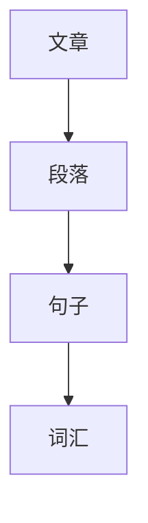
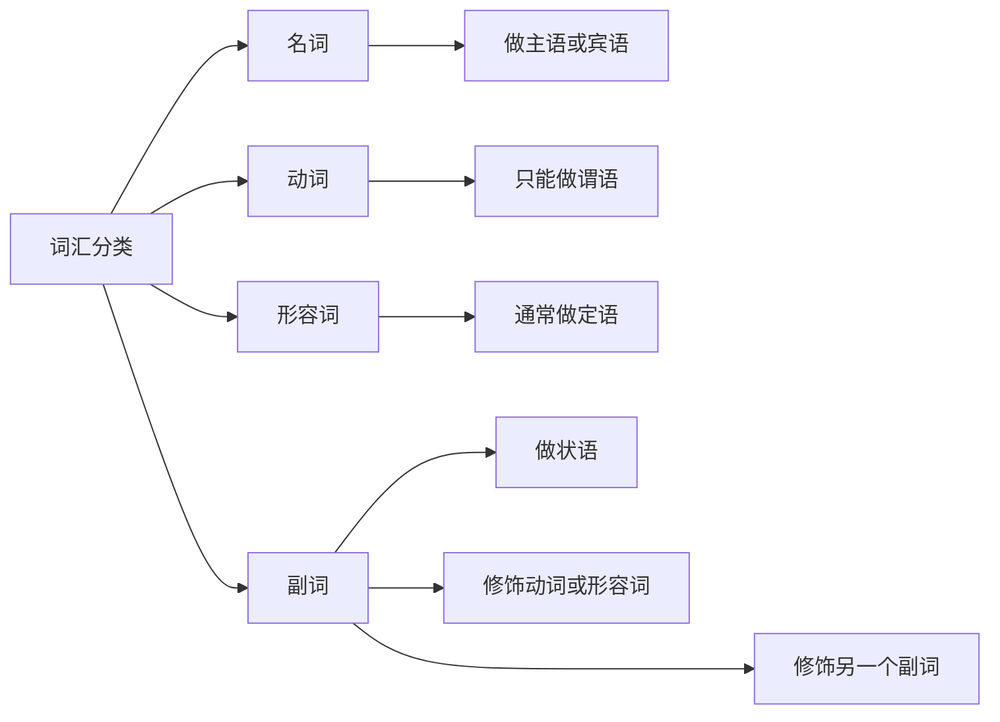

## 第01课 使用文字的本质

### 文字的基本构成

一篇文章由很多段落组成

一个段落由一个或多个句子构成

一个句子是由一个或多个词汇构成

词汇是最基本的组成

### 词汇的分类

1. 名词
   - 做主语或宾语 
2. 动词
   - 只能做谓语
3. 形容词
   - 通常做定语
4. 副词
   - 做状语
   - 用来修饰动词或形容词
   - 甚至可以修饰另一个副词

名词 修饰 动词

动词 修饰 名词

形容词 修饰 名词

副词 修饰 形容词

副词 修饰 动词

副词 修饰 副词

### 词性的本质

名词:用来描述能够感知的事物,不论抽象还是具体

动词:描述能够感知的动作,不管抽象还是具体

形容词:用来描述能够感知的那个事物的感知

副词:在修饰动词时,作用和形容词修饰名词一样,描述对那个动作的感知

副词修饰形容词时,作用是用来描述对感知的那个事物的感知的感知

副词修饰副词时,作用描述你对感知的那个事物的感知的感知的感知

#### 到底应不应该弃用副词

副词是用来描述一种深层的感知,用好比较困难,需要练习

读者在理解副词的时候会遇到困难

### 描述的本质

在诚实的情况下，你根本无法描述你感知不到的事物

### 如何钻入作者的脑子

把一篇文章所有的名词拿出来,如果所有名词都是具体名词,没有抽象名词,说明这个人受教育程度非常低,因为没有理解任何抽象概念

一个人受教育程度的高低就看能够理解多少清晰准确且必要的概念

看完名词,把修饰这些名词的形容词找出来,如果没有任何形容词说明这个人感知能力非常差,如果有,但不准确,依旧说明非常差,有且很准说明不光感知能力强,表达能力也强

### 写作的本质

写作的本质就是记录感知

进一步

让读者通过我们的文字获得感知

再进一步

让读者通过我们的文字获得我们想要他们获得的感知

### 作业1 标注文章词性

每天拿出一篇文章,不管说理文还是小说,还是散文亦或是纪实文学,只要是文字

拿出笔用圆圈画出名词,下划线画出名词前的形容词

按照上课讲的方式思考

这个作者抽象概念占比大概是多少,他的感知能力好坏

两三年之后会发现看到的东西和别人看到的内容完全不一样,感知能力不断增强

### 作业2 读文章反问几个问题

读任何文章,问自己以下几个问题,认真用纸笔写下能够想到的答案

1. 作者想要向我传达什么感知?

2. 他做的成功么?

3. 如果我是他,我会怎么做才更有效?

### 作业3 每天写小短文描述自己的感知

每天做一次练习,用300-500词描写一个特定的感知,不管是视觉的还是听觉的,嗅觉的触觉的,还是脑子里的震撼,可能来自于路上遇到的人或事,也可能来自于读者或者听众,你的体验专注于某一个感知,用300-500词写清楚,还要自我分辨,自己的文字是否真的能够有效传递感知

## 第02课 一切创作的前提都是选择

### 创作的门槛到底高不高?

伪专家强调天赋

创作实际上是0门槛的

发行渠道才是真正的门槛,过去出版商很少,很难出版你的书籍

### 后去中心化时代的渠道?

去中心化的意思并不是消灭所有的中心，而是当初唯且最大的中心”最终逐步被“多个相对较小的中心所替代”

渠道成本降低到几近为零

创作是零门槛的，过去真正门槛是渠道

虽然创作是零门槛的，可是你的观众、你的听众你的读者究竟在哪里？

没有受众的创作者最可怜

你误以为你得先学会创作才能做其他的事情

### 究竟写什么？

写什么远比怎么写重要一万倍

千万不要被李笑来限制住

选择比努力重要一万倍

人们误以为选择是属于当下的,事实上,选择属于未来

做出了选择实际上生命中相当长一段时间会因为这个选择而变化

### 非要讲道理怎么办？

我写的东西到底对别人有没有用？

我写的这些东西在十年后是否依然对读者有用？

我写的这些东西在廿年、三十年后后是否依然对读者有用？

为什么别人会觉得你写的东西有用,就是因为未知

讲故事讲究新奇特,3个字你仔细研究一下就会发现都是关于未知的,最终这肯定是少数人的选择,只有这样极致的标准要求自己,你才有可能真正有出息,否则就算能够热闹一时也早晚泯然众人矣

### 如何边进步边练习?

因为在未知原则这个前提下向受众提供价值的方法
除了提供新认知,还有加深旧认知

最快最容易上手的方法就是做教程

任何事的教程,分为以下内容

最基础的 HOW

再高级一点就是WHY

当然最高级的是WHAT

### 作业 1 回忆你遇到过的最好教程？
### 作业 2 你需要的教程别人写的好不好？
### 作业 3 如果你自己写，你能写成什么样？

真正的作业

### 作业 4 开始动手写100篇教程
### 作业 5 不停搜集反馈。。反复揣摩修改教程

建立渠道很重要,但这是写作课,具体的建立渠道可以看[微信互联网平民创业](https://github.com/xiaolai/everyones-guide-for-starting-up-on-wechat-network)

随处可见如何创建渠道,如何维护渠道的方法论

## 第03课 怎么写?

### 所谓格式化创作

是什么？
如何定义？
不是什么?
之类似的是什么？
怎么用？
常见用法有哪些
用的时候需要注意什么？
怎么用是错的？
常见错误都有哪些？
练习

"鸡尾酒效应"

一切的教材都是非常格式化的

教辅书籍的“模版

- 重点都有哪些？

- 针对每一个重点
  最常见错误都有哪些？
  根源是什么？

### HOW

5W1H -> 2W1H

Who,Where,When ∈ What

---

What/Why/How

描述清楚任务

描述清楚步骤

)用的油比别人多一点；
2)蛋也多几个；
3)蛋并不全部搅匀；
4)把蛋倒进锅里用筷子快速搅成丝；
5)加盐（以前也用过方便面料）
6)用冷饭，放进锅，调小火，翻炒
直至颗粒分清

1.细致完整

2.新颖

1)打两个鸡蛋；
2)放一点葱花；
3)撒一点咸盐；
4)把剩饭放进去拌匀；
5)在平底锅里放一点油：
6)点火；
7)油开之后把拌好的米饭鸡蛋糊倒进平底锅：
8)细火，像煎葱花饼一样煎透，使米饭鸡蛋
糊呈金黄色；
9)放到盘子里，用刀切成长条；
10)用手抓着吃。

如何出彩？
1. 细致完整
2. 新颖
3. 神评论

### WHY

现象/解释
问题/解决
分析/结论

WHY的创作难度,并不在于文字本身,而是在于底层的逻辑严谨

安慰剂
双盲测试

人至践则无敌

逻辑差的人啥都干不好

### 形式逻辑

#### 分类

类别之间的排它性

类别集合的完整性

#### 比较

属于同一范畴

拥有相同属性

#### 因果

A是B的理由嘛？
A是B唯一的理由嘛？
A如果不是B的唯一理由那么，请问最重要的理由是什么？

### 非形式逻辑

政客大多是骗子

川普是个政客

那么川普在多大程度上是个骗子呢？
## 第04课

## 第05课

## 第06课

## 第07课

## 第08课