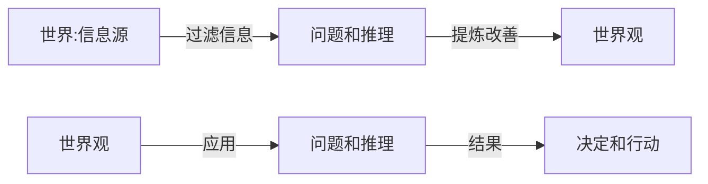
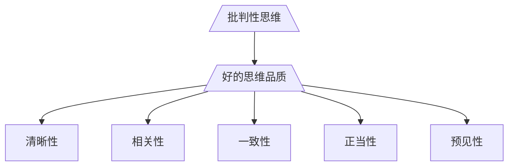
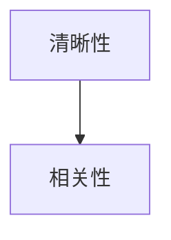
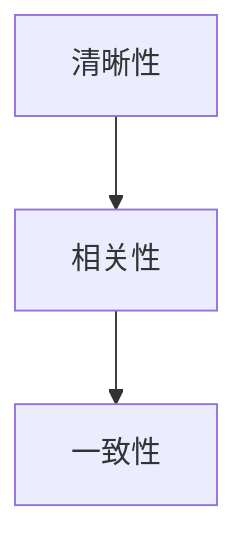

# 第一章 理性的声音：批判性思维
## 第一节 什么是批判性思维
### 一、恰当的提问与合理的论证

#### 什么是世界观？
人们对世界或对它的某些方面所形成的一系列信念和看法的总和

#### 世界观和批判性思维的关系？
由上图也已看出，世界观形成的核心是**问题和推理**

批判性思维就是**提出恰当问题和做出合理论证**的能力

#### 批判性思维和好的思维品质的关系

### 二、清晰性：澄清思维混乱

- 对一个问题可以拆成不同层次辨析

在准备对一个问题做出回答之前，要思考这个问题是否假定了一些事实，这个事实如果是不成立的，就是一个不恰当的问题

- 思考要有条理,不要将事实问题,价值问题,情感问题同时混在一起讨论和思考

- 清晰性意味着清楚,准确地使用概念和语言.**想清楚的事情未必表达清楚,没想清楚的事情肯定表达不清楚**,概念不清和语词滥用也是导致思维混乱的根源。

### 三、相关性：摆脱感情纠葛
围绕一个问题进行思考,搜集相关信息,做出针对回答或找出有针对性的解决方案,避免将不相关的问题牵扯进来

>布什列举一大堆事实性陈述,没有回答是否逃逸服兵役的问题

相关性意味着**思考问题时,诉诸逻辑推理,而不是情感心理**

#### 诉诸情感为什么有效?
原因之一是由于人们在考虑问题难以切断感情的纠葛

#### 在承认问题和寻求答案的问题上,需要?
理智的见解,深思熟虑和基于事实的分析与推理,如果不能摆脱情感依赖,就会陷入快捷廉价的选择判断之中,时过境迁之后,会为当初的选择后悔

清晰性时批判性思维的第一标准,如果不清晰,则问题不知道是什么,相关性无从谈起

满足清晰性,不等于满足相关性

### 四、一致性：避免自相矛盾

自相矛盾是最尖锐的不一致。自相矛盾的主张必有一个是不能成立的

在相关性的基础上，才谈得上一致性。

> 我说：“青蛙会唱歌，总是过着快乐的生活。”你说：“歌星会唱歌，可他们有时并不快乐。”你我谈论的对象不同，因而谈不上一致或不一致。

一致性总是针对**同一个对象具有或不具有某种属性，或者针对同一个问题的不同回答而言的**。

满足了相关性的要求，不等于满足了一致性的要求

### 五、正当性：消除不可靠的信念

正当性意味着使用真实可信的理由为信念做出担保。

#### 信念和信仰的区别?
一个人信仰什么可能不需要讲理由，但是，一个人相信什么却需要讲理由。

#### 应该基于什么相信?
可靠的证据。基于个人的偏见、情感和愿望等，所获得的信念是不可靠的。

#### 什么是可靠证据?
可靠的证据是在不受人为因素和不恰当的测量方法干扰的情况下，在不同的观察者面前能重复得到同样结论的实验结果。

根据理由对信念的支持强弱来决定对信念的确信程度,对信念的确信程度超出了手中所掌握的证据的担保能力,这种确信就是不正当的

### 六、预见性：拒绝盲目行动
预见性意味着**信念的实用性**。如果你拥有的信念能帮助你对周围的世界做出较好的解释和理解，而且能够对周围世界所发生的事件做出较好的预测和控制，那么你的信念就是非常实用的。

预见性意味着**行动的主动性**。了解事物的原因不只是为了满足好奇心和消除恐惧感，而是要引导我们的行动，知道要做些什么、什么时候去做以及如何去做，并为我们做决定提供依据。

## 第二节 发展批判性思维能力
### 一、正确的态度
### 二、原则性知识
### 三、勤奋的实践

## 第三节 批判性思维课程的设计
### 一、批判性思维课程的设计风格
### 二、批判性思维教育的意义
### 三、教程内容的组织安排

# 第二章 主张与断言
## 第一节 论证的概念
### 一、什么是论证
### 二、论证与解释
### 三、论证与推理
### 四、推理的有效性
### 五、归谬与证伪
### 六、论证的可靠性
### 七、论证的谬误

## 第二节 抓住断言
### 一、语句与陈述
### 二、陈述与断言
### 三、断言与主张

## 第三节 简单陈述
### 一、直言陈述
### 二、量化陈述
### 三、矛盾陈述
### 四、对当关系
### 五、陈述的标准化

## 第四节 复合陈述
### 一、联言陈述及其否定
### 二、选言陈述及其否定
### 三、假言陈述及其否定

## 第五节 避免自相矛盾
### 一、自相矛盾的主张
### 二、自相矛盾的论证
### 三、悖论
### 练习题

# 第三章 问题与主张
## 第一节 理解问题
### 一、问题、回答和预设
### 二、单一问题与多重问题
### 三、责任性回答

## 第二节 恰当提问的益处
### 一、明确论证的主张
### 二、辨析争议的焦点
### 三、描述性问题与规范性问题

## 第三节 问题的谬误
### 一、误导性问题
### 二、不一致的问题
### 三、无视问题的谬误
### 练习题

# 第四章 理由与正当理由
## 第一节 辨识理由
### 一、理由的标志与面貌
### 二、辨识理由的困难
### 三、理由与原因
### 四、前提与假设

## 第二节 论证图解
### 一、单一结构
### 二、T型结构
### 三、V型结构
### 四、复合结构

## 第三节 不正当的理由
### 一、诉诸情感
### 二、诉诸权威
### 三、未确证的假设
### 练习题

# 第五章 澄清意义
## 第一节 语言的意义
### 一、意义理论
### 二、语言的基本功用
### 三、概念的内涵与外延
### 四、歧义与模糊

## 第二节 定义方法
### 一、语词定义
### 二、内涵定义
### 三、内涵定义的规则

## 第三节 划分方法
### 一、划分的结构和方法
### 二、划分的规则
### 三、划分、分类与分解
### 四、限制与概括

## 第四节 苏格拉底方法

### 一、逻辑推论与不一致的信念
### 二、反例反驳与有纰漏的定义
### 三、诘问式的益处
### 练习题

# 第六章 演绎论证
## 第一节 直言三段论
### 一、定义和结构
### 二、主词与谓词的周延性
### 三、判定有效式的规则
### 四、评估直言三段论的有效性

## 第二节 假言三段论
### 一、假言推理的基本式
### 二、纯假言推理的常用式
### 三、归谬法和反证法
### 四、评估假言推理的有效性

## 第三节 选言三段论
### 一、选言推理的基本式
### 二、二难推理
### 三、评估选言推理的有效性

## 第四节 论证的可靠性
### 一、关于真的理论
### 二、经验性陈述与非经验性陈述
### 三、评估演绎论证的可靠性
### 练习题

# 第七章 归纳论证
## 第一节 枚举论证
### 一、全称枚举推理
### 二、特称枚举与单称枚举
### 三、枚举论证的谬误

## 第二节 类比论证与比喻论证
### 一、类比推理
### 二、比喻论证
### 三、评估类比和比喻论证

## 第三节 统计论证
### 一、统计概括
### 二、统计三段论
### 三、统计推理的谬误
### 四、评估统计数据

## 第四节 因果解释与因果论证
### 一、解释、假说和预测
### 二、因果推论的术语
### 三、时间关联与统计关联
### 四、确立实质性因果主张
### 五、确立统计性因果主张
### 六、因果论证的谬误
### 练习题

# 第八章 批判性写作
## 第一节 分析性写作与批判性准则
### 一、批判性阅读与分析性写作
### 二、宽容原则与中立原则
### 三、阅读与写作的批判性准则

## 第二节 分析性写作的步骤和方法
## 第一步：如何发现分析性写作的分论点
## 第二步：如何对评估的分论点进行论证
## 第三步：如何组织文章结构、进行语言表达
## 第三节 批判性写作赏析
### 梁实秋：“资本家的走狗”
### 鲁迅：“丧家的”“资本家的乏走狗”
### 赏析：“丧家的”与“乏”
### 练习题
### 部分练习题参考答案

